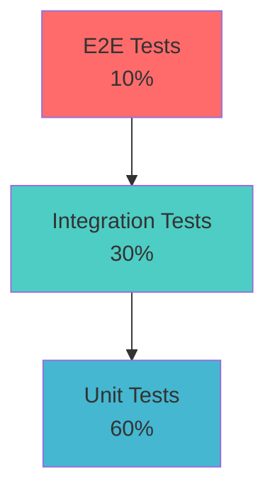

# 🧪 API 테스팅 가이드라인

> Korea Public Data Backend API의 체계적이고 효율적인 테스팅을 위한 종합 가이드

## 📋 목차
- [테스팅 개요](#테스팅-개요)
- [테스팅 전략](#테스팅-전략)
- [도메인별 테스팅](#도메인별-테스팅)
- [테스트 환경 설정](#테스트-환경-설정)
- [자동화 테스팅](#자동화-테스팅)
- [성능 테스팅](#성능-테스팅)
- [보안 테스팅](#보안-테스팅)
- [테스트 메트릭](#테스트-메트릭)

## 🎯 테스팅 개요

### 테스팅 목표
1. **기능 정확성**: 모든 API 엔드포인트가 명세대로 동작
2. **성능 보장**: 응답 시간 및 처리량 목표 달성
3. **안정성 확보**: 예외 상황에서의 견고한 처리
4. **보안 강화**: 인증, 인가, 데이터 검증 확인

### 테스팅 원칙
- **Shift-Left Testing**: 개발 초기 단계부터 테스팅 통합
- **Test Automation**: 반복 가능한 테스트의 자동화
- **Continuous Testing**: CI/CD 파이프라인과 통합
- **Risk-Based Testing**: 비즈니스 리스크 기반 우선순위

## 🏗️ 테스팅 전략

### 테스팅 피라미드


### 테스트 레벨별 범위
| 테스트 레벨 | 범위 | 도구 | 목표 커버리지 |
|-------------|------|------|---------------|
| **Unit Tests** | 개별 함수/메서드 | pytest | 90%+ |
| **Integration Tests** | API 엔드포인트 | FastAPI TestClient | 85%+ |
| **Contract Tests** | API 명세 준수 | Pact, OpenAPI | 100% |
| **E2E Tests** | 사용자 시나리오 | Playwright + API | 80%+ |
| **Performance Tests** | 응답시간/처리량 | Locust, Artillery | 주요 엔드포인트 |

## 🔧 테스트 환경 설정

### 개발 환경 설정
```bash
# 가상환경 설정
python -m venv venv
source venv/bin/activate  # Linux/Mac
# venv\Scripts\activate   # Windows

# 테스트 의존성 설치
pip install -r requirements-test.txt

# 테스트 데이터베이스 설정
export MONGODB_TEST_URL="mongodb://localhost:27017/korea_test"
export REDIS_TEST_URL="redis://localhost:6379/1"

# 테스트 실행
pytest tests/ -v --cov=app --cov-report=html
```

### Docker 테스트 환경
```yaml
# docker-compose.test.yml
version: '3.8'
services:
  mongodb-test:
    image: mongo:7
    environment:
      MONGO_INITDB_DATABASE: korea_test
    ports:
      - "27018:27017"
    volumes:
      - ./scripts/init-test-db.js:/docker-entrypoint-initdb.d/init.js

  redis-test:
    image: redis:7-alpine
    ports:
      - "6380:6379"
    command: redis-server --appendonly yes

  app-test:
    build:
      context: .
      dockerfile: Dockerfile.test
    environment:
      - MONGODB_URL=mongodb://mongodb-test:27017/korea_test
      - REDIS_URL=redis://redis-test:6379
      - ENVIRONMENT=test
    depends_on:
      - mongodb-test
      - redis-test
    volumes:
      - ./tests:/app/tests
      - ./coverage:/app/coverage
```

### 테스트 설정 파일
```python
# tests/conftest.py

import asyncio
import pytest
import pytest_asyncio
from httpx import AsyncClient
from fastapi.testclient import TestClient

from app.main import app
from app.core.database import get_database
from app.core.config import get_settings

# Test fixtures
@pytest.fixture(scope="session")
def event_loop():
    """Create an instance of the default event loop for the test session."""
    loop = asyncio.new_event_loop()
    yield loop
    loop.close()

@pytest_asyncio.fixture
async def test_db():
    """Test database fixture with cleanup."""
    settings = get_settings()
    database = get_database()
    
    # Setup: Create test data
    yield database
    
    # Teardown: Clean test data
    await database.announcements.delete_many({})
    await database.businesses.delete_many({})
    await database.contents.delete_many({})
    await database.statistics.delete_many({})

@pytest_asyncio.fixture
async def client(test_db):
    """Async HTTP client for testing."""
    async with AsyncClient(app=app, base_url="http://test") as ac:
        yield ac

@pytest.fixture
def sample_announcement():
    """Sample announcement data for testing."""
    return {
        "business_id": "BIZ-2025-001",
        "title": "테스트 공고",
        "content": "테스트용 공고 내용",
        "category": "기술개발",
        "application_start_date": "2025-08-15",
        "application_end_date": "2025-09-15",
        "is_active": True
    }

@pytest.fixture
def authenticated_headers():
    """Authentication headers for protected endpoints."""
    # Mock JWT token for testing
    mock_token = "eyJhbGciOiJIUzI1NiIsInR5cCI6IkpXVCJ9..."
    return {"Authorization": f"Bearer {mock_token}"}
```

## 🏢 도메인별 테스팅

### Announcements 도메인 테스팅
```python
# tests/test_announcements.py

import pytest
from httpx import AsyncClient

class TestAnnouncementsAPI:
    """공고 관련 API 테스트"""
    
    @pytest.mark.asyncio
    async def test_create_announcement(self, client: AsyncClient, sample_announcement):
        """공고 생성 테스트"""
        response = await client.post("/api/v1/announcements/", json=sample_announcement)
        
        assert response.status_code == 201
        data = response.json()
        assert data["title"] == sample_announcement["title"]
        assert data["business_id"] == sample_announcement["business_id"]
        assert "id" in data
        assert "created_at" in data

    @pytest.mark.asyncio
    async def test_get_announcements_list(self, client: AsyncClient):
        """공고 목록 조회 테스트"""
        response = await client.get("/api/v1/announcements/")
        
        assert response.status_code == 200
        data = response.json()
        assert "items" in data
        assert "total" in data
        assert "page" in data
        assert "size" in data

    @pytest.mark.asyncio
    async def test_get_announcement_detail(self, client: AsyncClient, sample_announcement):
        """공고 상세 조회 테스트"""
        # 먼저 공고 생성
        create_response = await client.post("/api/v1/announcements/", json=sample_announcement)
        announcement_id = create_response.json()["id"]
        
        # 상세 조회
        response = await client.get(f"/api/v1/announcements/{announcement_id}")
        
        assert response.status_code == 200
        data = response.json()
        assert data["id"] == announcement_id
        assert data["title"] == sample_announcement["title"]

    @pytest.mark.asyncio
    async def test_fetch_external_announcements(self, client: AsyncClient):
        """외부 API 데이터 수집 테스트"""
        response = await client.post(
            "/api/v1/announcements/fetch",
            params={"num_of_rows": 5}
        )
        
        assert response.status_code == 200
        data = response.json()
        assert "message" in data
        assert "fetched_count" in data

    @pytest.mark.asyncio
    async def test_announcement_validation(self, client: AsyncClient):
        """공고 데이터 검증 테스트"""
        invalid_data = {
            "business_id": "",  # 필수 필드 누락
            "title": "a" * 501,  # 길이 제한 초과
            "application_start_date": "invalid-date"  # 잘못된 날짜 형식
        }
        
        response = await client.post("/api/v1/announcements/", json=invalid_data)
        
        assert response.status_code == 422
        errors = response.json()["detail"]
        assert len(errors) >= 3  # 각 필드별 검증 오류

    @pytest.mark.asyncio
    async def test_announcement_search(self, client: AsyncClient):
        """공고 검색 기능 테스트"""
        response = await client.get(
            "/api/v1/announcements/",
            params={
                "search": "기술개발",
                "category": "기술개발",
                "is_active": True
            }
        )
        
        assert response.status_code == 200
        data = response.json()
        assert isinstance(data["items"], list)
```

### Businesses 도메인 테스팅
```python
# tests/test_businesses.py

class TestBusinessesAPI:
    """사업 관련 API 테스트"""
    
    @pytest.mark.asyncio
    async def test_business_analysis(self, client: AsyncClient):
        """비즈니스 분석 기능 테스트"""
        response = await client.get(
            "/api/v1/businesses/analysis",
            params={
                "industry": "IT",
                "size": "startup",
                "location": "서울"
            }
        )
        
        assert response.status_code == 200
        data = response.json()
        assert "businesses" in data
        assert "analysis" in data
        
        # 분석 데이터 검증
        analysis = data["analysis"]
        assert "related_announcements" in analysis
        assert "performance_metrics" in analysis
        assert "recommendation_score" in analysis

    @pytest.mark.asyncio
    async def test_business_comparison(self, client: AsyncClient):
        """사업 비교 기능 테스트"""
        business_ids = ["BIZ-001", "BIZ-002", "BIZ-003"]
        
        response = await client.post(
            "/api/v1/businesses/compare",
            json={"business_ids": business_ids}
        )
        
        assert response.status_code == 200
        data = response.json()
        assert "comparison_result" in data
        assert len(data["comparison_result"]) == len(business_ids)

    @pytest.mark.asyncio
    async def test_business_recommendations(self, client: AsyncClient, authenticated_headers):
        """사업 추천 시스템 테스트"""
        response = await client.get(
            "/api/v1/businesses/recommendations",
            headers=authenticated_headers,
            params={"limit": 10}
        )
        
        assert response.status_code == 200
        data = response.json()
        assert "recommendations" in data
        assert len(data["recommendations"]) <= 10
        
        # 추천 스코어 검증
        for rec in data["recommendations"]:
            assert "business" in rec
            assert "score" in rec
            assert 0 <= rec["score"] <= 1
```

### Statistics 도메인 테스팅
```python
# tests/test_statistics.py

class TestStatisticsAPI:
    """통계 관련 API 테스트"""
    
    @pytest.mark.asyncio
    async def test_real_time_metrics(self, client: AsyncClient):
        """실시간 통계 메트릭 테스트"""
        response = await client.get(
            "/api/v1/statistics/real-time",
            params={
                "metrics": "user_activity,api_usage",
                "time_range": "1h"
            }
        )
        
        assert response.status_code == 200
        data = response.json()
        assert "current_metrics" in data
        assert "trends" in data
        assert "predictions" in data

    @pytest.mark.asyncio
    async def test_dashboard_data(self, client: AsyncClient):
        """대시보드 데이터 API 테스트"""
        response = await client.get("/api/v1/statistics/dashboard")
        
        assert response.status_code == 200
        data = response.json()
        assert "charts" in data
        assert "kpis" in data
        assert "alerts" in data

    @pytest.mark.asyncio
    async def test_trend_analysis(self, client: AsyncClient):
        """트렌드 분석 API 테스트"""
        response = await client.get(
            "/api/v1/statistics/trends",
            params={
                "period": "30d",
                "metrics": "announcements,businesses"
            }
        )
        
        assert response.status_code == 200
        data = response.json()
        assert "trends" in data
        assert "forecasts" in data
        assert "anomalies" in data
```

## 🚀 자동화 테스팅

### GitHub Actions CI/CD
```yaml
# .github/workflows/test.yml
name: API Tests

on:
  push:
    branches: [ main, develop ]
  pull_request:
    branches: [ main ]

jobs:
  test:
    runs-on: ubuntu-latest
    
    services:
      mongodb:
        image: mongo:7
        ports:
          - 27017:27017
      
      redis:
        image: redis:7
        ports:
          - 6379:6379

    steps:
    - uses: actions/checkout@v4
    
    - name: Set up Python
      uses: actions/setup-python@v4
      with:
        python-version: '3.11'
    
    - name: Install dependencies
      run: |
        python -m pip install --upgrade pip
        pip install -r requirements.txt
        pip install -r requirements-test.txt
    
    - name: Run unit tests
      run: |
        pytest tests/unit/ -v --cov=app --cov-report=xml
    
    - name: Run integration tests
      run: |
        pytest tests/integration/ -v --cov=app --cov-append --cov-report=xml
    
    - name: Run contract tests
      run: |
        pytest tests/contract/ -v
    
    - name: Upload coverage to Codecov
      uses: codecov/codecov-action@v3
      with:
        file: ./coverage.xml
        fail_ci_if_error: true

  performance-test:
    runs-on: ubuntu-latest
    needs: test
    
    steps:
    - uses: actions/checkout@v4
    
    - name: Set up Node.js
      uses: actions/setup-node@v4
      with:
        node-version: '18'
    
    - name: Install Artillery
      run: npm install -g artillery
    
    - name: Run performance tests
      run: |
        artillery run tests/performance/load-test.yml
```

### 테스트 실행 스크립트
```bash
#!/bin/bash
# scripts/run_tests.sh

set -e

echo "🧪 Starting API Test Suite..."

# 테스트 환경 변수 설정
export ENVIRONMENT=test
export MONGODB_URL="mongodb://localhost:27017/korea_test"
export REDIS_URL="redis://localhost:6379/1"

# 테스트 데이터베이스 초기화
echo "📊 Initializing test database..."
python scripts/init_test_data.py

# 단위 테스트 실행
echo "🔬 Running unit tests..."
pytest tests/unit/ -v --cov=app --cov-report=html --cov-report=term

# 통합 테스트 실행
echo "🔗 Running integration tests..."
pytest tests/integration/ -v --cov=app --cov-append

# Contract 테스트 실행
echo "📋 Running contract tests..."
pytest tests/contract/ -v

# 성능 테스트 실행 (옵션)
if [ "$1" = "--with-performance" ]; then
    echo "⚡ Running performance tests..."
    artillery run tests/performance/load-test.yml
fi

# 보안 테스트 실행 (옵션)
if [ "$1" = "--with-security" ]; then
    echo "🛡️ Running security tests..."
    pytest tests/security/ -v
fi

echo "✅ All tests completed successfully!"

# 커버리지 보고서 열기
if command -v xdg-open > /dev/null; then
    xdg-open htmlcov/index.html
elif command -v open > /dev/null; then
    open htmlcov/index.html
fi
```

## ⚡ 성능 테스팅

### Artillery 로드 테스트
```yaml
# tests/performance/load-test.yml
config:
  target: 'http://localhost:8000'
  phases:
    - duration: 60
      arrivalRate: 5
      name: "Warm up"
    - duration: 300
      arrivalRate: 20
      name: "Sustained load"
    - duration: 60
      arrivalRate: 50
      name: "Peak load"
  
  payload:
    path: "./test-data.csv"
    fields:
      - "business_id"
      - "category"

scenarios:
  - name: "Announcements API Load Test"
    weight: 40
    flow:
      - get:
          url: "/api/v1/announcements/"
          expect:
            - statusCode: 200
            - contentType: json
      - think: 2
      - get:
          url: "/api/v1/announcements/{{ business_id }}"
          expect:
            - statusCode: 200

  - name: "Search API Load Test"
    weight: 30
    flow:
      - get:
          url: "/api/v1/announcements/"
          qs:
            search: "{{ category }}"
            limit: 20
          expect:
            - statusCode: 200
            - json: "$.items.length"

  - name: "External API Fetch Test"
    weight: 20
    flow:
      - post:
          url: "/api/v1/announcements/fetch"
          qs:
            num_of_rows: 10
          expect:
            - statusCode: 200

  - name: "Statistics API Test"
    weight: 10
    flow:
      - get:
          url: "/api/v1/statistics/dashboard"
          expect:
            - statusCode: 200
```

### Locust 성능 테스트
```python
# tests/performance/locust_test.py

from locust import HttpUser, task, between
import random

class APIUser(HttpUser):
    wait_time = between(1, 3)
    host = "http://localhost:8000"
    
    def on_start(self):
        """테스트 시작 시 실행"""
        # 인증 토큰 획득 (필요한 경우)
        pass
    
    @task(3)
    def get_announcements(self):
        """공고 목록 조회 (가장 빈번한 작업)"""
        params = {
            "page": random.randint(1, 10),
            "size": random.choice([10, 20, 50]),
            "category": random.choice(["기술개발", "마케팅", "사업화"])
        }
        
        with self.client.get("/api/v1/announcements/", params=params, catch_response=True) as response:
            if response.status_code == 200:
                data = response.json()
                if len(data["items"]) > 0:
                    response.success()
                else:
                    response.failure("No items returned")
            else:
                response.failure(f"Status code: {response.status_code}")
    
    @task(2)
    def search_announcements(self):
        """공고 검색"""
        search_terms = ["AI", "빅데이터", "클라우드", "IoT", "블록체인"]
        search_term = random.choice(search_terms)
        
        params = {"search": search_term, "limit": 20}
        
        with self.client.get("/api/v1/announcements/", params=params, catch_response=True) as response:
            if response.elapsed.total_seconds() > 2.0:
                response.failure("Request took too long")
            elif response.status_code == 200:
                response.success()
            else:
                response.failure(f"Status code: {response.status_code}")
    
    @task(1)
    def get_business_analysis(self):
        """비즈니스 분석 (부하가 큰 작업)"""
        params = {
            "industry": random.choice(["IT", "바이오", "에너지"]),
            "size": random.choice(["startup", "sme", "large"])
        }
        
        with self.client.get("/api/v1/businesses/analysis", params=params, catch_response=True) as response:
            if response.elapsed.total_seconds() > 5.0:
                response.failure("Analysis took too long")
            elif response.status_code == 200:
                response.success()
            else:
                response.failure(f"Status code: {response.status_code}")
    
    @task(1)
    def get_statistics(self):
        """통계 대시보드"""
        with self.client.get("/api/v1/statistics/dashboard", catch_response=True) as response:
            if response.status_code == 200:
                data = response.json()
                if "charts" in data and "kpis" in data:
                    response.success()
                else:
                    response.failure("Missing required dashboard data")
            else:
                response.failure(f"Status code: {response.status_code}")
```

## 🛡️ 보안 테스팅

### OWASP ZAP 보안 스캔
```python
# tests/security/zap_scan.py

import time
import requests
from zapv2 import ZAPv2

class SecurityTester:
    def __init__(self):
        self.zap = ZAPv2(proxies={'http': 'http://127.0.0.1:8080', 'https': 'http://127.0.0.1:8080'})
        self.target_url = 'http://localhost:8000'
    
    def run_security_scan(self):
        """보안 스캔 실행"""
        print("🛡️ Starting security scan...")
        
        # Spider (크롤링)
        print("🕷️ Starting spider scan...")
        spider_id = self.zap.spider.scan(self.target_url)
        self.wait_for_scan(spider_id, 'spider')
        
        # Active scan
        print("🔍 Starting active security scan...")
        active_scan_id = self.zap.ascan.scan(self.target_url)
        self.wait_for_scan(active_scan_id, 'ascan')
        
        # 결과 분석
        self.analyze_results()
    
    def wait_for_scan(self, scan_id, scan_type):
        """스캔 완료 대기"""
        while True:
            progress = int(self.zap.spider.status(scan_id)) if scan_type == 'spider' else int(self.zap.ascan.status(scan_id))
            print(f"Scan progress: {progress}%")
            
            if progress >= 100:
                break
            time.sleep(5)
    
    def analyze_results(self):
        """취약점 분석 및 보고서 생성"""
        alerts = self.zap.core.alerts()
        
        vulnerabilities = {
            'High': [],
            'Medium': [],
            'Low': [],
            'Informational': []
        }
        
        for alert in alerts:
            risk = alert['risk']
            vulnerabilities[risk].append({
                'name': alert['alert'],
                'description': alert['description'],
                'url': alert['url'],
                'solution': alert['solution']
            })
        
        # 보고서 생성
        self.generate_security_report(vulnerabilities)
        
        # 높은 위험도 취약점이 있으면 테스트 실패
        if vulnerabilities['High']:
            raise Exception(f"High-risk vulnerabilities found: {len(vulnerabilities['High'])}")
    
    def generate_security_report(self, vulnerabilities):
        """보안 테스트 보고서 생성"""
        with open('security_report.html', 'w') as f:
            f.write(self.zap.core.htmlreport())
        
        print("📊 Security scan completed. Report saved to security_report.html")
```

### JWT 토큰 테스팅
```python
# tests/security/test_jwt_security.py

import jwt
import pytest
from datetime import datetime, timedelta

class TestJWTSecurity:
    """JWT 토큰 보안 테스트"""
    
    @pytest.mark.asyncio
    async def test_invalid_token(self, client):
        """유효하지 않은 토큰 테스트"""
        invalid_headers = {"Authorization": "Bearer invalid_token"}
        
        response = await client.get("/api/v1/businesses/recommendations", headers=invalid_headers)
        assert response.status_code == 401
    
    @pytest.mark.asyncio
    async def test_expired_token(self, client):
        """만료된 토큰 테스트"""
        # 만료된 토큰 생성
        expired_payload = {
            "sub": "test_user",
            "exp": datetime.utcnow() - timedelta(hours=1)
        }
        expired_token = jwt.encode(expired_payload, "secret", algorithm="HS256")
        
        headers = {"Authorization": f"Bearer {expired_token}"}
        response = await client.get("/api/v1/businesses/recommendations", headers=headers)
        assert response.status_code == 401
    
    @pytest.mark.asyncio
    async def test_token_without_bearer(self, client):
        """Bearer 없는 토큰 테스트"""
        headers = {"Authorization": "invalid_token_format"}
        
        response = await client.get("/api/v1/businesses/recommendations", headers=headers)
        assert response.status_code == 401
```

## 📊 테스트 메트릭

### 테스트 커버리지 설정
```ini
# .coveragerc
[run]
source = app
omit = 
    */tests/*
    */venv/*
    */migrations/*
    app/main.py
    */conftest.py

[report]
exclude_lines =
    pragma: no cover
    def __repr__
    if self.debug:
    if settings.DEBUG
    raise AssertionError
    raise NotImplementedError
    if 0:
    if __name__ == .__main__.:
    class .*\bProtocol\):
    @(abc\.)?abstractmethod

[html]
directory = htmlcov
```

### 성능 메트릭 수집
```python
# tests/metrics/performance_collector.py

import time
import statistics
from functools import wraps
from dataclasses import dataclass
from typing import List, Dict

@dataclass
class PerformanceMetric:
    endpoint: str
    method: str
    response_time: float
    status_code: int
    timestamp: float

class PerformanceCollector:
    def __init__(self):
        self.metrics: List[PerformanceMetric] = []
    
    def record_metric(self, endpoint: str, method: str, response_time: float, status_code: int):
        """성능 메트릭 기록"""
        self.metrics.append(PerformanceMetric(
            endpoint=endpoint,
            method=method,
            response_time=response_time,
            status_code=status_code,
            timestamp=time.time()
        ))
    
    def generate_report(self) -> Dict:
        """성능 보고서 생성"""
        if not self.metrics:
            return {}
        
        # 엔드포인트별 통계
        endpoint_stats = {}
        for metric in self.metrics:
            key = f"{metric.method} {metric.endpoint}"
            if key not in endpoint_stats:
                endpoint_stats[key] = []
            endpoint_stats[key].append(metric.response_time)
        
        report = {}
        for endpoint, times in endpoint_stats.items():
            report[endpoint] = {
                'count': len(times),
                'avg_response_time': statistics.mean(times),
                'median_response_time': statistics.median(times),
                'p95_response_time': self.percentile(times, 95),
                'p99_response_time': self.percentile(times, 99),
                'min_response_time': min(times),
                'max_response_time': max(times)
            }
        
        return report
    
    @staticmethod
    def percentile(data: List[float], percentile: float) -> float:
        """백분위수 계산"""
        sorted_data = sorted(data)
        index = int((percentile / 100) * len(sorted_data))
        return sorted_data[min(index, len(sorted_data) - 1)]

# 성능 측정 데코레이터
def measure_performance(collector: PerformanceCollector):
    def decorator(func):
        @wraps(func)
        async def wrapper(*args, **kwargs):
            start_time = time.time()
            response = await func(*args, **kwargs)
            end_time = time.time()
            
            response_time = (end_time - start_time) * 1000  # milliseconds
            collector.record_metric(
                endpoint=kwargs.get('endpoint', 'unknown'),
                method=kwargs.get('method', 'GET'),
                response_time=response_time,
                status_code=response.status_code if hasattr(response, 'status_code') else 200
            )
            
            return response
        return wrapper
    return decorator
```

### 테스트 품질 대시보드
```python
# scripts/test_dashboard.py

import json
import matplotlib.pyplot as plt
from datetime import datetime, timedelta

class TestDashboard:
    def __init__(self, test_results_file: str):
        with open(test_results_file, 'r') as f:
            self.data = json.load(f)
    
    def generate_coverage_chart(self):
        """테스트 커버리지 차트 생성"""
        coverage_data = self.data.get('coverage', {})
        
        labels = list(coverage_data.keys())
        values = list(coverage_data.values())
        
        plt.figure(figsize=(10, 6))
        bars = plt.bar(labels, values, color=['green' if v >= 90 else 'orange' if v >= 80 else 'red' for v in values])
        
        plt.title('테스트 커버리지 현황')
        plt.ylabel('커버리지 (%)')
        plt.ylim(0, 100)
        
        # 목표선 추가
        plt.axhline(y=90, color='red', linestyle='--', label='목표 (90%)')
        plt.axhline(y=80, color='orange', linestyle='--', label='최소 (80%)')
        
        plt.legend()
        plt.tight_layout()
        plt.savefig('coverage_chart.png')
        plt.close()
    
    def generate_performance_trends(self):
        """성능 트렌드 차트 생성"""
        performance_data = self.data.get('performance_history', [])
        
        dates = [datetime.fromisoformat(d['date']) for d in performance_data]
        avg_times = [d['avg_response_time'] for d in performance_data]
        p95_times = [d['p95_response_time'] for d in performance_data]
        
        plt.figure(figsize=(12, 6))
        plt.plot(dates, avg_times, label='평균 응답시간', marker='o')
        plt.plot(dates, p95_times, label='95th 백분위수', marker='s')
        
        plt.title('API 성능 트렌드')
        plt.ylabel('응답시간 (ms)')
        plt.xlabel('날짜')
        
        # 목표선 추가
        plt.axhline(y=200, color='red', linestyle='--', label='목표 (200ms)')
        
        plt.legend()
        plt.xticks(rotation=45)
        plt.tight_layout()
        plt.savefig('performance_trends.png')
        plt.close()
    
    def generate_test_summary(self):
        """테스트 요약 보고서 생성"""
        summary = self.data.get('summary', {})
        
        print("📊 테스트 실행 요약")
        print("=" * 50)
        print(f"총 테스트 수: {summary.get('total_tests', 0)}")
        print(f"성공: {summary.get('passed_tests', 0)}")
        print(f"실패: {summary.get('failed_tests', 0)}")
        print(f"건너뜀: {summary.get('skipped_tests', 0)}")
        print(f"실행 시간: {summary.get('execution_time', 0):.2f}초")
        print()
        
        print("📈 커버리지 현황")
        print("-" * 30)
        coverage = self.data.get('coverage', {})
        for module, cov in coverage.items():
            status = "✅" if cov >= 90 else "🟡" if cov >= 80 else "❌"
            print(f"{status} {module}: {cov}%")
        print()
        
        print("⚡ 성능 현황")
        print("-" * 30)
        performance = self.data.get('performance', {})
        for endpoint, metrics in performance.items():
            avg_time = metrics.get('avg_response_time', 0)
            status = "✅" if avg_time < 200 else "🟡" if avg_time < 500 else "❌"
            print(f"{status} {endpoint}: {avg_time:.0f}ms")
```

## 🔄 테스트 개선 및 모니터링

### 테스트 자동 실행 (Cron)
```bash
#!/bin/bash
# scripts/scheduled_tests.sh

# 매일 밤 자동 테스트 실행
0 2 * * * /path/to/project/scripts/run_tests.sh --with-performance >> /var/log/api-tests.log 2>&1

# 주간 보안 스캔
0 2 * * 0 /path/to/project/scripts/security_scan.sh >> /var/log/security-tests.log 2>&1
```

### 테스트 결과 알림
```python
# scripts/test_notifier.py

import requests
import json
from typing import Dict

class TestNotifier:
    def __init__(self, webhook_url: str):
        self.webhook_url = webhook_url
    
    def send_test_results(self, results: Dict):
        """테스트 결과 Slack 알림"""
        color = "good" if results["success"] else "danger"
        
        message = {
            "attachments": [
                {
                    "color": color,
                    "title": "API 테스트 결과",
                    "fields": [
                        {
                            "title": "성공률",
                            "value": f"{results['success_rate']:.1f}%",
                            "short": True
                        },
                        {
                            "title": "커버리지",
                            "value": f"{results['coverage']:.1f}%",
                            "short": True
                        },
                        {
                            "title": "평균 응답시간",
                            "value": f"{results['avg_response_time']:.0f}ms",
                            "short": True
                        },
                        {
                            "title": "실행 시간",
                            "value": f"{results['duration']:.1f}초",
                            "short": True
                        }
                    ]
                }
            ]
        }
        
        requests.post(self.webhook_url, json=message)
```

## 📚 참고 자료

### 관련 문서
- [API 구현 현황](./api_implementation_status.md)
- [Performance Monitoring](../operations/monitoring_strategy.md)
- [Security Guidelines](../../pm/05_security/security_guidelines.md)

### 유용한 도구
- **pytest**: Python 테스팅 프레임워크
- **httpx**: 비동기 HTTP 클라이언트
- **Artillery**: 성능 테스팅 도구
- **Locust**: Python 기반 로드 테스팅
- **OWASP ZAP**: 보안 취약점 스캔
- **Codecov**: 테스트 커버리지 모니터링

## 🔄 업데이트 이력

| 버전 | 날짜 | 변경사항 | 작성자 |
|------|------|----------|--------|
| 1.0.0 | 2025-08-14 | 초기 API 테스팅 가이드라인 작성 | Backend Team |

---

*이 가이드라인은 Korea Public Data API의 품질과 안정성을 보장하기 위한 종합적인 테스팅 전략을 제시합니다. 지속적인 개선을 통해 더 나은 API 서비스를 제공하겠습니다.*