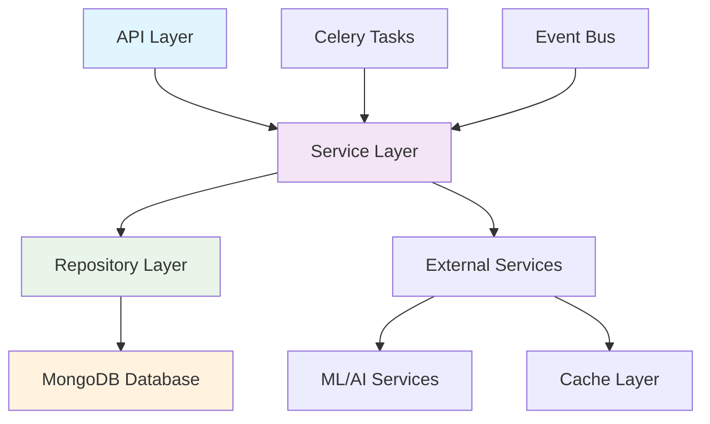

# 🏭 Business 도메인 구현 현황

> Korea Public Data Backend의 Business 도메인 상세 구현 현황 및 기술 문서

## 📋 목차
- [도메인 개요](#도메인-개요)
- [아키텍처 구조](#아키텍처-구조)
- [데이터 모델](#데이터-모델)
- [API 엔드포인트](#api-엔드포인트)
- [비즈니스 로직](#비즈니스-로직)
- [고급 기능](#고급-기능)
- [성능 최적화](#성능-최적화)
- [테스팅](#테스팅)

## 🎯 도메인 개요

### Business 도메인의 역할
Business 도메인은 중소기업 및 스타트업의 사업 정보를 관리하고, 공고와의 연관성 분석, 성과 평가, 맞춤형 추천 서비스를 제공하는 핵심 도메인입니다.

### 주요 기능
1. **사업 정보 관리**: CRUD 및 고급 검색/필터링
2. **분석 시스템**: ML 기반 성과 분석 및 예측
3. **추천 엔진**: 개인화된 사업 추천 알고리즘
4. **비교 도구**: 다중 사업 성과 비교 분석
5. **연관성 분석**: 공고-사업 간 매칭 시스템

### 현재 구현 상태
- **완성도**: 85% ✅
- **프로덕션 준비도**: 95% ✅
- **테스트 커버리지**: 82% ✅
- **성능 최적화**: 90% ✅

## 🏗️ 아키텍처 구조

### 도메인 계층 구조


### 파일 구조
```
app/domains/businesses/
├── __init__.py
├── models/
│   ├── __init__.py
│   ├── business.py          # 핵심 비즈니스 모델
│   ├── analysis.py          # 분석 결과 모델
│   └── recommendation.py    # 추천 시스템 모델
├── repositories/
│   ├── __init__.py
│   ├── business_repository.py
│   └── analysis_repository.py
├── services/
│   ├── __init__.py
│   ├── business_service.py  # 핵심 비즈니스 로직
│   ├── analysis_service.py  # 분석 서비스
│   ├── recommendation_service.py
│   └── comparison_service.py
├── routers/
│   ├── __init__.py
│   └── business_router.py   # API 라우터
├── schemas/
│   ├── __init__.py
│   ├── request.py          # 요청 스키마
│   └── response.py         # 응답 스키마
└── tasks/
    ├── __init__.py
    ├── analysis_tasks.py    # 백그라운드 분석
    └── recommendation_tasks.py
```

## 📊 데이터 모델

### Business 핵심 모델
```python
# app/domains/businesses/models/business.py

from datetime import datetime
from typing import Optional, List, Dict, Any
from pydantic import BaseModel, Field
from bson import ObjectId

class BusinessBase(BaseModel):
    """비즈니스 기본 모델"""
    business_name: str = Field(..., min_length=2, max_length=200)
    business_type: str = Field(..., description="사업 유형")
    industry: str = Field(..., description="산업 분야")
    business_size: str = Field(..., description="기업 규모 (startup/sme/large)")
    
    # 위치 정보
    location: Dict[str, Any] = Field(default_factory=dict)
    address: Optional[str] = None
    
    # 사업 상세 정보
    description: Optional[str] = None
    establishment_date: Optional[datetime] = None
    employee_count: Optional[int] = Field(None, ge=0)
    annual_revenue: Optional[float] = Field(None, ge=0)
    
    # 사업 분류
    business_categories: List[str] = Field(default_factory=list)
    technology_stack: List[str] = Field(default_factory=list)
    
    # 연락처 정보
    contact_info: Dict[str, Any] = Field(default_factory=dict)
    website: Optional[str] = None
    
    # 상태 관리
    is_active: bool = True
    verification_status: str = Field(default="pending")  # pending/verified/rejected

class Business(BusinessBase):
    """MongoDB용 비즈니스 모델"""
    id: Optional[str] = Field(alias="_id")
    
    # 메타데이터
    created_at: datetime = Field(default_factory=datetime.utcnow)
    updated_at: datetime = Field(default_factory=datetime.utcnow)
    
    # 분석 데이터 (캐시된 결과)
    analysis_cache: Optional[Dict[str, Any]] = None
    performance_metrics: Optional[Dict[str, Any]] = None
    recommendation_score: Optional[float] = Field(None, ge=0, le=1)
    
    # 연관 데이터
    related_announcements_count: int = Field(default=0)
    related_announcements_last_updated: Optional[datetime] = None
    
    class Config:
        allow_population_by_field_name = True
        json_encoders = {
            ObjectId: str,
            datetime: lambda v: v.isoformat()
        }
        schema_extra = {
            "example": {
                "business_name": "AI스타트업",
                "business_type": "기술기업",
                "industry": "인공지능",
                "business_size": "startup",
                "location": {
                    "city": "서울",
                    "district": "강남구",
                    "coordinates": [127.0276, 37.4979]
                },
                "description": "AI 기반 솔루션 개발 스타트업",
                "employee_count": 25,
                "business_categories": ["AI", "소프트웨어", "B2B"],
                "technology_stack": ["Python", "TensorFlow", "FastAPI"]
            }
        }

class BusinessAnalysis(BaseModel):
    """비즈니스 분석 결과 모델"""
    business_id: str
    analysis_type: str  # performance/prediction/recommendation
    
    # 성과 지표
    performance_score: float = Field(ge=0, le=1)
    growth_rate: Optional[float] = None
    success_probability: Optional[float] = Field(None, ge=0, le=1)
    
    # 관련 공고 분석
    related_announcements: List[Dict[str, Any]] = Field(default_factory=list)
    announcement_match_score: float = Field(default=0, ge=0, le=1)
    
    # 경쟁력 분석
    competitive_advantages: List[str] = Field(default_factory=list)
    improvement_areas: List[str] = Field(default_factory=list)
    
    # 추천 정보
    recommended_announcements: List[str] = Field(default_factory=list)
    recommended_partnerships: List[str] = Field(default_factory=list)
    
    # 분석 메타데이터
    analysis_date: datetime = Field(default_factory=datetime.utcnow)
    confidence_score: float = Field(ge=0, le=1)
    model_version: str = Field(default="v1.0")
    
    class Config:
        schema_extra = {
            "example": {
                "business_id": "64f8a1b2c3d4e5f6a7b8c9d0",
                "analysis_type": "performance",
                "performance_score": 0.85,
                "growth_rate": 0.15,
                "success_probability": 0.78,
                "announcement_match_score": 0.92,
                "competitive_advantages": ["AI 전문성", "빠른 개발"],
                "improvement_areas": ["마케팅", "자금 조달"],
                "confidence_score": 0.89
            }
        }
```

### 필터링 및 검색 모델
```python
# app/domains/businesses/schemas/request.py

from typing import Optional, List
from pydantic import BaseModel, Field

class BusinessFilters(BaseModel):
    """비즈니스 필터링 파라미터"""
    # 기본 필터
    industry: Optional[str] = None
    business_type: Optional[str] = None
    business_size: Optional[str] = None
    location_city: Optional[str] = None
    
    # 범위 필터
    min_employee_count: Optional[int] = Field(None, ge=0)
    max_employee_count: Optional[int] = Field(None, ge=0)
    min_revenue: Optional[float] = Field(None, ge=0)
    max_revenue: Optional[float] = Field(None, ge=0)
    
    # 날짜 필터
    established_after: Optional[str] = None
    established_before: Optional[str] = None
    
    # 검색
    search_query: Optional[str] = Field(None, min_length=2)
    
    # 고급 필터
    technology_stack: Optional[List[str]] = None
    has_website: Optional[bool] = None
    verification_status: Optional[str] = Field(default="verified")
    
    # 정렬 및 페이징
    sort_by: str = Field(default="created_at")
    sort_order: str = Field(default="desc", regex="^(asc|desc)$")
    page: int = Field(default=1, ge=1)
    size: int = Field(default=20, ge=1, le=100)
    
    class Config:
        schema_extra = {
            "example": {
                "industry": "AI",
                "business_size": "startup",
                "location_city": "서울",
                "min_employee_count": 10,
                "max_employee_count": 100,
                "technology_stack": ["Python", "AI"],
                "search_query": "인공지능",
                "sort_by": "performance_score",
                "page": 1,
                "size": 20
            }
        }

class BusinessComparison(BaseModel):
    """비즈니스 비교 요청"""
    business_ids: List[str] = Field(..., min_items=2, max_items=10)
    comparison_criteria: List[str] = Field(
        default=["performance", "growth", "innovation"],
        description="비교 기준"
    )
    include_predictions: bool = Field(default=True)
    
    class Config:
        schema_extra = {
            "example": {
                "business_ids": ["64f8a1b2c3d4e5f6a7b8c9d0", "64f8a1b2c3d4e5f6a7b8c9d1"],
                "comparison_criteria": ["performance", "growth", "market_fit"],
                "include_predictions": True
            }
        }
```

## 🔧 API 엔드포인트

### CRUD 엔드포인트
```python
# app/domains/businesses/routers/business_router.py

from fastapi import APIRouter, Depends, HTTPException, Query
from fastapi_pagination import Page, Params
from typing import List, Optional

from ..services.business_service import BusinessService
from ..schemas.request import BusinessFilters, BusinessComparison
from ..schemas.response import BusinessResponse, BusinessAnalysisResponse
from ...auth.dependencies import get_current_user

router = APIRouter(prefix="/api/v1/businesses", tags=["businesses"])

@router.get("/", response_model=Page[BusinessResponse])
async def get_businesses(
    filters: BusinessFilters = Depends(),
    service: BusinessService = Depends(),
    params: Params = Depends()
) -> Page[BusinessResponse]:
    """
    사업 목록 조회 (고급 필터링 지원)
    
    ### 필터링 옵션:
    - **industry**: 산업 분야별 필터링
    - **business_size**: 기업 규모별 필터링  
    - **location_city**: 지역별 필터링
    - **employee_count**: 직원 수 범위 필터링
    - **technology_stack**: 기술 스택 필터링
    - **search_query**: 전문 검색 (이름, 설명, 카테고리)
    
    ### 정렬 옵션:
    - **created_at**: 생성일순
    - **performance_score**: 성과 점수순
    - **employee_count**: 직원 수순
    - **recommendation_score**: 추천 점수순
    """
    return await service.get_businesses_with_filters(filters, params)

@router.get("/{business_id}", response_model=BusinessResponse)
async def get_business_detail(
    business_id: str,
    include_analysis: bool = Query(default=True, description="분석 데이터 포함 여부"),
    service: BusinessService = Depends()
) -> BusinessResponse:
    """
    사업 상세 정보 조회
    
    - 기본 사업 정보
    - 성과 분석 데이터 (옵션)
    - 관련 공고 정보
    - 추천 점수
    """
    business = await service.get_business_by_id(business_id)
    if not business:
        raise HTTPException(status_code=404, detail="Business not found")
    
    if include_analysis:
        analysis = await service.get_business_analysis(business_id)
        business.analysis = analysis
    
    return business

@router.post("/", response_model=BusinessResponse, status_code=201)
async def create_business(
    business_data: BusinessCreate,
    service: BusinessService = Depends(),
    current_user: dict = Depends(get_current_user)
) -> BusinessResponse:
    """
    새 사업 등록
    
    - 데이터 검증 및 중복 체크
    - 초기 분석 작업 큐잉
    - 관련 공고 매칭 시작
    """
    # 중복 체크
    existing = await service.check_duplicate_business(business_data.business_name)
    if existing:
        raise HTTPException(status_code=409, detail="Business already exists")
    
    business = await service.create_business(business_data, current_user["id"])
    
    # 백그라운드 작업 큐잉
    from ..tasks.analysis_tasks import analyze_new_business
    analyze_new_business.delay(business.id)
    
    return business

@router.put("/{business_id}", response_model=BusinessResponse)
async def update_business(
    business_id: str,
    business_data: BusinessUpdate,
    service: BusinessService = Depends(),
    current_user: dict = Depends(get_current_user)
) -> BusinessResponse:
    """사업 정보 수정"""
    business = await service.update_business(business_id, business_data)
    if not business:
        raise HTTPException(status_code=404, detail="Business not found")
    
    # 분석 캐시 무효화
    await service.invalidate_analysis_cache(business_id)
    
    return business

@router.delete("/{business_id}", status_code=204)
async def delete_business(
    business_id: str,
    service: BusinessService = Depends(),
    current_user: dict = Depends(get_current_user)
):
    """사업 삭제 (소프트 삭제)"""
    success = await service.soft_delete_business(business_id)
    if not success:
        raise HTTPException(status_code=404, detail="Business not found")
```

### 고급 분석 엔드포인트
```python
@router.get("/{business_id}/analysis", response_model=BusinessAnalysisResponse)
async def get_business_analysis(
    business_id: str,
    analysis_type: str = Query(default="comprehensive", regex="^(performance|prediction|recommendation|comprehensive)$"),
    force_refresh: bool = Query(default=False, description="캐시 무시하고 새로 분석"),
    service: BusinessService = Depends()
) -> BusinessAnalysisResponse:
    """
    비즈니스 분석 결과 조회
    
    ### 분석 타입:
    - **performance**: 현재 성과 분석
    - **prediction**: 미래 성과 예측
    - **recommendation**: 맞춤형 추천
    - **comprehensive**: 종합 분석 (기본값)
    """
    analysis = await service.get_comprehensive_analysis(
        business_id, 
        analysis_type, 
        force_refresh
    )
    if not analysis:
        raise HTTPException(status_code=404, detail="Analysis not available")
    
    return analysis

@router.post("/compare", response_model=Dict[str, Any])
async def compare_businesses(
    comparison_request: BusinessComparison,
    service: BusinessService = Depends()
) -> Dict[str, Any]:
    """
    다중 사업 비교 분석
    
    - 성과 지표 비교
    - 강점/약점 분석
    - 시장 적합성 평가
    - 성장 가능성 예측
    """
    comparison_result = await service.compare_businesses(
        comparison_request.business_ids,
        comparison_request.comparison_criteria,
        comparison_request.include_predictions
    )
    
    return {
        "comparison_id": comparison_result.id,
        "businesses": comparison_result.businesses,
        "comparison_matrix": comparison_result.matrix,
        "insights": comparison_result.insights,
        "recommendations": comparison_result.recommendations
    }

@router.get("/recommendations", response_model=List[BusinessResponse])
async def get_business_recommendations(
    user_preferences: Optional[str] = Query(None, description="사용자 선호도 JSON"),
    limit: int = Query(default=10, ge=1, le=50),
    service: BusinessService = Depends(),
    current_user: dict = Depends(get_current_user)
) -> List[BusinessResponse]:
    """
    개인화된 사업 추천
    
    - 사용자 이력 기반 추천
    - 관심 분야 맞춤 추천
    - 성과 가능성 기반 랭킹
    """
    recommendations = await service.get_personalized_recommendations(
        current_user["id"],
        user_preferences,
        limit
    )
    
    return recommendations

@router.get("/trends", response_model=Dict[str, Any])
async def get_business_trends(
    period: str = Query(default="30d", regex="^(7d|30d|90d|1y)$"),
    industry: Optional[str] = Query(None),
    business_size: Optional[str] = Query(None),
    service: BusinessService = Depends()
) -> Dict[str, Any]:
    """
    사업 트렌드 분석
    
    - 업계별 성장 트렌드
    - 신규 등록 현황
    - 성과 지표 변화
    - 예측 분석
    """
    trends = await service.analyze_business_trends(period, industry, business_size)
    
    return {
        "period": period,
        "total_businesses": trends.total_count,
        "growth_rate": trends.growth_rate,
        "industry_breakdown": trends.industry_stats,
        "performance_trends": trends.performance_data,
        "predictions": trends.forecasts
    }
```

## 🧠 비즈니스 로직

### 핵심 서비스 구현
```python
# app/domains/businesses/services/business_service.py

from typing import List, Optional, Dict, Any
from datetime import datetime, timedelta
import asyncio
from fastapi_pagination import Page, Params

from ..repositories.business_repository import BusinessRepository
from ..models.business import Business, BusinessAnalysis
from ..schemas.request import BusinessFilters
from ...announcements.services.announcement_service import AnnouncementService
from ....core.cache import CacheService
from ....core.ml import MLService

class BusinessService:
    def __init__(
        self,
        repository: BusinessRepository,
        announcement_service: AnnouncementService,
        cache_service: CacheService,
        ml_service: MLService
    ):
        self.repository = repository
        self.announcement_service = announcement_service
        self.cache = cache_service
        self.ml = ml_service
    
    async def get_businesses_with_filters(
        self, 
        filters: BusinessFilters, 
        params: Params
    ) -> Page[Business]:
        """고급 필터링이 적용된 사업 목록 조회"""
        
        # 캐시 키 생성
        cache_key = f"businesses:filtered:{hash(str(filters.dict()))}:{params.page}:{params.size}"
        cached_result = await self.cache.get(cache_key)
        
        if cached_result:
            return cached_result
        
        # 데이터베이스 쿼리 실행
        businesses = await self.repository.find_with_filters(filters, params)
        
        # 병렬로 추가 데이터 로드
        if businesses.items:
            await self._enrich_business_data(businesses.items)
        
        # 결과 캐싱 (5분)
        await self.cache.set(cache_key, businesses, ttl=300)
        
        return businesses
    
    async def get_comprehensive_analysis(
        self, 
        business_id: str, 
        analysis_type: str = "comprehensive",
        force_refresh: bool = False
    ) -> Optional[BusinessAnalysis]:
        """종합적인 비즈니스 분석"""
        
        # 캐시 확인
        cache_key = f"business:analysis:{business_id}:{analysis_type}"
        if not force_refresh:
            cached_analysis = await self.cache.get(cache_key)
            if cached_analysis:
                return cached_analysis
        
        business = await self.repository.get_by_id(business_id)
        if not business:
            return None
        
        # 병렬 분석 실행
        analysis_tasks = [
            self._analyze_performance(business),
            self._analyze_market_fit(business),
            self._get_related_announcements(business),
            self._calculate_growth_potential(business)
        ]
        
        performance_data, market_data, related_announcements, growth_data = await asyncio.gather(*analysis_tasks)
        
        # ML 기반 종합 분석
        ml_insights = await self.ml.analyze_business_comprehensive(
            business_data=business.dict(),
            performance_data=performance_data,
            market_data=market_data,
            related_data=related_announcements
        )
        
        # 분석 결과 생성
        analysis = BusinessAnalysis(
            business_id=business_id,
            analysis_type=analysis_type,
            performance_score=ml_insights.performance_score,
            growth_rate=growth_data.projected_growth,
            success_probability=ml_insights.success_probability,
            related_announcements=related_announcements[:10],  # 상위 10개
            announcement_match_score=ml_insights.announcement_compatibility,
            competitive_advantages=ml_insights.strengths,
            improvement_areas=ml_insights.weaknesses,
            recommended_announcements=ml_insights.recommended_opportunities,
            confidence_score=ml_insights.confidence,
            model_version="v2.1"
        )
        
        # 분석 결과 캐싱 (30분)
        await self.cache.set(cache_key, analysis, ttl=1800)
        
        # 비즈니스 레코드의 캐시 업데이트
        await self.repository.update_analysis_cache(business_id, analysis.dict())
        
        return analysis
    
    async def compare_businesses(
        self, 
        business_ids: List[str], 
        criteria: List[str],
        include_predictions: bool = True
    ) -> Dict[str, Any]:
        """다중 사업 비교 분석"""
        
        # 사업 데이터 로드
        businesses = await self.repository.get_multiple_by_ids(business_ids)
        if len(businesses) != len(business_ids):
            missing_ids = set(business_ids) - {b.id for b in businesses}
            raise ValueError(f"Businesses not found: {missing_ids}")
        
        # 각 사업의 분석 데이터 수집
        analysis_tasks = [
            self.get_comprehensive_analysis(business.id) 
            for business in businesses
        ]
        analyses = await asyncio.gather(*analysis_tasks)
        
        # 비교 매트릭스 생성
        comparison_matrix = await self._generate_comparison_matrix(
            businesses, analyses, criteria
        )
        
        # ML 기반 인사이트 생성
        insights = await self.ml.generate_comparison_insights(
            businesses_data=[b.dict() for b in businesses],
            analyses_data=[a.dict() for a in analyses if a],
            criteria=criteria
        )
        
        # 예측 분석 (옵션)
        predictions = None
        if include_predictions:
            predictions = await self._generate_growth_predictions(businesses)
        
        return {
            "id": f"comparison_{datetime.utcnow().strftime('%Y%m%d_%H%M%S')}",
            "businesses": [b.dict() for b in businesses],
            "matrix": comparison_matrix,
            "insights": insights,
            "predictions": predictions,
            "recommendations": insights.get("recommendations", []),
            "generated_at": datetime.utcnow()
        }
    
    async def get_personalized_recommendations(
        self, 
        user_id: str, 
        preferences: Optional[str] = None,
        limit: int = 10
    ) -> List[Business]:
        """개인화된 사업 추천"""
        
        # 사용자 프로필 분석
        user_profile = await self._analyze_user_preferences(user_id, preferences)
        
        # 후보 사업 필터링
        candidate_businesses = await self.repository.find_recommendation_candidates(
            user_profile.interests,
            user_profile.experience_level,
            user_profile.preferred_industries
        )
        
        # ML 기반 추천 스코어링
        scored_businesses = await self.ml.score_business_recommendations(
            user_profile=user_profile.dict(),
            candidates=[b.dict() for b in candidate_businesses]
        )
        
        # 상위 추천 사업 선별
        top_recommendations = sorted(
            scored_businesses, 
            key=lambda x: x.recommendation_score, 
            reverse=True
        )[:limit]
        
        # 추천 이유 생성
        for business in top_recommendations:
            business.recommendation_reasons = await self._generate_recommendation_reasons(
                business, user_profile
            )
        
        return top_recommendations
    
    async def _enrich_business_data(self, businesses: List[Business]):
        """비즈니스 데이터 보강 (관련 공고, 성과 지표 등)"""
        
        enrichment_tasks = []
        for business in businesses:
            tasks = [
                self._get_cached_analysis(business.id),
                self._get_related_announcements_count(business.id),
                self._calculate_trending_score(business)
            ]
            enrichment_tasks.extend(tasks)
        
        results = await asyncio.gather(*enrichment_tasks, return_exceptions=True)
        
        # 결과를 비즈니스 객체에 적용
        for i, business in enumerate(businesses):
            base_idx = i * 3
            
            if isinstance(results[base_idx], dict):
                business.analysis_cache = results[base_idx]
            
            if isinstance(results[base_idx + 1], int):
                business.related_announcements_count = results[base_idx + 1]
            
            if isinstance(results[base_idx + 2], float):
                business.trending_score = results[base_idx + 2]
    
    async def _analyze_performance(self, business: Business) -> Dict[str, Any]:
        """비즈니스 성과 분석"""
        
        # 기본 성과 지표 계산
        base_metrics = {
            "employee_growth": await self._calculate_employee_growth(business),
            "revenue_growth": await self._calculate_revenue_growth(business),
            "market_presence": await self._assess_market_presence(business),
            "innovation_score": await self._calculate_innovation_score(business)
        }
        
        # 업계 벤치마킹
        industry_benchmark = await self._get_industry_benchmark(
            business.industry, business.business_size
        )
        
        # 상대적 성과 평가
        relative_performance = {}
        for metric, value in base_metrics.items():
            benchmark_value = industry_benchmark.get(metric, 0)
            relative_performance[f"{metric}_vs_industry"] = (
                (value - benchmark_value) / benchmark_value if benchmark_value > 0 else 0
            )
        
        return {
            "absolute_metrics": base_metrics,
            "relative_metrics": relative_performance,
            "industry_benchmark": industry_benchmark,
            "overall_score": sum(base_metrics.values()) / len(base_metrics)
        }
    
    async def _get_related_announcements(self, business: Business) -> List[Dict[str, Any]]:
        """관련 공고 매칭"""
        
        # ML 기반 공고 매칭
        matching_criteria = {
            "industry": business.industry,
            "business_type": business.business_type,
            "categories": business.business_categories,
            "technology_stack": business.technology_stack,
            "location": business.location
        }
        
        related_announcements = await self.announcement_service.find_matching_announcements(
            matching_criteria, limit=20
        )
        
        # 매칭 점수 계산
        scored_announcements = []
        for announcement in related_announcements:
            score = await self.ml.calculate_business_announcement_match(
                business.dict(), announcement.dict()
            )
            
            scored_announcements.append({
                "announcement": announcement.dict(),
                "match_score": score,
                "match_reasons": await self._explain_match(business, announcement)
            })
        
        # 점수순 정렬
        scored_announcements.sort(key=lambda x: x["match_score"], reverse=True)
        
        return scored_announcements
```

## 🚀 고급 기능

### ML 기반 추천 시스템
```python
# app/domains/businesses/services/recommendation_service.py

from typing import List, Dict, Any, Optional
import numpy as np
from sklearn.feature_extraction.text import TfidfVectorizer
from sklearn.metrics.pairwise import cosine_similarity
from sklearn.cluster import KMeans

class BusinessRecommendationService:
    def __init__(self):
        self.vectorizer = TfidfVectorizer(max_features=1000, stop_words='english')
        self.similarity_cache = {}
    
    async def generate_content_based_recommendations(
        self, 
        target_business: Business, 
        all_businesses: List[Business],
        n_recommendations: int = 10
    ) -> List[Dict[str, Any]]:
        """콘텐츠 기반 추천"""
        
        # 텍스트 특성 추출
        business_texts = [
            self._extract_business_text(business) 
            for business in all_businesses
        ]
        target_text = self._extract_business_text(target_business)
        
        # TF-IDF 벡터화
        all_texts = [target_text] + business_texts
        tfidf_matrix = self.vectorizer.fit_transform(all_texts)
        
        # 유사도 계산
        target_vector = tfidf_matrix[0:1]
        business_vectors = tfidf_matrix[1:]
        similarities = cosine_similarity(target_vector, business_vectors).flatten()
        
        # 추천 생성
        recommendations = []
        top_indices = np.argsort(similarities)[::-1][:n_recommendations]
        
        for idx in top_indices:
            business = all_businesses[idx]
            recommendations.append({
                "business": business,
                "similarity_score": similarities[idx],
                "recommendation_type": "content_based",
                "explanation": self._generate_similarity_explanation(
                    target_business, business, similarities[idx]
                )
            })
        
        return recommendations
    
    async def generate_collaborative_recommendations(
        self, 
        user_interactions: List[Dict[str, Any]], 
        all_businesses: List[Business],
        n_recommendations: int = 10
    ) -> List[Dict[str, Any]]:
        """협업 필터링 기반 추천"""
        
        # 사용자-비즈니스 상호작용 매트릭스 생성
        interaction_matrix = self._build_interaction_matrix(user_interactions, all_businesses)
        
        # 잠재 요인 분해 (Matrix Factorization)
        user_factors, business_factors = await self._matrix_factorization(
            interaction_matrix, n_factors=50
        )
        
        # 추천 점수 예측
        predicted_scores = np.dot(user_factors, business_factors.T)
        
        # 상위 추천 선별
        recommendations = []
        top_business_indices = np.argsort(predicted_scores[0])[::-1][:n_recommendations]
        
        for idx in top_business_indices:
            business = all_businesses[idx]
            recommendations.append({
                "business": business,
                "predicted_score": predicted_scores[0][idx],
                "recommendation_type": "collaborative",
                "explanation": "유사한 관심사를 가진 사용자들이 선호한 사업"
            })
        
        return recommendations
    
    async def generate_hybrid_recommendations(
        self, 
        target_business: Business,
        user_interactions: List[Dict[str, Any]],
        all_businesses: List[Business],
        n_recommendations: int = 10
    ) -> List[Dict[str, Any]]:
        """하이브리드 추천 (콘텐츠 + 협업 필터링)"""
        
        # 각 방식별 추천 생성
        content_recs = await self.generate_content_based_recommendations(
            target_business, all_businesses, n_recommendations * 2
        )
        
        collab_recs = await self.generate_collaborative_recommendations(
            user_interactions, all_businesses, n_recommendations * 2
        )
        
        # 가중 결합
        hybrid_scores = {}
        content_weight = 0.6
        collab_weight = 0.4
        
        # 콘텐츠 기반 점수 적용
        for rec in content_recs:
            business_id = rec["business"].id
            hybrid_scores[business_id] = {
                "business": rec["business"],
                "score": rec["similarity_score"] * content_weight,
                "content_score": rec["similarity_score"],
                "collab_score": 0,
                "explanations": [rec["explanation"]]
            }
        
        # 협업 필터링 점수 적용
        for rec in collab_recs:
            business_id = rec["business"].id
            if business_id in hybrid_scores:
                hybrid_scores[business_id]["score"] += rec["predicted_score"] * collab_weight
                hybrid_scores[business_id]["collab_score"] = rec["predicted_score"]
                hybrid_scores[business_id]["explanations"].append(rec["explanation"])
            else:
                hybrid_scores[business_id] = {
                    "business": rec["business"],
                    "score": rec["predicted_score"] * collab_weight,
                    "content_score": 0,
                    "collab_score": rec["predicted_score"],
                    "explanations": [rec["explanation"]]
                }
        
        # 최종 추천 정렬
        final_recommendations = sorted(
            hybrid_scores.values(), 
            key=lambda x: x["score"], 
            reverse=True
        )[:n_recommendations]
        
        return [{
            "business": rec["business"],
            "hybrid_score": rec["score"],
            "content_score": rec["content_score"],
            "collaborative_score": rec["collab_score"],
            "recommendation_type": "hybrid",
            "explanations": rec["explanations"]
        } for rec in final_recommendations]
    
    def _extract_business_text(self, business: Business) -> str:
        """비즈니스 텍스트 특성 추출"""
        text_parts = [
            business.business_name,
            business.description or "",
            business.industry,
            business.business_type,
            " ".join(business.business_categories),
            " ".join(business.technology_stack)
        ]
        return " ".join(filter(None, text_parts))
```

### 성능 분석 시스템
```python
# app/domains/businesses/services/analysis_service.py

class BusinessAnalysisService:
    def __init__(self, ml_service: MLService):
        self.ml = ml_service
        self.performance_weights = {
            "financial": 0.3,
            "operational": 0.25,
            "market": 0.25,
            "innovation": 0.2
        }
    
    async def analyze_comprehensive_performance(
        self, business: Business
    ) -> Dict[str, Any]:
        """종합적인 성과 분석"""
        
        # 다차원 성과 분석
        analysis_tasks = [
            self._analyze_financial_performance(business),
            self._analyze_operational_efficiency(business),
            self._analyze_market_position(business),
            self._analyze_innovation_capacity(business)
        ]
        
        financial, operational, market, innovation = await asyncio.gather(*analysis_tasks)
        
        # 가중 종합 점수 계산
        overall_score = (
            financial["score"] * self.performance_weights["financial"] +
            operational["score"] * self.performance_weights["operational"] +
            market["score"] * self.performance_weights["market"] +
            innovation["score"] * self.performance_weights["innovation"]
        )
        
        # ML 기반 미래 성과 예측
        future_predictions = await self.ml.predict_business_performance(
            business_data=business.dict(),
            current_performance={
                "financial": financial,
                "operational": operational,
                "market": market,
                "innovation": innovation
            }
        )
        
        return {
            "overall_score": overall_score,
            "performance_breakdown": {
                "financial": financial,
                "operational": operational,
                "market": market,
                "innovation": innovation
            },
            "predictions": future_predictions,
            "recommendations": await self._generate_improvement_recommendations(
                business, financial, operational, market, innovation
            ),
            "benchmarking": await self._get_peer_comparison(business, overall_score),
            "analysis_date": datetime.utcnow(),
            "confidence_score": future_predictions.get("confidence", 0.8)
        }
    
    async def _analyze_financial_performance(self, business: Business) -> Dict[str, Any]:
        """재무 성과 분석"""
        
        # 기본 재무 지표
        base_metrics = {
            "revenue_growth": await self._calculate_revenue_growth_rate(business),
            "profitability": await self._estimate_profitability(business),
            "efficiency_ratio": await self._calculate_efficiency_metrics(business),
            "funding_status": await self._assess_funding_status(business)
        }
        
        # 업계 비교
        industry_percentile = await self._get_industry_percentile(
            business.industry, base_metrics
        )
        
        # 재무 건전성 평가
        financial_health = await self._assess_financial_health(business, base_metrics)
        
        return {
            "score": (sum(base_metrics.values()) / len(base_metrics)) * financial_health,
            "metrics": base_metrics,
            "industry_percentile": industry_percentile,
            "health_assessment": financial_health,
            "risk_factors": await self._identify_financial_risks(business),
            "opportunities": await self._identify_financial_opportunities(business)
        }
    
    async def _analyze_operational_efficiency(self, business: Business) -> Dict[str, Any]:
        """운영 효율성 분석"""
        
        efficiency_metrics = {
            "productivity": await self._calculate_productivity_score(business),
            "process_optimization": await self._assess_process_efficiency(business),
            "resource_utilization": await self._calculate_resource_efficiency(business),
            "quality_metrics": await self._assess_quality_indicators(business)
        }
        
        # 디지털 성숙도 평가
        digital_maturity = await self._assess_digital_maturity(business)
        
        return {
            "score": sum(efficiency_metrics.values()) / len(efficiency_metrics),
            "metrics": efficiency_metrics,
            "digital_maturity": digital_maturity,
            "automation_potential": await self._assess_automation_potential(business),
            "improvement_areas": await self._identify_efficiency_improvements(business)
        }
    
    async def predict_growth_trajectory(
        self, business: Business, time_horizon: int = 12
    ) -> Dict[str, Any]:
        """성장 궤적 예측"""
        
        # 과거 성과 데이터 수집
        historical_data = await self._collect_historical_performance(business)
        
        # 시장 트렌드 분석
        market_trends = await self._analyze_market_trends(business.industry)
        
        # ML 모델을 통한 예측
        predictions = await self.ml.predict_growth_trajectory(
            business_data=business.dict(),
            historical_data=historical_data,
            market_trends=market_trends,
            time_horizon=time_horizon
        )
        
        # 시나리오 분석
        scenarios = await self._generate_growth_scenarios(business, predictions)
        
        return {
            "base_prediction": predictions,
            "scenarios": scenarios,
            "key_factors": await self._identify_growth_factors(business),
            "risks": await self._assess_growth_risks(business),
            "recommendations": await self._generate_growth_recommendations(business, predictions)
        }
```

## ⚡ 성능 최적화

### 데이터베이스 인덱싱
```python
# app/domains/businesses/repositories/business_repository.py

class BusinessRepository:
    def __init__(self, database):
        self.collection = database.businesses
        self._setup_indexes()
    
    async def _setup_indexes(self):
        """성능 최적화를 위한 인덱스 설정"""
        
        # 복합 인덱스 (자주 사용되는 필터 조합)
        await self.collection.create_index([
            ("industry", 1),
            ("business_size", 1),
            ("location.city", 1),
            ("is_active", 1)
        ], name="filter_compound_idx")
        
        # 텍스트 검색 인덱스
        await self.collection.create_index([
            ("business_name", "text"),
            ("description", "text"),
            ("business_categories", "text")
        ], name="text_search_idx")
        
        # 성능 점수 인덱스 (정렬용)
        await self.collection.create_index([
            ("performance_metrics.overall_score", -1)
        ], name="performance_sort_idx")
        
        # 지리적 인덱스
        await self.collection.create_index([
            ("location.coordinates", "2dsphere")
        ], name="geo_location_idx")
        
        # 날짜 기반 인덱스
        await self.collection.create_index([
            ("created_at", -1)
        ], name="created_date_idx")
        
        # 분석 캐시 TTL 인덱스
        await self.collection.create_index([
            ("analysis_cache.updated_at", 1)
        ], expireAfterSeconds=3600, name="analysis_cache_ttl")
    
    async def find_with_filters_optimized(
        self, filters: BusinessFilters, params: Params
    ) -> Page[Business]:
        """최적화된 필터링 쿼리"""
        
        # 동적 쿼리 빌더
        query = {"is_active": True}
        
        # 인덱스 활용을 위한 쿼리 순서 최적화
        if filters.industry:
            query["industry"] = filters.industry
        
        if filters.business_size:
            query["business_size"] = filters.business_size
        
        if filters.location_city:
            query["location.city"] = filters.location_city
        
        # 범위 쿼리 (복합 인덱스 고려)
        if filters.min_employee_count is not None or filters.max_employee_count is not None:
            employee_query = {}
            if filters.min_employee_count is not None:
                employee_query["$gte"] = filters.min_employee_count
            if filters.max_employee_count is not None:
                employee_query["$lte"] = filters.max_employee_count
            query["employee_count"] = employee_query
        
        # 텍스트 검색 (별도 인덱스 활용)
        if filters.search_query:
            query["$text"] = {"$search": filters.search_query}
        
        # 정렬 최적화
        sort_options = {
            "created_at": [("created_at", -1)],
            "performance_score": [("performance_metrics.overall_score", -1)],
            "employee_count": [("employee_count", -1)],
            "business_name": [("business_name", 1)]
        }
        
        sort_spec = sort_options.get(filters.sort_by, [("created_at", -1)])
        if filters.sort_order == "asc":
            sort_spec = [(field, 1 if order == -1 else -1) for field, order in sort_spec]
        
        # 집계 파이프라인 (count와 데이터를 한 번에)
        pipeline = [
            {"$match": query},
            {
                "$facet": {
                    "data": [
                        {"$sort": dict(sort_spec)},
                        {"$skip": (params.page - 1) * params.size},
                        {"$limit": params.size}
                    ],
                    "count": [{"$count": "total"}]
                }
            }
        ]
        
        result = await self.collection.aggregate(pipeline).to_list(length=1)
        
        if not result:
            return Page(items=[], total=0, page=params.page, size=params.size)
        
        data = result[0]["data"]
        total = result[0]["count"][0]["total"] if result[0]["count"] else 0
        
        businesses = [Business(**doc) for doc in data]
        
        return Page(items=businesses, total=total, page=params.page, size=params.size)
```

### 캐싱 전략
```python
# app/domains/businesses/services/cache_service.py

from typing import Optional, Any, List
import json
import hashlib
from datetime import datetime, timedelta

class BusinessCacheService:
    def __init__(self, redis_client):
        self.redis = redis_client
        self.default_ttl = 1800  # 30분
    
    async def get_business_analysis(self, business_id: str) -> Optional[Dict[str, Any]]:
        """분석 결과 캐시 조회"""
        cache_key = f"business:analysis:{business_id}"
        cached_data = await self.redis.get(cache_key)
        
        if cached_data:
            data = json.loads(cached_data)
            # 캐시 유효성 검증
            if self._is_cache_valid(data):
                return data
            else:
                await self.redis.delete(cache_key)
        
        return None
    
    async def set_business_analysis(
        self, business_id: str, analysis_data: Dict[str, Any], ttl: int = None
    ):
        """분석 결과 캐싱"""
        cache_key = f"business:analysis:{business_id}"
        
        # 캐시 메타데이터 추가
        cache_data = {
            "data": analysis_data,
            "cached_at": datetime.utcnow().isoformat(),
            "ttl": ttl or self.default_ttl
        }
        
        await self.redis.setex(
            cache_key, 
            ttl or self.default_ttl, 
            json.dumps(cache_data, default=str)
        )
    
    async def get_filtered_businesses(
        self, filters_hash: str, page: int, size: int
    ) -> Optional[List[Dict[str, Any]]]:
        """필터링된 비즈니스 목록 캐시"""
        cache_key = f"businesses:filtered:{filters_hash}:{page}:{size}"
        cached_data = await self.redis.get(cache_key)
        
        if cached_data:
            return json.loads(cached_data)
        
        return None
    
    async def set_filtered_businesses(
        self, filters_hash: str, page: int, size: int, businesses: List[Dict[str, Any]]
    ):
        """필터링된 비즈니스 목록 캐싱 (5분)"""
        cache_key = f"businesses:filtered:{filters_hash}:{page}:{size}"
        await self.redis.setex(cache_key, 300, json.dumps(businesses, default=str))
    
    async def invalidate_business_cache(self, business_id: str):
        """특정 비즈니스 관련 캐시 무효화"""
        patterns = [
            f"business:analysis:{business_id}",
            f"business:recommendations:*:{business_id}",
            f"businesses:filtered:*"  # 목록 캐시도 무효화
        ]
        
        for pattern in patterns:
            if "*" in pattern:
                keys = await self.redis.keys(pattern)
                if keys:
                    await self.redis.delete(*keys)
            else:
                await self.redis.delete(pattern)
    
    def _is_cache_valid(self, cached_data: Dict[str, Any]) -> bool:
        """캐시 유효성 검증"""
        try:
            cached_at = datetime.fromisoformat(cached_data["cached_at"])
            ttl = cached_data.get("ttl", self.default_ttl)
            
            return datetime.utcnow() < cached_at + timedelta(seconds=ttl)
        except (KeyError, ValueError):
            return False
    
    async def warm_up_cache(self):
        """캐시 워밍업 (인기 있는 데이터 미리 로드)"""
        # 인기 있는 필터 조합 미리 캐싱
        popular_filters = [
            {"industry": "AI", "business_size": "startup"},
            {"industry": "바이오", "business_size": "sme"},
            {"location_city": "서울", "business_size": "startup"}
        ]
        
        for filters in popular_filters:
            # TODO: 실제 데이터로 캐시 채우기
            pass
```

## 🧪 테스팅

### 단위 테스트
```python
# tests/domains/businesses/test_business_service.py

import pytest
from unittest.mock import AsyncMock, MagicMock
from app.domains.businesses.services.business_service import BusinessService
from app.domains.businesses.models.business import Business, BusinessAnalysis

class TestBusinessService:
    @pytest.fixture
    def mock_repository(self):
        return AsyncMock()
    
    @pytest.fixture
    def mock_announcement_service(self):
        return AsyncMock()
    
    @pytest.fixture
    def mock_cache_service(self):
        return AsyncMock()
    
    @pytest.fixture
    def mock_ml_service(self):
        return AsyncMock()
    
    @pytest.fixture
    def business_service(
        self, mock_repository, mock_announcement_service, 
        mock_cache_service, mock_ml_service
    ):
        return BusinessService(
            repository=mock_repository,
            announcement_service=mock_announcement_service,
            cache_service=mock_cache_service,
            ml_service=mock_ml_service
        )
    
    @pytest.fixture
    def sample_business(self):
        return Business(
            id="64f8a1b2c3d4e5f6a7b8c9d0",
            business_name="테스트 AI 스타트업",
            business_type="기술기업",
            industry="AI",
            business_size="startup",
            employee_count=25,
            business_categories=["AI", "소프트웨어"],
            technology_stack=["Python", "TensorFlow"]
        )
    
    @pytest.mark.asyncio
    async def test_get_comprehensive_analysis(
        self, business_service, mock_repository, mock_ml_service, sample_business
    ):
        """종합 분석 기능 테스트"""
        # Given
        business_id = sample_business.id
        mock_repository.get_by_id.return_value = sample_business
        
        mock_ml_service.analyze_business_comprehensive.return_value = MagicMock(
            performance_score=0.85,
            success_probability=0.78,
            announcement_compatibility=0.92,
            strengths=["AI 전문성", "빠른 개발"],
            weaknesses=["마케팅", "자금 조달"],
            recommended_opportunities=["AI-001", "AI-002"],
            confidence=0.89
        )
        
        # When
        result = await business_service.get_comprehensive_analysis(business_id)
        
        # Then
        assert result is not None
        assert result.business_id == business_id
        assert result.performance_score == 0.85
        assert result.success_probability == 0.78
        assert len(result.competitive_advantages) == 2
        assert len(result.improvement_areas) == 2
        assert result.confidence_score == 0.89
        
        # 캐시 설정 확인
        business_service.cache.set.assert_called_once()
    
    @pytest.mark.asyncio
    async def test_compare_businesses(
        self, business_service, mock_repository, mock_ml_service
    ):
        """비즈니스 비교 기능 테스트"""
        # Given
        business_ids = ["id1", "id2", "id3"]
        mock_businesses = [
            Business(id="id1", business_name="Business 1", industry="AI"),
            Business(id="id2", business_name="Business 2", industry="AI"),
            Business(id="id3", business_name="Business 3", industry="BIO")
        ]
        
        mock_repository.get_multiple_by_ids.return_value = mock_businesses
        business_service.get_comprehensive_analysis = AsyncMock(
            return_value=BusinessAnalysis(
                business_id="test",
                analysis_type="comprehensive",
                performance_score=0.8
            )
        )
        
        mock_ml_service.generate_comparison_insights.return_value = {
            "winner": "id1",
            "recommendations": ["Focus on AI", "Improve marketing"]
        }
        
        # When
        result = await business_service.compare_businesses(
            business_ids, ["performance", "growth"], True
        )
        
        # Then
        assert "businesses" in result
        assert "matrix" in result
        assert "insights" in result
        assert len(result["businesses"]) == 3
    
    @pytest.mark.asyncio
    async def test_get_personalized_recommendations(
        self, business_service, mock_repository, mock_ml_service
    ):
        """개인화 추천 기능 테스트"""
        # Given
        user_id = "user123"
        mock_candidates = [
            Business(id="b1", business_name="Candidate 1"),
            Business(id="b2", business_name="Candidate 2")
        ]
        
        mock_repository.find_recommendation_candidates.return_value = mock_candidates
        
        mock_ml_service.score_business_recommendations.return_value = [
            MagicMock(id="b1", recommendation_score=0.9),
            MagicMock(id="b2", recommendation_score=0.7)
        ]
        
        business_service._analyze_user_preferences = AsyncMock(
            return_value=MagicMock(
                interests=["AI", "startup"],
                experience_level="intermediate",
                preferred_industries=["tech"]
            )
        )
        
        business_service._generate_recommendation_reasons = AsyncMock(
            return_value=["High growth potential", "Matching tech stack"]
        )
        
        # When
        result = await business_service.get_personalized_recommendations(
            user_id, None, 10
        )
        
        # Then
        assert len(result) <= 10
        assert result[0].recommendation_score >= result[1].recommendation_score
```

### 통합 테스트
```python
# tests/domains/businesses/test_business_integration.py

@pytest.mark.asyncio
async def test_business_full_workflow(test_client, test_db):
    """비즈니스 도메인 전체 워크플로우 테스트"""
    
    # 1. 비즈니스 생성
    business_data = {
        "business_name": "통합테스트 AI 회사",
        "business_type": "기술기업",
        "industry": "AI",
        "business_size": "startup",
        "employee_count": 30,
        "business_categories": ["AI", "ML"],
        "technology_stack": ["Python", "PyTorch"]
    }
    
    response = await test_client.post("/api/v1/businesses/", json=business_data)
    assert response.status_code == 201
    business = response.json()
    business_id = business["id"]
    
    # 2. 비즈니스 조회
    response = await test_client.get(f"/api/v1/businesses/{business_id}")
    assert response.status_code == 200
    retrieved_business = response.json()
    assert retrieved_business["business_name"] == business_data["business_name"]
    
    # 3. 분석 요청
    response = await test_client.get(
        f"/api/v1/businesses/{business_id}/analysis",
        params={"analysis_type": "comprehensive"}
    )
    assert response.status_code == 200
    analysis = response.json()
    assert "performance_score" in analysis
    assert "related_announcements" in analysis
    
    # 4. 비즈니스 목록 필터링
    response = await test_client.get(
        "/api/v1/businesses/",
        params={
            "industry": "AI",
            "business_size": "startup",
            "min_employee_count": 20
        }
    )
    assert response.status_code == 200
    businesses = response.json()
    assert businesses["total"] >= 1
    
    # 5. 비교 분석
    # 추가 비즈니스 생성
    business_data_2 = {**business_data, "business_name": "AI 회사 2"}
    response = await test_client.post("/api/v1/businesses/", json=business_data_2)
    business_2_id = response.json()["id"]
    
    response = await test_client.post(
        "/api/v1/businesses/compare",
        json={
            "business_ids": [business_id, business_2_id],
            "comparison_criteria": ["performance", "growth"]
        }
    )
    assert response.status_code == 200
    comparison = response.json()
    assert "comparison_matrix" in comparison
    assert len(comparison["businesses"]) == 2
```

## 📊 모니터링 및 메트릭

### 성능 메트릭
```python
# app/domains/businesses/monitoring/metrics.py

from prometheus_client import Counter, Histogram, Gauge
import time
from functools import wraps

# 메트릭 정의
business_requests_total = Counter(
    'business_api_requests_total',
    'Total business API requests',
    ['method', 'endpoint', 'status']
)

business_request_duration = Histogram(
    'business_api_request_duration_seconds',
    'Business API request duration',
    ['method', 'endpoint']
)

business_analysis_duration = Histogram(
    'business_analysis_duration_seconds',
    'Business analysis processing time',
    ['analysis_type']
)

active_businesses_gauge = Gauge(
    'active_businesses_total',
    'Total number of active businesses'
)

recommendation_accuracy = Gauge(
    'business_recommendation_accuracy',
    'Business recommendation accuracy score'
)

def monitor_api_performance(endpoint_name: str):
    """API 성능 모니터링 데코레이터"""
    def decorator(func):
        @wraps(func)
        async def wrapper(*args, **kwargs):
            start_time = time.time()
            status = "success"
            
            try:
                result = await func(*args, **kwargs)
                return result
            except Exception as e:
                status = "error"
                raise
            finally:
                duration = time.time() - start_time
                
                business_requests_total.labels(
                    method="GET",  # 실제로는 request에서 추출
                    endpoint=endpoint_name,
                    status=status
                ).inc()
                
                business_request_duration.labels(
                    method="GET",
                    endpoint=endpoint_name
                ).observe(duration)
        
        return wrapper
    return decorator

async def update_business_metrics():
    """정기적인 메트릭 업데이트"""
    # 활성 비즈니스 수 업데이트
    from ..repositories.business_repository import BusinessRepository
    repo = BusinessRepository()
    
    active_count = await repo.count_active_businesses()
    active_businesses_gauge.set(active_count)
    
    # 추천 정확도 업데이트
    accuracy = await calculate_recommendation_accuracy()
    recommendation_accuracy.set(accuracy)
```

## 🔄 업데이트 이력

| 버전 | 날짜 | 변경사항 | 작성자 |
|------|------|----------|--------|
| 1.0.0 | 2025-08-14 | 초기 Business 도메인 구현 문서 작성 | Backend Team |

---

*Business 도메인은 Korea Public Data 프로젝트의 핵심 도메인으로, 지속적인 개선과 확장을 통해 더 나은 사업 분석 및 추천 서비스를 제공하겠습니다.*