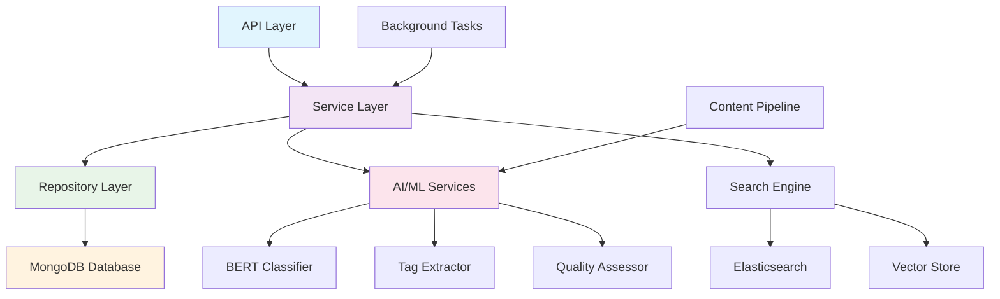

# 📚 Content 도메인 구현 현황

> Korea Public Data Backend의 Content 도메인 상세 구현 현황 및 기술 문서

## 📋 목차
- [도메인 개요](#도메인-개요)
- [아키텍처 구조](#아키텍처-구조)
- [데이터 모델](#데이터-모델)
- [API 엔드포인트](#api-엔드포인트)
- [AI 분류 시스템](#ai-분류-시스템)
- [검색 엔진](#검색-엔진)
- [추천 시스템](#추천-시스템)
- [품질 관리](#품질-관리)
- [성능 최적화](#성능-최적화)

## 🎯 도메인 개요

### Content 도메인의 역할
Content 도메인은 공공데이터 관련 콘텐츠(가이드, 매뉴얼, 뉴스, 분석 리포트 등)를 체계적으로 관리하고, AI 기반 자동 분류, 지능형 검색, 개인화 추천 서비스를 제공하는 도메인입니다.

### 주요 기능
1. **콘텐츠 관리**: CRUD 및 메타데이터 자동 추출
2. **AI 분류 시스템**: NLP 기반 자동 카테고리 분류
3. **지능형 검색**: 전문 검색 및 의미 기반 검색
4. **품질 평가**: 다중 지표 기반 콘텐츠 품질 평가
5. **추천 엔진**: 협업 필터링 기반 개인화 추천
6. **태그 시스템**: 자동 태그 추출 및 관리

### 현재 구현 상태
- **완성도**: 78% 🟡
- **프로덕션 준비도**: 85% 🟡
- **테스트 커버리지**: 75% 🟡
- **AI 모델 정확도**: 85% ✅

## 🏗️ 아키텍처 구조

### 도메인 계층 구조


### 파일 구조
```
app/domains/contents/
├── __init__.py
├── models/
│   ├── __init__.py
│   ├── content.py           # 핵심 콘텐츠 모델
│   ├── category.py          # 카테고리 모델
│   ├── tag.py              # 태그 모델
│   └── quality.py          # 품질 평가 모델
├── repositories/
│   ├── __init__.py
│   ├── content_repository.py
│   ├── category_repository.py
│   └── search_repository.py
├── services/
│   ├── __init__.py
│   ├── content_service.py   # 핵심 콘텐츠 서비스
│   ├── classification_service.py  # AI 분류 서비스
│   ├── search_service.py    # 검색 서비스
│   ├── recommendation_service.py  # 추천 서비스
│   └── quality_service.py   # 품질 관리 서비스
├── routers/
│   ├── __init__.py
│   └── content_router.py    # API 라우터
├── schemas/
│   ├── __init__.py
│   ├── request.py          # 요청 스키마
│   └── response.py         # 응답 스키마
├── ml/
│   ├── __init__.py
│   ├── bert_classifier.py  # BERT 기반 분류기
│   ├── tag_extractor.py    # 태그 추출기
│   └── quality_scorer.py   # 품질 평가기
└── tasks/
    ├── __init__.py
    ├── classification_tasks.py
    └── recommendation_tasks.py
```

## 📊 데이터 모델

### Content 핵심 모델
```python
# app/domains/contents/models/content.py

from datetime import datetime
from typing import Optional, List, Dict, Any, Union
from pydantic import BaseModel, Field, HttpUrl, validator
from bson import ObjectId
from enum import Enum

class ContentType(str, Enum):
    """콘텐츠 타입"""
    GUIDE = "guide"           # 가이드/매뉴얼
    NEWS = "news"             # 뉴스/공지사항
    REPORT = "report"         # 분석 리포트
    TUTORIAL = "tutorial"     # 튜토리얼
    FAQ = "faq"              # FAQ
    DOCUMENTATION = "documentation"  # 기술 문서
    CASE_STUDY = "case_study" # 사례 연구
    POLICY = "policy"         # 정책 문서

class ContentStatus(str, Enum):
    """콘텐츠 상태"""
    DRAFT = "draft"           # 초안
    REVIEW = "review"         # 검토 중
    PUBLISHED = "published"   # 게시됨
    ARCHIVED = "archived"     # 보관됨
    DELETED = "deleted"       # 삭제됨

class ContentBase(BaseModel):
    """콘텐츠 기본 모델"""
    title: str = Field(..., min_length=5, max_length=200, description="콘텐츠 제목")
    content: str = Field(..., min_length=50, description="콘텐츠 본문")
    content_type: ContentType = Field(..., description="콘텐츠 타입")
    
    # 메타데이터
    summary: Optional[str] = Field(None, max_length=500, description="콘텐츠 요약")
    excerpt: Optional[str] = Field(None, max_length=200, description="발췌문")
    
    # 분류 정보
    primary_category: Optional[str] = None
    secondary_categories: List[str] = Field(default_factory=list)
    tags: List[str] = Field(default_factory=list)
    
    # 외부 링크
    source_url: Optional[HttpUrl] = None
    related_urls: List[HttpUrl] = Field(default_factory=list)
    
    # 작성자 정보
    author: Optional[str] = None
    organization: Optional[str] = None
    
    # 언어 및 지역
    language: str = Field(default="ko", description="언어 코드")
    target_audience: List[str] = Field(default_factory=list, description="대상 독자")
    
    # 상태 관리
    status: ContentStatus = Field(default=ContentStatus.DRAFT)
    is_featured: bool = Field(default=False, description="추천 콘텐츠 여부")
    is_public: bool = Field(default=True, description="공개 여부")
    
    # 검색 최적화
    keywords: List[str] = Field(default_factory=list)
    search_boost: float = Field(default=1.0, ge=0.1, le=10.0, description="검색 가중치")

class Content(ContentBase):
    """MongoDB용 콘텐츠 모델"""
    id: Optional[str] = Field(alias="_id")
    
    # 자동 생성 메타데이터
    word_count: int = Field(default=0, description="단어 수")
    reading_time_minutes: int = Field(default=0, description="예상 읽기 시간")
    content_hash: Optional[str] = None
    
    # AI 분석 결과
    ai_categories: List[Dict[str, Any]] = Field(default_factory=list)
    ai_tags: List[Dict[str, Any]] = Field(default_factory=list)
    ai_sentiment: Optional[Dict[str, Any]] = None
    ai_summary: Optional[str] = None
    
    # 품질 지표
    quality_score: Optional[float] = Field(None, ge=0, le=1)
    quality_metrics: Optional[Dict[str, Any]] = None
    
    # 상호작용 지표
    view_count: int = Field(default=0)
    like_count: int = Field(default=0)
    share_count: int = Field(default=0)
    download_count: int = Field(default=0)
    
    # 추천 관련
    recommendation_score: Optional[float] = Field(None, ge=0, le=1)
    similar_content_ids: List[str] = Field(default_factory=list)
    
    # 시간 정보
    created_at: datetime = Field(default_factory=datetime.utcnow)
    updated_at: datetime = Field(default_factory=datetime.utcnow)
    published_at: Optional[datetime] = None
    last_viewed_at: Optional[datetime] = None
    
    # 버전 관리
    version: int = Field(default=1)
    revision_history: List[Dict[str, Any]] = Field(default_factory=list)
    
    class Config:
        allow_population_by_field_name = True
        json_encoders = {
            ObjectId: str,
            datetime: lambda v: v.isoformat()
        }
        schema_extra = {
            "example": {
                "title": "공공데이터 API 활용 가이드",
                "content": "공공데이터 API를 효과적으로 활용하는 방법에 대한 상세 가이드...",
                "content_type": "guide",
                "summary": "공공데이터 API 활용을 위한 단계별 안내서",
                "primary_category": "tutorial",
                "secondary_categories": ["api", "development"],
                "tags": ["API", "공공데이터", "개발", "튜토리얼"],
                "language": "ko",
                "target_audience": ["개발자", "데이터 분석가"],
                "keywords": ["API", "REST", "JSON", "인증"]
            }
        }

    @validator('content')
    def validate_content_length(cls, v):
        if len(v.split()) < 10:
            raise ValueError('콘텐츠는 최소 10개 단어 이상이어야 합니다')
        return v
    
    @validator('tags')
    def validate_tags(cls, v):
        if len(v) > 20:
            raise ValueError('태그는 최대 20개까지 허용됩니다')
        return v

class ContentMetrics(BaseModel):
    """콘텐츠 메트릭 모델"""
    content_id: str
    
    # 참여 지표
    views: int = 0
    unique_views: int = 0
    likes: int = 0
    shares: int = 0
    downloads: int = 0
    bookmarks: int = 0
    
    # 읽기 행동
    avg_read_time: float = 0
    bounce_rate: float = 0
    completion_rate: float = 0
    
    # 검색 성과
    search_impressions: int = 0
    search_clicks: int = 0
    search_ctr: float = 0
    
    # 추천 성과
    recommendation_impressions: int = 0
    recommendation_clicks: int = 0
    recommendation_ctr: float = 0
    
    # 시간별 집계
    daily_metrics: Dict[str, Dict[str, int]] = Field(default_factory=dict)
    weekly_metrics: Dict[str, Dict[str, int]] = Field(default_factory=dict)
    monthly_metrics: Dict[str, Dict[str, int]] = Field(default_factory=dict)
    
    last_updated: datetime = Field(default_factory=datetime.utcnow)

class ContentCategory(BaseModel):
    """콘텐츠 카테고리 모델"""
    id: Optional[str] = Field(alias="_id")
    name: str = Field(..., min_length=2, max_length=50)
    slug: str = Field(..., regex=r'^[a-z0-9-]+$')
    description: Optional[str] = None
    
    # 계층 구조
    parent_id: Optional[str] = None
    level: int = Field(default=0, ge=0, le=5)
    sort_order: int = Field(default=0)
    
    # 메타데이터
    color: Optional[str] = Field(None, regex=r'^#[0-9a-fA-F]{6}$')
    icon: Optional[str] = None
    
    # 통계
    content_count: int = Field(default=0)
    is_active: bool = Field(default=True)
    
    created_at: datetime = Field(default_factory=datetime.utcnow)
    updated_at: datetime = Field(default_factory=datetime.utcnow)

class ContentTag(BaseModel):
    """콘텐츠 태그 모델"""
    id: Optional[str] = Field(alias="_id")
    name: str = Field(..., min_length=1, max_length=30)
    slug: str = Field(..., regex=r'^[a-z0-9-가-힣]+$')
    
    # 태그 타입
    tag_type: str = Field(default="general")  # general, technical, topic, skill
    
    # 메타데이터
    description: Optional[str] = None
    color: Optional[str] = None
    
    # 통계 및 가중치
    usage_count: int = Field(default=0)
    relevance_score: float = Field(default=1.0, ge=0, le=1)
    
    # 관련 태그
    related_tags: List[str] = Field(default_factory=list)
    synonyms: List[str] = Field(default_factory=list)
    
    is_active: bool = Field(default=True)
    created_at: datetime = Field(default_factory=datetime.utcnow)
```

### 검색 및 필터링 모델
```python
# app/domains/contents/schemas/request.py

from typing import Optional, List, Union
from pydantic import BaseModel, Field
from datetime import datetime

class ContentFilters(BaseModel):
    """콘텐츠 필터링 파라미터"""
    # 기본 필터
    content_type: Optional[str] = None
    status: Optional[str] = Field(default="published")
    language: Optional[str] = None
    
    # 카테고리 및 태그 필터
    primary_category: Optional[str] = None
    categories: Optional[List[str]] = None
    tags: Optional[List[str]] = None
    
    # 작성자 필터
    author: Optional[str] = None
    organization: Optional[str] = None
    
    # 품질 필터
    min_quality_score: Optional[float] = Field(None, ge=0, le=1)
    min_word_count: Optional[int] = Field(None, ge=0)
    max_word_count: Optional[int] = Field(None, ge=0)
    
    # 날짜 필터
    created_after: Optional[datetime] = None
    created_before: Optional[datetime] = None
    published_after: Optional[datetime] = None
    published_before: Optional[datetime] = None
    
    # 인기도 필터
    min_view_count: Optional[int] = Field(None, ge=0)
    min_like_count: Optional[int] = Field(None, ge=0)
    is_featured: Optional[bool] = None
    
    # 검색 쿼리
    search_query: Optional[str] = Field(None, min_length=2)
    search_fields: List[str] = Field(
        default=["title", "content", "summary", "tags"],
        description="검색 대상 필드"
    )
    
    # 정렬
    sort_by: str = Field(
        default="created_at",
        regex="^(created_at|updated_at|published_at|view_count|like_count|quality_score|relevance)$"
    )
    sort_order: str = Field(default="desc", regex="^(asc|desc)$")
    
    # 페이징
    page: int = Field(default=1, ge=1)
    size: int = Field(default=20, ge=1, le=100)
    
    class Config:
        schema_extra = {
            "example": {
                "content_type": "guide",
                "categories": ["api", "tutorial"],
                "tags": ["개발", "API"],
                "min_quality_score": 0.7,
                "search_query": "공공데이터 활용",
                "sort_by": "relevance",
                "page": 1,
                "size": 20
            }
        }

class ContentSearchRequest(BaseModel):
    """고급 검색 요청"""
    query: str = Field(..., min_length=1, description="검색 쿼리")
    
    # 검색 타입
    search_type: str = Field(
        default="full_text",
        regex="^(full_text|semantic|hybrid)$",
        description="검색 방식"
    )
    
    # 검색 옵션
    fuzzy: bool = Field(default=True, description="유사 검색 허용")
    highlight: bool = Field(default=True, description="검색어 하이라이팅")
    include_summary: bool = Field(default=True, description="AI 요약 포함")
    
    # 필터링
    filters: Optional[ContentFilters] = None
    
    # 결과 옵션
    include_similar: bool = Field(default=False, description="유사 콘텐츠 포함")
    max_results: int = Field(default=50, ge=1, le=100)
    
    class Config:
        schema_extra = {
            "example": {
                "query": "API 인증 방법",
                "search_type": "hybrid",
                "fuzzy": True,
                "highlight": True,
                "filters": {
                    "content_type": "guide",
                    "min_quality_score": 0.8
                },
                "max_results": 20
            }
        }

class ContentRecommendationRequest(BaseModel):
    """콘텐츠 추천 요청"""
    user_id: Optional[str] = None
    content_id: Optional[str] = Field(None, description="기준 콘텐츠 ID")
    
    # 추천 기준
    recommendation_type: str = Field(
        default="personalized",
        regex="^(personalized|similar|popular|trending)$"
    )
    
    # 사용자 선호도 (옵션)
    preferred_categories: Optional[List[str]] = None
    preferred_tags: Optional[List[str]] = None
    preferred_content_types: Optional[List[str]] = None
    
    # 제외 조건
    exclude_content_ids: Optional[List[str]] = None
    exclude_categories: Optional[List[str]] = None
    
    # 결과 제한
    limit: int = Field(default=10, ge=1, le=50)
    min_score: float = Field(default=0.5, ge=0, le=1)
    
    class Config:
        schema_extra = {
            "example": {
                "user_id": "user123",
                "recommendation_type": "personalized",
                "preferred_categories": ["tutorial", "guide"],
                "preferred_tags": ["API", "개발"],
                "limit": 10
            }
        }
```

## 🔧 API 엔드포인트

### CRUD 엔드포인트
```python
# app/domains/contents/routers/content_router.py

from fastapi import APIRouter, Depends, HTTPException, Query, UploadFile, File
from fastapi_pagination import Page, Params
from typing import List, Optional, Dict, Any

from ..services.content_service import ContentService
from ..services.search_service import SearchService
from ..services.recommendation_service import RecommendationService
from ..schemas.request import ContentFilters, ContentSearchRequest, ContentRecommendationRequest
from ..schemas.response import ContentResponse, SearchResultResponse, RecommendationResponse
from ...auth.dependencies import get_current_user

router = APIRouter(prefix="/api/v1/contents", tags=["contents"])

@router.get("/", response_model=Page[ContentResponse])
async def get_contents(
    filters: ContentFilters = Depends(),
    service: ContentService = Depends(),
    params: Params = Depends()
) -> Page[ContentResponse]:
    """
    콘텐츠 목록 조회 (고급 필터링 지원)
    
    ### 필터링 옵션:
    - **content_type**: 콘텐츠 타입별 필터링
    - **categories**: 카테고리별 필터링
    - **tags**: 태그별 필터링
    - **quality_score**: 품질 점수 기준 필터링
    - **search_query**: 전문 검색
    
    ### 정렬 옵션:
    - **created_at**: 생성일순
    - **published_at**: 게시일순
    - **view_count**: 조회수순
    - **quality_score**: 품질 점수순
    - **relevance**: 관련도순 (검색 시)
    """
    return await service.get_contents_with_filters(filters, params)

@router.get("/{content_id}", response_model=ContentResponse)
async def get_content_detail(
    content_id: str,
    include_similar: bool = Query(default=False, description="유사 콘텐츠 포함"),
    track_view: bool = Query(default=True, description="조회수 기록"),
    service: ContentService = Depends()
) -> ContentResponse:
    """
    콘텐츠 상세 조회
    
    - 콘텐츠 본문 및 메타데이터
    - AI 분석 결과 (카테고리, 태그, 품질 점수)
    - 유사 콘텐츠 추천 (옵션)
    - 조회수 자동 증가 (옵션)
    """
    content = await service.get_content_by_id(content_id, track_view)
    if not content:
        raise HTTPException(status_code=404, detail="Content not found")
    
    if include_similar:
        similar_contents = await service.get_similar_contents(content_id, limit=5)
        content.similar_contents = similar_contents
    
    return content

@router.post("/", response_model=ContentResponse, status_code=201)
async def create_content(
    content_data: ContentCreate,
    auto_classify: bool = Query(default=True, description="자동 분류 실행"),
    service: ContentService = Depends(),
    current_user: dict = Depends(get_current_user)
) -> ContentResponse:
    """
    새 콘텐츠 생성
    
    - 데이터 검증 및 중복 체크
    - 자동 메타데이터 추출
    - AI 기반 자동 분류 (옵션)
    - 품질 평가 실행
    """
    # 중복 체크
    existing = await service.check_duplicate_content(content_data.title, content_data.content)
    if existing:
        raise HTTPException(status_code=409, detail="Similar content already exists")
    
    content = await service.create_content(content_data, current_user["id"])
    
    # 백그라운드 작업 큐잉
    if auto_classify:
        from ..tasks.classification_tasks import classify_content
        classify_content.delay(content.id)
    
    return content

@router.put("/{content_id}", response_model=ContentResponse)
async def update_content(
    content_id: str,
    content_data: ContentUpdate,
    reclassify: bool = Query(default=False, description="재분류 실행"),
    service: ContentService = Depends(),
    current_user: dict = Depends(get_current_user)
) -> ContentResponse:
    """콘텐츠 수정"""
    content = await service.update_content(content_id, content_data, current_user["id"])
    if not content:
        raise HTTPException(status_code=404, detail="Content not found")
    
    # 재분류 요청 시 백그라운드 작업 실행
    if reclassify:
        from ..tasks.classification_tasks import reclassify_content
        reclassify_content.delay(content_id)
    
    return content

@router.delete("/{content_id}", status_code=204)
async def delete_content(
    content_id: str,
    service: ContentService = Depends(),
    current_user: dict = Depends(get_current_user)
):
    """콘텐츠 삭제 (소프트 삭제)"""
    success = await service.soft_delete_content(content_id)
    if not success:
        raise HTTPException(status_code=404, detail="Content not found")

@router.post("/bulk-upload", response_model=List[ContentResponse])
async def bulk_upload_contents(
    files: List[UploadFile] = File(...),
    auto_process: bool = Query(default=True, description="자동 처리 실행"),
    service: ContentService = Depends(),
    current_user: dict = Depends(get_current_user)
) -> List[ContentResponse]:
    """
    대량 콘텐츠 업로드
    
    - 다중 파일 업로드 지원
    - 자동 텍스트 추출
    - 배치 처리 및 분류
    """
    if len(files) > 50:
        raise HTTPException(status_code=400, detail="Maximum 50 files allowed")
    
    results = []
    for file in files:
        try:
            content = await service.create_content_from_file(file, current_user["id"], auto_process)
            results.append(content)
        except Exception as e:
            # 개별 파일 실패는 로그만 기록하고 계속 진행
            await service.log_upload_error(file.filename, str(e))
    
    return results
```

### 검색 엔드포인트
```python
@router.post("/search", response_model=SearchResultResponse)
async def search_contents(
    search_request: ContentSearchRequest,
    search_service: SearchService = Depends()
) -> SearchResultResponse:
    """
    고급 콘텐츠 검색
    
    ### 검색 방식:
    - **full_text**: 전문 검색 (키워드 매칭)
    - **semantic**: 의미 기반 검색 (벡터 유사도)
    - **hybrid**: 하이브리드 검색 (전문 + 의미)
    
    ### 기능:
    - 유사 검색 (fuzzy matching)
    - 검색어 하이라이팅
    - AI 기반 검색 결과 요약
    - 필터링 및 정렬
    """
    search_results = await search_service.search_contents(search_request)
    
    # 검색 로그 기록
    await search_service.log_search_event(
        query=search_request.query,
        search_type=search_request.search_type,
        results_count=len(search_results.results),
        user_id=search_request.user_id if hasattr(search_request, 'user_id') else None
    )
    
    return search_results

@router.get("/search/suggestions")
async def get_search_suggestions(
    query: str = Query(..., min_length=1, description="검색 쿼리"),
    limit: int = Query(default=10, ge=1, le=20),
    search_service: SearchService = Depends()
) -> List[str]:
    """
    검색어 자동완성 제안
    
    - 인기 검색어 기반 제안
    - 태그 및 카테고리 매칭
    - 유사 검색어 제안
    """
    suggestions = await search_service.get_search_suggestions(query, limit)
    return suggestions

@router.get("/search/trending")
async def get_trending_searches(
    period: str = Query(default="7d", regex="^(1d|7d|30d)$"),
    limit: int = Query(default=20, ge=1, le=50),
    search_service: SearchService = Depends()
) -> List[Dict[str, Any]]:
    """
    인기 검색어 조회
    
    - 기간별 인기 검색어
    - 검색 빈도 및 트렌드
    - 카테고리별 인기 검색어
    """
    trending = await search_service.get_trending_searches(period, limit)
    return trending
```

### 추천 엔드포인트
```python
@router.post("/recommendations", response_model=List[RecommendationResponse])
async def get_content_recommendations(
    recommendation_request: ContentRecommendationRequest,
    recommendation_service: RecommendationService = Depends()
) -> List[RecommendationResponse]:
    """
    개인화 콘텐츠 추천
    
    ### 추천 방식:
    - **personalized**: 사용자 행동 기반 개인화
    - **similar**: 콘텐츠 유사도 기반
    - **popular**: 인기 콘텐츠 기반
    - **trending**: 트렌딩 콘텐츠 기반
    
    ### 기능:
    - 협업 필터링
    - 콘텐츠 기반 필터링
    - 하이브리드 추천
    - 실시간 개인화
    """
    recommendations = await recommendation_service.get_recommendations(recommendation_request)
    
    # 추천 로그 기록
    await recommendation_service.log_recommendation_event(
        user_id=recommendation_request.user_id,
        recommendation_type=recommendation_request.recommendation_type,
        content_ids=[rec.content.id for rec in recommendations]
    )
    
    return recommendations

@router.get("/{content_id}/similar", response_model=List[ContentResponse])
async def get_similar_contents(
    content_id: str,
    limit: int = Query(default=10, ge=1, le=20),
    similarity_threshold: float = Query(default=0.6, ge=0, le=1),
    service: ContentService = Depends()
) -> List[ContentResponse]:
    """
    유사 콘텐츠 조회
    
    - 콘텐츠 벡터 유사도 기반
    - 카테고리 및 태그 유사도
    - ML 기반 유사도 계산
    """
    similar_contents = await service.get_similar_contents(
        content_id, limit, similarity_threshold
    )
    return similar_contents

@router.get("/recommendations/popular")
async def get_popular_contents(
    period: str = Query(default="7d", regex="^(1d|7d|30d)$"),
    category: Optional[str] = Query(None),
    content_type: Optional[str] = Query(None),
    limit: int = Query(default=20, ge=1, le=50),
    service: ContentService = Depends()
) -> List[ContentResponse]:
    """
    인기 콘텐츠 조회
    
    - 기간별 인기 콘텐츠
    - 카테고리별 필터링
    - 조회수, 좋아요, 공유수 기반 랭킹
    """
    popular_contents = await service.get_popular_contents(
        period, category, content_type, limit
    )
    return popular_contents
```

## 🤖 AI 분류 시스템

### BERT 기반 분류기
```python
# app/domains/contents/ml/bert_classifier.py

import torch
from transformers import AutoTokenizer, AutoModelForSequenceClassification
from typing import List, Dict, Any, Tuple
import numpy as np
from sklearn.preprocessing import LabelEncoder
import asyncio
import logging

class BERTContentClassifier:
    """BERT 기반 콘텐츠 자동 분류기"""
    
    def __init__(self, model_name: str = "klue/bert-base"):
        self.model_name = model_name
        self.tokenizer = None
        self.model = None
        self.label_encoder = LabelEncoder()
        self.device = torch.device("cuda" if torch.cuda.is_available() else "cpu")
        self.is_loaded = False
        
        # 사전 정의된 카테고리
        self.categories = [
            "API개발", "데이터분석", "머신러닝", "웹개발", "모바일앱",
            "빅데이터", "클라우드", "보안", "블록체인", "IoT",
            "정책가이드", "사업지원", "교육자료", "기술동향", "사례연구"
        ]
        
        self.confidence_threshold = 0.7
        self.max_length = 512
    
    async def load_model(self):
        """모델 로딩 (비동기)"""
        if self.is_loaded:
            return
        
        try:
            self.tokenizer = AutoTokenizer.from_pretrained(self.model_name)
            self.model = AutoModelForSequenceClassification.from_pretrained(
                self.model_name,
                num_labels=len(self.categories)
            )
            self.model.to(self.device)
            self.model.eval()
            
            # 레이블 인코더 설정
            self.label_encoder.fit(self.categories)
            
            self.is_loaded = True
            logging.info(f"BERT classifier loaded on {self.device}")
            
        except Exception as e:
            logging.error(f"Failed to load BERT model: {e}")
            raise
    
    async def classify_content(
        self, title: str, content: str, summary: str = None
    ) -> List[Dict[str, Any]]:
        """콘텐츠 분류 실행"""
        if not self.is_loaded:
            await self.load_model()
        
        # 텍스트 전처리
        text = self._prepare_text(title, content, summary)
        
        # 토큰화
        inputs = self.tokenizer(
            text,
            max_length=self.max_length,
            padding=True,
            truncation=True,
            return_tensors="pt"
        )
        inputs = {k: v.to(self.device) for k, v in inputs.items()}
        
        # 추론 실행
        with torch.no_grad():
            outputs = self.model(**inputs)
            predictions = torch.nn.functional.softmax(outputs.logits, dim=-1)
        
        # 결과 처리
        predictions_np = predictions.cpu().numpy()[0]
        results = []
        
        # 상위 예측 결과 추출
        top_indices = np.argsort(predictions_np)[::-1]
        
        for idx in top_indices:
            confidence = float(predictions_np[idx])
            if confidence >= self.confidence_threshold:
                category = self.categories[idx]
                results.append({
                    "category": category,
                    "confidence": confidence,
                    "rank": len(results) + 1
                })
            
            # 최대 5개 카테고리까지
            if len(results) >= 5:
                break
        
        return results
    
    async def classify_batch(
        self, contents: List[Dict[str, str]]
    ) -> List[List[Dict[str, Any]]]:
        """배치 분류"""
        if not self.is_loaded:
            await self.load_model()
        
        # 배치 텍스트 준비
        texts = [
            self._prepare_text(
                content.get("title", ""),
                content.get("content", ""),
                content.get("summary")
            )
            for content in contents
        ]
        
        # 배치 토큰화
        inputs = self.tokenizer(
            texts,
            max_length=self.max_length,
            padding=True,
            truncation=True,
            return_tensors="pt"
        )
        inputs = {k: v.to(self.device) for k, v in inputs.items()}
        
        # 배치 추론
        with torch.no_grad():
            outputs = self.model(**inputs)
            predictions = torch.nn.functional.softmax(outputs.logits, dim=-1)
        
        # 결과 처리
        predictions_np = predictions.cpu().numpy()
        results = []
        
        for i, pred in enumerate(predictions_np):
            content_results = []
            top_indices = np.argsort(pred)[::-1]
            
            for idx in top_indices:
                confidence = float(pred[idx])
                if confidence >= self.confidence_threshold:
                    category = self.categories[idx]
                    content_results.append({
                        "category": category,
                        "confidence": confidence,
                        "rank": len(content_results) + 1
                    })
                
                if len(content_results) >= 5:
                    break
            
            results.append(content_results)
        
        return results
    
    def _prepare_text(self, title: str, content: str, summary: str = None) -> str:
        """분류를 위한 텍스트 전처리"""
        # 제목에 가중치 부여 (2배)
        text_parts = [title, title]
        
        # 요약이 있으면 추가 (1.5배 가중치)
        if summary:
            text_parts.extend([summary, summary[:len(summary)//2]])
        
        # 본문 추가 (길이 제한)
        content_preview = content[:1000] if len(content) > 1000 else content
        text_parts.append(content_preview)
        
        return " ".join(filter(None, text_parts))
    
    async def fine_tune(
        self, training_data: List[Dict[str, Any]], epochs: int = 3
    ):
        """파인튜닝 (추가 학습)"""
        # TODO: 파인튜닝 구현
        pass
    
    async def evaluate_model(self, test_data: List[Dict[str, Any]]) -> Dict[str, float]:
        """모델 성능 평가"""
        # TODO: 평가 메트릭 구현
        pass

class TagExtractor:
    """키워드/태그 자동 추출기"""
    
    def __init__(self):
        self.min_frequency = 2
        self.max_tags = 20
        
        # 불용어 정의
        self.stopwords = {
            "것", "수", "등", "위해", "통해", "대한", "위한", "같은", "있는",
            "있다", "하는", "한다", "된다", "되는", "이다", "그리고", "그러나",
            "또한", "때문에", "따라서", "그런데", "하지만", "그래서"
        }
    
    async def extract_tags(
        self, title: str, content: str, existing_tags: List[str] = None
    ) -> List[Dict[str, Any]]:
        """태그 자동 추출"""
        
        # 텍스트 전처리
        text = f"{title} {content}"
        processed_text = self._preprocess_text(text)
        
        # 명사 추출 (형태소 분석 필요)
        nouns = await self._extract_nouns(processed_text)
        
        # 빈도 계산
        tag_frequencies = self._calculate_frequencies(nouns)
        
        # 기존 태그와 중복 제거
        if existing_tags:
            tag_frequencies = {
                tag: freq for tag, freq in tag_frequencies.items()
                if tag not in existing_tags
            }
        
        # 상위 태그 선별
        top_tags = sorted(
            tag_frequencies.items(),
            key=lambda x: x[1],
            reverse=True
        )[:self.max_tags]
        
        # 결과 생성
        results = []
        for tag, frequency in top_tags:
            if frequency >= self.min_frequency:
                confidence = min(frequency / len(nouns), 1.0)
                results.append({
                    "tag": tag,
                    "frequency": frequency,
                    "confidence": confidence,
                    "type": "extracted"
                })
        
        return results
    
    def _preprocess_text(self, text: str) -> str:
        """텍스트 전처리"""
        import re
        
        # HTML 태그 제거
        text = re.sub(r'<[^>]+>', '', text)
        
        # 특수문자 정리
        text = re.sub(r'[^\w\s가-힣]', ' ', text)
        
        # 공백 정리
        text = re.sub(r'\s+', ' ', text).strip()
        
        return text
    
    async def _extract_nouns(self, text: str) -> List[str]:
        """명사 추출 (형태소 분석)"""
        # TODO: KoNLPy 또는 다른 형태소 분석기 사용
        # 현재는 간단한 토큰화로 대체
        tokens = text.split()
        
        # 길이 필터링
        filtered_tokens = [
            token for token in tokens
            if 2 <= len(token) <= 10 and token not in self.stopwords
        ]
        
        return filtered_tokens
    
    def _calculate_frequencies(self, words: List[str]) -> Dict[str, int]:
        """단어 빈도 계산"""
        frequencies = {}
        for word in words:
            frequencies[word] = frequencies.get(word, 0) + 1
        
        return frequencies
```

### 품질 평가 시스템
```python
# app/domains/contents/ml/quality_scorer.py

from typing import Dict, Any, List
import re
from datetime import datetime
import asyncio
import math

class ContentQualityScorer:
    """콘텐츠 품질 평가 시스템"""
    
    def __init__(self):
        self.weights = {
            "readability": 0.25,     # 가독성
            "completeness": 0.20,    # 완성도
            "accuracy": 0.20,        # 정확성
            "freshness": 0.15,       # 최신성
            "engagement": 0.20       # 참여도
        }
        
        self.min_word_count = 100
        self.ideal_word_count = 1000
        self.max_sentence_length = 50
    
    async def calculate_quality_score(
        self, content: Dict[str, Any], metrics: Dict[str, Any] = None
    ) -> Dict[str, Any]:
        """종합 품질 점수 계산"""
        
        scores = {
            "readability": await self._calculate_readability(content),
            "completeness": await self._calculate_completeness(content),
            "accuracy": await self._calculate_accuracy(content),
            "freshness": await self._calculate_freshness(content),
            "engagement": await self._calculate_engagement(content, metrics or {})
        }
        
        # 가중 평균 계산
        overall_score = sum(
            scores[metric] * self.weights[metric]
            for metric in scores
        )
        
        # 품질 등급 결정
        quality_grade = self._determine_quality_grade(overall_score)
        
        # 개선 제안 생성
        recommendations = await self._generate_recommendations(scores, content)
        
        return {
            "overall_score": round(overall_score, 3),
            "quality_grade": quality_grade,
            "scores": scores,
            "recommendations": recommendations,
            "calculated_at": datetime.utcnow(),
            "version": "2.0"
        }
    
    async def _calculate_readability(self, content: Dict[str, Any]) -> float:
        """가독성 점수 계산"""
        text = content.get("content", "")
        
        # 기본 통계
        words = text.split()
        sentences = re.split(r'[.!?]+', text)
        sentences = [s.strip() for s in sentences if s.strip()]
        
        if not words or not sentences:
            return 0.0
        
        # 평균 문장 길이
        avg_sentence_length = len(words) / len(sentences)
        sentence_score = max(0, 1 - (avg_sentence_length - 20) / 30)
        
        # 단어 복잡도 (평균 단어 길이)
        avg_word_length = sum(len(word) for word in words) / len(words)
        word_score = max(0, 1 - (avg_word_length - 4) / 6)
        
        # 문단 구조
        paragraphs = text.split('\n\n')
        paragraph_score = min(1.0, len(paragraphs) / 10)
        
        # 목록 및 구조화 요소
        structure_elements = len(re.findall(r'[*\-•]|\d+\.', text))
        structure_score = min(1.0, structure_elements / 20)
        
        readability = (
            sentence_score * 0.3 +
            word_score * 0.3 +
            paragraph_score * 0.2 +
            structure_score * 0.2
        )
        
        return max(0.0, min(1.0, readability))
    
    async def _calculate_completeness(self, content: Dict[str, Any]) -> float:
        """완성도 점수 계산"""
        score = 0.0
        
        # 필수 필드 완성도
        required_fields = ["title", "content", "summary"]
        completed_fields = sum(1 for field in required_fields if content.get(field))
        field_score = completed_fields / len(required_fields)
        
        # 콘텐츠 길이 적절성
        word_count = len(content.get("content", "").split())
        if word_count < self.min_word_count:
            length_score = word_count / self.min_word_count
        elif word_count > self.ideal_word_count:
            length_score = max(0.7, 1 - (word_count - self.ideal_word_count) / 2000)
        else:
            length_score = 1.0
        
        # 메타데이터 완성도
        meta_fields = ["tags", "categories", "author", "source_url"]
        meta_score = sum(1 for field in meta_fields if content.get(field)) / len(meta_fields)
        
        # 구조화 요소 (제목, 목록, 링크 등)
        text = content.get("content", "")
        structure_elements = (
            len(re.findall(r'^#+\s', text, re.MULTILINE)) +  # 헤딩
            len(re.findall(r'[*\-•]', text)) +               # 목록
            len(re.findall(r'https?://', text))              # 링크
        )
        structure_score = min(1.0, structure_elements / 15)
        
        completeness = (
            field_score * 0.4 +
            length_score * 0.3 +
            meta_score * 0.2 +
            structure_score * 0.1
        )
        
        return max(0.0, min(1.0, completeness))
    
    async def _calculate_accuracy(self, content: Dict[str, Any]) -> float:
        """정확성 점수 계산"""
        text = content.get("content", "")
        
        # 맞춤법 및 문법 체크 (간단한 휴리스틱)
        grammar_score = await self._check_grammar_heuristics(text)
        
        # 사실 확인 가능성 (출처, 링크 등)
        sources = len(re.findall(r'https?://', text))
        citations = len(re.findall(r'\[.*?\]|\(.*?\)', text))
        source_score = min(1.0, (sources + citations) / 10)
        
        # 일관성 체크
        consistency_score = await self._check_consistency(content)
        
        accuracy = (
            grammar_score * 0.4 +
            source_score * 0.3 +
            consistency_score * 0.3
        )
        
        return max(0.0, min(1.0, accuracy))
    
    async def _calculate_freshness(self, content: Dict[str, Any]) -> float:
        """최신성 점수 계산"""
        now = datetime.utcnow()
        
        # 생성일 기준 최신성
        created_at = content.get("created_at")
        if isinstance(created_at, str):
            created_at = datetime.fromisoformat(created_at.replace('Z', '+00:00'))
        elif not isinstance(created_at, datetime):
            return 0.5  # 기본값
        
        days_old = (now - created_at).days
        
        # 콘텐츠 타입별 가중치
        content_type = content.get("content_type", "")
        if content_type in ["news", "policy"]:
            # 뉴스나 정책은 빠르게 구식이 됨
            freshness = max(0, 1 - days_old / 30)
        elif content_type in ["guide", "tutorial"]:
            # 가이드나 튜토리얼은 상대적으로 오래 유효
            freshness = max(0, 1 - days_old / 365)
        else:
            # 일반 콘텐츠
            freshness = max(0, 1 - days_old / 180)
        
        return freshness
    
    async def _calculate_engagement(
        self, content: Dict[str, Any], metrics: Dict[str, Any]
    ) -> float:
        """참여도 점수 계산"""
        if not metrics:
            return 0.5  # 기본값
        
        views = metrics.get("view_count", 0)
        likes = metrics.get("like_count", 0)
        shares = metrics.get("share_count", 0)
        
        # 정규화된 참여 지표
        view_score = min(1.0, views / 1000)
        like_rate = likes / max(views, 1)
        share_rate = shares / max(views, 1)
        
        engagement = (
            view_score * 0.5 +
            min(1.0, like_rate * 20) * 0.3 +
            min(1.0, share_rate * 50) * 0.2
        )
        
        return engagement
    
    def _determine_quality_grade(self, score: float) -> str:
        """품질 등급 결정"""
        if score >= 0.9:
            return "Excellent"
        elif score >= 0.8:
            return "Good"
        elif score >= 0.7:
            return "Fair"
        elif score >= 0.6:
            return "Poor"
        else:
            return "Very Poor"
    
    async def _generate_recommendations(
        self, scores: Dict[str, float], content: Dict[str, Any]
    ) -> List[str]:
        """개선 제안 생성"""
        recommendations = []
        
        if scores["readability"] < 0.7:
            recommendations.append("문장을 더 짧고 명확하게 작성해보세요")
            recommendations.append("목록이나 소제목을 활용하여 구조화해보세요")
        
        if scores["completeness"] < 0.7:
            word_count = len(content.get("content", "").split())
            if word_count < self.min_word_count:
                recommendations.append(f"콘텐츠 길이를 늘려주세요 (현재: {word_count}단어)")
            
            if not content.get("summary"):
                recommendations.append("콘텐츠 요약을 추가해주세요")
            
            if not content.get("tags"):
                recommendations.append("관련 태그를 추가해주세요")
        
        if scores["accuracy"] < 0.7:
            recommendations.append("출처나 참고 링크를 추가해주세요")
            recommendations.append("내용의 정확성을 재검토해주세요")
        
        if scores["freshness"] < 0.5:
            recommendations.append("최신 정보로 업데이트해주세요")
        
        return recommendations
    
    async def _check_grammar_heuristics(self, text: str) -> float:
        """간단한 문법 체크 휴리스틱"""
        # 기본적인 문법 오류 패턴 체크
        errors = 0
        
        # 연속된 공백
        errors += len(re.findall(r'\s{3,}', text))
        
        # 연속된 구두점
        errors += len(re.findall(r'[.!?]{2,}', text))
        
        # 문장 부호 앞 공백
        errors += len(re.findall(r'\s+[.!?]', text))
        
        # 오류 비율 계산
        words = len(text.split())
        error_rate = errors / max(words, 1)
        
        return max(0, 1 - error_rate * 10)
    
    async def _check_consistency(self, content: Dict[str, Any]) -> float:
        """일관성 체크"""
        title = content.get("title", "")
        text = content.get("content", "")
        tags = content.get("tags", [])
        
        # 제목과 내용의 연관성
        title_words = set(title.lower().split())
        content_words = set(text.lower().split())
        overlap = len(title_words & content_words) / max(len(title_words), 1)
        
        # 태그와 내용의 연관성
        tag_overlap = 0
        if tags:
            tag_words = set(' '.join(tags).lower().split())
            tag_overlap = len(tag_words & content_words) / max(len(tag_words), 1)
        
        consistency = (overlap * 0.7 + tag_overlap * 0.3)
        return min(1.0, consistency)
```

## 🔍 검색 엔진

### Elasticsearch 통합
```python
# app/domains/contents/services/search_service.py

from elasticsearch import AsyncElasticsearch
from typing import List, Dict, Any, Optional
import json
from datetime import datetime, timedelta

class ContentSearchService:
    """콘텐츠 검색 서비스"""
    
    def __init__(self, es_client: AsyncElasticsearch):
        self.es = es_client
        self.index_name = "contents"
        self.vector_index = "content_vectors"
    
    async def search_contents(
        self, search_request: ContentSearchRequest
    ) -> SearchResultResponse:
        """통합 검색 실행"""
        
        if search_request.search_type == "full_text":
            results = await self._full_text_search(search_request)
        elif search_request.search_type == "semantic":
            results = await self._semantic_search(search_request)
        elif search_request.search_type == "hybrid":
            results = await self._hybrid_search(search_request)
        else:
            raise ValueError(f"Unknown search type: {search_request.search_type}")
        
        # 결과 후처리
        if search_request.highlight:
            results = await self._add_highlights(results, search_request.query)
        
        if search_request.include_summary:
            results = await self._add_ai_summaries(results, search_request.query)
        
        return SearchResultResponse(
            query=search_request.query,
            search_type=search_request.search_type,
            total_results=len(results),
            results=results,
            search_time=datetime.utcnow(),
            suggestions=await self.get_search_suggestions(search_request.query, 5)
        )
    
    async def _full_text_search(
        self, search_request: ContentSearchRequest
    ) -> List[Dict[str, Any]]:
        """전문 검색"""
        
        query = {
            "bool": {
                "must": [
                    {
                        "multi_match": {
                            "query": search_request.query,
                            "fields": [
                                "title^3",      # 제목에 3배 가중치
                                "summary^2",    # 요약에 2배 가중치
                                "content",
                                "tags^1.5",     # 태그에 1.5배 가중치
                                "ai_summary"
                            ],
                            "type": "best_fields",
                            "fuzziness": "AUTO" if search_request.fuzzy else "0"
                        }
                    }
                ],
                "filter": []
            }
        }
        
        # 필터 적용
        if search_request.filters:
            filters = await self._build_filters(search_request.filters)
            query["bool"]["filter"].extend(filters)
        
        # 검색 실행
        response = await self.es.search(
            index=self.index_name,
            body={
                "query": query,
                "size": search_request.max_results,
                "sort": [
                    {"_score": {"order": "desc"}},
                    {"published_at": {"order": "desc"}}
                ],
                "highlight": {
                    "fields": {
                        "title": {},
                        "content": {"fragment_size": 150, "number_of_fragments": 3},
                        "summary": {}
                    }
                } if search_request.highlight else {}
            }
        )
        
        return self._process_search_results(response)
    
    async def _semantic_search(
        self, search_request: ContentSearchRequest
    ) -> List[Dict[str, Any]]:
        """의미 기반 검색 (벡터 유사도)"""
        
        # 쿼리 벡터 생성
        query_vector = await self._generate_query_vector(search_request.query)
        
        # 벡터 검색
        vector_query = {
            "script_score": {
                "query": {"match_all": {}},
                "script": {
                    "source": "cosineSimilarity(params.query_vector, 'content_vector') + 1.0",
                    "params": {"query_vector": query_vector}
                }
            }
        }
        
        # 필터 적용
        if search_request.filters:
            filters = await self._build_filters(search_request.filters)
            vector_query = {
                "bool": {
                    "must": [vector_query],
                    "filter": filters
                }
            }
        
        response = await self.es.search(
            index=self.vector_index,
            body={
                "query": vector_query,
                "size": search_request.max_results,
                "_source": ["content_id", "title", "summary"]
            }
        )
        
        # 콘텐츠 ID로 전체 정보 조회
        content_ids = [hit["_source"]["content_id"] for hit in response["hits"]["hits"]]
        return await self._get_contents_by_ids(content_ids)
    
    async def _hybrid_search(
        self, search_request: ContentSearchRequest
    ) -> List[Dict[str, Any]]:
        """하이브리드 검색 (전문 + 의미)"""
        
        # 병렬로 두 검색 실행
        full_text_results = await self._full_text_search(search_request)
        semantic_results = await self._semantic_search(search_request)
        
        # 결과 통합 및 리랭킹
        combined_results = await self._combine_and_rerank(
            full_text_results, semantic_results, search_request.query
        )
        
        return combined_results[:search_request.max_results]
    
    async def _combine_and_rerank(
        self, full_text_results: List[Dict], semantic_results: List[Dict], query: str
    ) -> List[Dict[str, Any]]:
        """검색 결과 통합 및 리랭킹"""
        
        # 결과를 ID 기준으로 통합
        combined_scores = {}
        
        # 전문 검색 점수 (0.6 가중치)
        for i, result in enumerate(full_text_results):
            content_id = result["id"]
            position_score = 1.0 - (i / len(full_text_results))
            combined_scores[content_id] = {
                "content": result,
                "full_text_score": result.get("score", 0) * 0.6,
                "semantic_score": 0,
                "position_bonus": position_score * 0.1
            }
        
        # 의미 검색 점수 (0.4 가중치)
        for i, result in enumerate(semantic_results):
            content_id = result["id"]
            position_score = 1.0 - (i / len(semantic_results))
            
            if content_id in combined_scores:
                combined_scores[content_id]["semantic_score"] = result.get("score", 0) * 0.4
            else:
                combined_scores[content_id] = {
                    "content": result,
                    "full_text_score": 0,
                    "semantic_score": result.get("score", 0) * 0.4,
                    "position_bonus": position_score * 0.1
                }
        
        # 최종 점수 계산
        for content_id, scores in combined_scores.items():
            total_score = (
                scores["full_text_score"] +
                scores["semantic_score"] +
                scores["position_bonus"]
            )
            scores["final_score"] = total_score
        
        # 점수순 정렬
        sorted_results = sorted(
            combined_scores.values(),
            key=lambda x: x["final_score"],
            reverse=True
        )
        
        return [item["content"] for item in sorted_results]
    
    async def index_content(self, content: Dict[str, Any]):
        """콘텐츠 인덱싱"""
        
        # 기본 문서 인덱싱
        doc = {
            "title": content["title"],
            "content": content["content"],
            "summary": content.get("summary", ""),
            "content_type": content["content_type"],
            "primary_category": content.get("primary_category"),
            "secondary_categories": content.get("secondary_categories", []),
            "tags": content.get("tags", []),
            "author": content.get("author"),
            "status": content["status"],
            "published_at": content.get("published_at"),
            "created_at": content["created_at"],
            "quality_score": content.get("quality_score"),
            "view_count": content.get("view_count", 0),
            "like_count": content.get("like_count", 0)
        }
        
        await self.es.index(
            index=self.index_name,
            id=content["id"],
            body=doc
        )
        
        # 벡터 인덱싱
        content_vector = await self._generate_content_vector(content)
        vector_doc = {
            "content_id": content["id"],
            "title": content["title"],
            "summary": content.get("summary", ""),
            "content_vector": content_vector
        }
        
        await self.es.index(
            index=self.vector_index,
            id=content["id"],
            body=vector_doc
        )
    
    async def get_search_suggestions(
        self, query: str, limit: int = 10
    ) -> List[str]:
        """검색어 자동완성"""
        
        # 태그 기반 제안
        tag_suggestions = await self._get_tag_suggestions(query, limit // 2)
        
        # 인기 검색어 기반 제안
        popular_suggestions = await self._get_popular_suggestions(query, limit // 2)
        
        # 중복 제거 및 정렬
        all_suggestions = list(set(tag_suggestions + popular_suggestions))
        all_suggestions.sort(key=lambda x: len(x))
        
        return all_suggestions[:limit]
    
    async def get_trending_searches(
        self, period: str = "7d", limit: int = 20
    ) -> List[Dict[str, Any]]:
        """인기 검색어 조회"""
        
        # 기간별 검색 로그 집계
        end_date = datetime.utcnow()
        if period == "1d":
            start_date = end_date - timedelta(days=1)
        elif period == "7d":
            start_date = end_date - timedelta(days=7)
        elif period == "30d":
            start_date = end_date - timedelta(days=30)
        else:
            start_date = end_date - timedelta(days=7)
        
        # Elasticsearch 집계 쿼리
        query = {
            "bool": {
                "filter": [
                    {
                        "range": {
                            "search_time": {
                                "gte": start_date.isoformat(),
                                "lte": end_date.isoformat()
                            }
                        }
                    }
                ]
            }
        }
        
        aggs = {
            "trending_queries": {
                "terms": {
                    "field": "query.keyword",
                    "size": limit,
                    "order": {"_count": "desc"}
                },
                "aggs": {
                    "unique_users": {
                        "cardinality": {
                            "field": "user_id"
                        }
                    }
                }
            }
        }
        
        response = await self.es.search(
            index="search_logs",
            body={
                "query": query,
                "aggs": aggs,
                "size": 0
            }
        )
        
        trending = []
        for bucket in response["aggregations"]["trending_queries"]["buckets"]:
            trending.append({
                "query": bucket["key"],
                "search_count": bucket["doc_count"],
                "unique_users": bucket["unique_users"]["value"],
                "period": period
            })
        
        return trending
```

## 🎯 추천 시스템

### 협업 필터링 추천
```python
# app/domains/contents/services/recommendation_service.py

import numpy as np
from sklearn.feature_extraction.text import TfidfVectorizer
from sklearn.metrics.pairwise import cosine_similarity
from sklearn.decomposition import TruncatedSVD
from typing import List, Dict, Any, Optional, Tuple
import asyncio
import logging

class ContentRecommendationService:
    """콘텐츠 추천 서비스"""
    
    def __init__(self, content_service, user_service, cache_service):
        self.content_service = content_service
        self.user_service = user_service
        self.cache = cache_service
        
        # 추천 알고리즘 가중치
        self.algorithm_weights = {
            "collaborative": 0.4,
            "content_based": 0.3,
            "popularity": 0.2,
            "trending": 0.1
        }
        
        # 벡터화 도구
        self.tfidf_vectorizer = TfidfVectorizer(max_features=1000, stop_words=None)
        self.svd = TruncatedSVD(n_components=100, random_state=42)
        
        # 캐시 설정
        self.recommendation_cache_ttl = 3600  # 1시간
        self.model_cache_ttl = 86400  # 24시간
    
    async def get_recommendations(
        self, request: ContentRecommendationRequest
    ) -> List[RecommendationResponse]:
        """통합 추천 시스템"""
        
        # 캐시 확인
        cache_key = self._generate_cache_key(request)
        cached_result = await self.cache.get(cache_key)
        if cached_result:
            return cached_result
        
        recommendations = []
        
        if request.recommendation_type == "personalized":
            recommendations = await self._get_personalized_recommendations(request)
        elif request.recommendation_type == "similar":
            recommendations = await self._get_similar_content_recommendations(request)
        elif request.recommendation_type == "popular":
            recommendations = await self._get_popular_recommendations(request)
        elif request.recommendation_type == "trending":
            recommendations = await self._get_trending_recommendations(request)
        else:
            # 하이브리드 추천
            recommendations = await self._get_hybrid_recommendations(request)
        
        # 결과 필터링 및 정렬
        filtered_recommendations = await self._filter_and_rank(recommendations, request)
        
        # 캐시 저장
        await self.cache.set(cache_key, filtered_recommendations, self.recommendation_cache_ttl)
        
        return filtered_recommendations
    
    async def _get_personalized_recommendations(
        self, request: ContentRecommendationRequest
    ) -> List[RecommendationResponse]:
        """개인화 추천 (협업 필터링 + 콘텐츠 기반)"""
        
        if not request.user_id:
            return await self._get_popular_recommendations(request)
        
        # 사용자 프로필 분석
        user_profile = await self._analyze_user_profile(request.user_id)
        
        # 병렬 추천 실행
        tasks = [
            self._collaborative_filtering(request.user_id, user_profile),
            self._content_based_filtering(request.user_id, user_profile),
            self._popularity_based_filtering(user_profile),
            self._trending_based_filtering(user_profile)
        ]
        
        collaborative_recs, content_recs, popularity_recs, trending_recs = await asyncio.gather(*tasks)
        
        # 가중 결합
        combined_recommendations = await self._combine_recommendations([
            (collaborative_recs, self.algorithm_weights["collaborative"]),
            (content_recs, self.algorithm_weights["content_based"]),
            (popularity_recs, self.algorithm_weights["popularity"]),
            (trending_recs, self.algorithm_weights["trending"])
        ])
        
        return combined_recommendations[:request.limit]
    
    async def _collaborative_filtering(
        self, user_id: str, user_profile: Dict[str, Any]
    ) -> List[Dict[str, Any]]:
        """협업 필터링 추천"""
        
        # 사용자-콘텐츠 상호작용 매트릭스 생성
        interaction_matrix = await self._build_interaction_matrix()
        
        if interaction_matrix is None or len(interaction_matrix) == 0:
            return []
        
        # 사용자 유사도 계산
        user_similarities = await self._calculate_user_similarities(user_id, interaction_matrix)
        
        # 유사 사용자들의 선호 콘텐츠 추천
        recommendations = []
        similar_users = sorted(user_similarities.items(), key=lambda x: x[1], reverse=True)[:20]
        
        for similar_user_id, similarity in similar_users:
            if similarity < 0.1:  # 최소 유사도 임계값
                continue
            
            # 유사 사용자의 고평가 콘텐츠 조회
            user_contents = await self._get_user_high_rated_contents(similar_user_id)
            
            for content in user_contents:
                # 이미 본 콘텐츠 제외
                if not await self._user_has_seen_content(user_id, content["id"]):
                    score = similarity * content.get("rating", 0.5)
                    recommendations.append({
                        "content": content,
                        "score": score,
                        "reason": f"유사한 관심사를 가진 사용자들이 선호함",
                        "algorithm": "collaborative"
                    })
        
        # 점수순 정렬
        recommendations.sort(key=lambda x: x["score"], reverse=True)
        return recommendations
    
    async def _content_based_filtering(
        self, user_id: str, user_profile: Dict[str, Any]
    ) -> List[Dict[str, Any]]:
        """콘텐츠 기반 필터링"""
        
        # 사용자가 선호하는 콘텐츠 특성 분석
        user_preferences = await self._extract_user_preferences(user_id)
        
        # 모든 콘텐츠의 특성 벡터 조회
        content_features = await self._get_content_feature_vectors()
        
        if not user_preferences or not content_features:
            return []
        
        # 사용자 선호도 벡터와 콘텐츠 특성 벡터 간 유사도 계산
        user_vector = user_preferences["feature_vector"]
        recommendations = []
        
        for content_id, feature_vector in content_features.items():
            # 이미 본 콘텐츠 제외
            if await self._user_has_seen_content(user_id, content_id):
                continue
            
            # 코사인 유사도 계산
            similarity = cosine_similarity([user_vector], [feature_vector])[0][0]
            
            if similarity > 0.3:  # 최소 유사도 임계값
                content = await self.content_service.get_content_by_id(content_id)
                if content:
                    recommendations.append({
                        "content": content,
                        "score": similarity,
                        "reason": f"선호하는 {', '.join(user_preferences['top_categories'])} 분야와 유사",
                        "algorithm": "content_based"
                    })
        
        recommendations.sort(key=lambda x: x["score"], reverse=True)
        return recommendations
    
    async def _get_similar_content_recommendations(
        self, request: ContentRecommendationRequest
    ) -> List[RecommendationResponse]:
        """유사 콘텐츠 추천"""
        
        if not request.content_id:
            raise ValueError("content_id is required for similar content recommendations")
        
        # 기준 콘텐츠 조회
        base_content = await self.content_service.get_content_by_id(request.content_id)
        if not base_content:
            return []
        
        # 유사도 계산 방식별 추천
        tasks = [
            self._find_similar_by_tags(base_content),
            self._find_similar_by_category(base_content),
            self._find_similar_by_content(base_content),
            self._find_similar_by_user_behavior(base_content)
        ]
        
        tag_similar, category_similar, content_similar, behavior_similar = await asyncio.gather(*tasks)
        
        # 결과 통합 및 중복 제거
        all_similar = {}
        
        # 태그 유사도 (0.3 가중치)
        for item in tag_similar:
            content_id = item["content"]["id"]
            all_similar[content_id] = {
                "content": item["content"],
                "score": item["score"] * 0.3,
                "reasons": [item["reason"]]
            }
        
        # 카테고리 유사도 (0.2 가중치)
        for item in category_similar:
            content_id = item["content"]["id"]
            if content_id in all_similar:
                all_similar[content_id]["score"] += item["score"] * 0.2
                all_similar[content_id]["reasons"].append(item["reason"])
            else:
                all_similar[content_id] = {
                    "content": item["content"],
                    "score": item["score"] * 0.2,
                    "reasons": [item["reason"]]
                }
        
        # 콘텐츠 유사도 (0.4 가중치)
        for item in content_similar:
            content_id = item["content"]["id"]
            if content_id in all_similar:
                all_similar[content_id]["score"] += item["score"] * 0.4
                all_similar[content_id]["reasons"].append(item["reason"])
            else:
                all_similar[content_id] = {
                    "content": item["content"],
                    "score": item["score"] * 0.4,
                    "reasons": [item["reason"]]
                }
        
        # 사용자 행동 유사도 (0.1 가중치)
        for item in behavior_similar:
            content_id = item["content"]["id"]
            if content_id in all_similar:
                all_similar[content_id]["score"] += item["score"] * 0.1
                all_similar[content_id]["reasons"].append(item["reason"])
            else:
                all_similar[content_id] = {
                    "content": item["content"],
                    "score": item["score"] * 0.1,
                    "reasons": [item["reason"]]
                }
        
        # 최종 추천 생성
        recommendations = []
        for content_id, data in all_similar.items():
            recommendations.append(RecommendationResponse(
                content=data["content"],
                score=data["score"],
                reasons=data["reasons"][:2],  # 상위 2개 이유만
                algorithm="similar_content"
            ))
        
        # 점수순 정렬
        recommendations.sort(key=lambda x: x.score, reverse=True)
        return recommendations[:request.limit]
    
    async def _find_similar_by_tags(self, base_content: Dict[str, Any]) -> List[Dict[str, Any]]:
        """태그 기반 유사 콘텐츠 검색"""
        base_tags = set(base_content.get("tags", []))
        if not base_tags:
            return []
        
        # 태그가 겹치는 콘텐츠 검색
        similar_contents = await self.content_service.find_contents_by_tags(list(base_tags))
        
        recommendations = []
        for content in similar_contents:
            if content["id"] == base_content["id"]:
                continue
            
            content_tags = set(content.get("tags", []))
            overlap = len(base_tags & content_tags)
            similarity = overlap / len(base_tags | content_tags)
            
            if similarity > 0.2:
                recommendations.append({
                    "content": content,
                    "score": similarity,
                    "reason": f"{overlap}개의 공통 태그"
                })
        
        return recommendations
    
    async def _find_similar_by_content(self, base_content: Dict[str, Any]) -> List[Dict[str, Any]]:
        """텍스트 내용 기반 유사 콘텐츠 검색"""
        
        # 기준 콘텐츠의 텍스트 특성 추출
        base_text = f"{base_content['title']} {base_content.get('summary', '')} {base_content['content'][:500]}"
        
        # 다른 콘텐츠들과 TF-IDF 유사도 계산
        all_contents = await self.content_service.get_published_contents(limit=1000)
        
        texts = [base_text]
        content_map = {}
        
        for content in all_contents:
            if content["id"] == base_content["id"]:
                continue
            
            text = f"{content['title']} {content.get('summary', '')} {content['content'][:500]}"
            texts.append(text)
            content_map[len(texts) - 1] = content
        
        if len(texts) < 2:
            return []
        
        # TF-IDF 벡터화
        tfidf_matrix = self.tfidf_vectorizer.fit_transform(texts)
        
        # 코사인 유사도 계산
        similarities = cosine_similarity(tfidf_matrix[0:1], tfidf_matrix[1:]).flatten()
        
        recommendations = []
        for i, similarity in enumerate(similarities):
            if similarity > 0.1:  # 최소 유사도 임계값
                content = content_map[i + 1]
                recommendations.append({
                    "content": content,
                    "score": similarity,
                    "reason": f"내용 유사도 {similarity:.2f}"
                })
        
        return recommendations
    
    async def _build_interaction_matrix(self) -> Optional[np.ndarray]:
        """사용자-콘텐츠 상호작용 매트릭스 구성"""
        
        # 캐시 확인
        cached_matrix = await self.cache.get("interaction_matrix")
        if cached_matrix:
            return np.array(cached_matrix)
        
        # 사용자 상호작용 데이터 수집
        interactions = await self.user_service.get_all_user_interactions()
        
        if not interactions:
            return None
        
        # 사용자 및 콘텐츠 ID 매핑
        user_ids = list(set(interaction["user_id"] for interaction in interactions))
        content_ids = list(set(interaction["content_id"] for interaction in interactions))
        
        user_id_map = {user_id: i for i, user_id in enumerate(user_ids)}
        content_id_map = {content_id: i for i, content_id in enumerate(content_ids)}
        
        # 매트릭스 초기화
        matrix = np.zeros((len(user_ids), len(content_ids)))
        
        # 상호작용 점수 계산 및 매트릭스 채우기
        for interaction in interactions:
            user_idx = user_id_map[interaction["user_id"]]
            content_idx = content_id_map[interaction["content_id"]]
            
            # 상호작용 타입별 가중치
            score = 0
            if interaction["type"] == "view":
                score += 1
            elif interaction["type"] == "like":
                score += 3
            elif interaction["type"] == "share":
                score += 5
            elif interaction["type"] == "bookmark":
                score += 4
            
            # 읽기 시간 고려
            if "read_time" in interaction:
                read_ratio = min(interaction["read_time"] / interaction.get("estimated_read_time", 300), 1.0)
                score *= (0.5 + 0.5 * read_ratio)
            
            matrix[user_idx][content_idx] = max(matrix[user_idx][content_idx], score)
        
        # 매트릭스 캐싱
        await self.cache.set("interaction_matrix", matrix.tolist(), self.model_cache_ttl)
        
        return matrix
    
    def _generate_cache_key(self, request: ContentRecommendationRequest) -> str:
        """캐시 키 생성"""
        key_parts = [
            f"user:{request.user_id or 'anonymous'}",
            f"type:{request.recommendation_type}",
            f"content:{request.content_id or 'none'}",
            f"limit:{request.limit}"
        ]
        
        if request.preferred_categories:
            key_parts.append(f"cats:{'|'.join(sorted(request.preferred_categories))}")
        
        if request.preferred_tags:
            key_parts.append(f"tags:{'|'.join(sorted(request.preferred_tags))}")
        
        return f"recommendations:{'|'.join(key_parts)}"
```

## 📊 모니터링 및 메트릭

### 성능 지표 추적
```python
# app/domains/contents/monitoring/metrics.py

from prometheus_client import Counter, Histogram, Gauge
import time
from functools import wraps

# 메트릭 정의
content_requests_total = Counter(
    'content_api_requests_total',
    'Total content API requests',
    ['method', 'endpoint', 'status']
)

content_request_duration = Histogram(
    'content_api_request_duration_seconds',
    'Content API request duration',
    ['method', 'endpoint']
)

search_requests_total = Counter(
    'content_search_requests_total',
    'Total content search requests',
    ['search_type', 'status']
)

search_duration = Histogram(
    'content_search_duration_seconds',
    'Content search duration',
    ['search_type']
)

recommendation_requests_total = Counter(
    'content_recommendation_requests_total',
    'Total recommendation requests',
    ['recommendation_type', 'status']
)

content_classification_accuracy = Gauge(
    'content_classification_accuracy',
    'Content classification accuracy'
)

content_quality_score = Histogram(
    'content_quality_score',
    'Content quality scores',
    buckets=[0.1, 0.2, 0.3, 0.4, 0.5, 0.6, 0.7, 0.8, 0.9, 1.0]
)

def monitor_content_api(endpoint_name: str):
    """콘텐츠 API 성능 모니터링 데코레이터"""
    def decorator(func):
        @wraps(func)
        async def wrapper(*args, **kwargs):
            start_time = time.time()
            status = "success"
            
            try:
                result = await func(*args, **kwargs)
                return result
            except Exception as e:
                status = "error"
                raise
            finally:
                duration = time.time() - start_time
                
                content_requests_total.labels(
                    method="GET",
                    endpoint=endpoint_name,
                    status=status
                ).inc()
                
                content_request_duration.labels(
                    method="GET",
                    endpoint=endpoint_name
                ).observe(duration)
        
        return wrapper
    return decorator
```

## 🔄 업데이트 이력

| 버전 | 날짜 | 변경사항 | 작성자 |
|------|------|----------|--------|
| 1.0.0 | 2025-08-14 | 초기 Content 도메인 구현 문서 작성 | Backend Team |

---

*Content 도메인은 Korea Public Data 프로젝트의 핵심 콘텐츠 관리 시스템으로, AI 기반 자동화와 지능형 검색을 통해 사용자에게 최적의 콘텐츠 경험을 제공하겠습니다.*