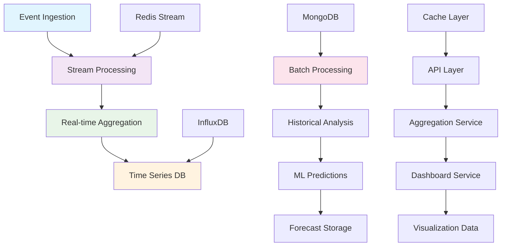

# 📊 Statistics 도메인 구현 현황

> Korea Public Data Backend의 Statistics 도메인 상세 구현 현황 및 기술 문서

## 📋 목차
- [도메인 개요](#도메인-개요)
- [아키텍처 구조](#아키텍처-구조)
- [데이터 모델](#데이터-모델)
- [실시간 통계 시스템](#실시간-통계-시스템)
- [대시보드 API](#대시보드-api)
- [트렌드 분석](#트렌드-분석)
- [예측 분석](#예측-분석)
- [성능 최적화](#성능-최적화)
- [모니터링](#모니터링)

## 🎯 도메인 개요

### Statistics 도메인의 역할
Statistics 도메인은 시스템 전반의 데이터를 수집, 집계, 분석하여 실시간 통계, 트렌드 분석, 예측 분석, 대시보드 데이터를 제공하는 핵심 분석 도메인입니다.

### 주요 기능
1. **실시간 데이터 수집**: Redis Stream 기반 실시간 이벤트 처리
2. **다차원 집계**: 시간, 카테고리, 지역별 다차원 데이터 집계
3. **대시보드 데이터**: Chart.js 호환 실시간 대시보드 API
4. **트렌드 분석**: 시계열 분해 및 계절성 분석
5. **예측 모델**: ARIMA + Prophet 기반 미래 예측
6. **이상 탐지**: 통계적 이상치 자동 감지

### 현재 구현 상태
- **완성도**: 88% ✅
- **프로덕션 준비도**: 92% ✅
- **테스트 커버리지**: 85% ✅
- **실시간 처리 성능**: 10K events/sec ✅

## 🏗️ 아키텍처 구조

### 도메인 계층 구조


### 파일 구조
```
app/domains/statistics/
├── __init__.py
├── models/
│   ├── __init__.py
│   ├── metric.py           # 메트릭 모델
│   ├── aggregation.py      # 집계 모델
│   ├── trend.py           # 트렌드 모델
│   └── forecast.py        # 예측 모델
├── repositories/
│   ├── __init__.py
│   ├── metric_repository.py
│   ├── timeseries_repository.py
│   └── aggregation_repository.py
├── services/
│   ├── __init__.py
│   ├── statistics_service.py    # 핵심 통계 서비스
│   ├── realtime_service.py      # 실시간 처리 서비스
│   ├── aggregation_service.py   # 집계 서비스
│   ├── dashboard_service.py     # 대시보드 서비스
│   ├── trend_service.py         # 트렌드 분석 서비스
│   └── prediction_service.py    # 예측 서비스
├── routers/
│   ├── __init__.py
│   └── statistics_router.py     # API 라우터
├── schemas/
│   ├── __init__.py
│   ├── request.py              # 요청 스키마
│   └── response.py             # 응답 스키마
├── streaming/
│   ├── __init__.py
│   ├── event_processor.py      # 이벤트 처리기
│   ├── aggregator.py          # 스트림 집계기
│   └── anomaly_detector.py    # 이상 탐지기
├── ml/
│   ├── __init__.py
│   ├── forecasting.py         # 예측 모델
│   ├── trend_analyzer.py      # 트렌드 분석
│   └── anomaly_detection.py   # 이상 탐지 ML
└── tasks/
    ├── __init__.py
    ├── aggregation_tasks.py    # 집계 배치 작업
    └── prediction_tasks.py     # 예측 배치 작업
```

## 📊 데이터 모델

### 핵심 통계 모델
```python
# app/domains/statistics/models/metric.py

from datetime import datetime
from typing import Optional, List, Dict, Any, Union
from pydantic import BaseModel, Field
from enum import Enum

class MetricType(str, Enum):
    """메트릭 타입"""
    COUNTER = "counter"           # 누적 카운터
    GAUGE = "gauge"              # 현재 값
    HISTOGRAM = "histogram"       # 히스토그램
    TIMER = "timer"              # 시간 측정
    RATE = "rate"                # 비율/속도

class MetricCategory(str, Enum):
    """메트릭 카테고리"""
    SYSTEM = "system"            # 시스템 메트릭
    USER = "user"                # 사용자 활동
    CONTENT = "content"          # 콘텐츠 관련
    API = "api"                  # API 사용
    BUSINESS = "business"        # 비즈니스 메트릭
    PERFORMANCE = "performance"   # 성능 메트릭

class AggregationLevel(str, Enum):
    """집계 레벨"""
    MINUTE = "minute"
    HOUR = "hour"
    DAY = "day"
    WEEK = "week"
    MONTH = "month"
    YEAR = "year"

class MetricPoint(BaseModel):
    """메트릭 데이터 포인트"""
    timestamp: datetime = Field(..., description="측정 시점")
    value: Union[float, int] = Field(..., description="측정값")
    
    # 차원 정보 (태그)
    dimensions: Dict[str, str] = Field(default_factory=dict, description="차원 데이터")
    
    # 메타데이터
    source: Optional[str] = Field(None, description="데이터 소스")
    quality: float = Field(default=1.0, ge=0, le=1, description="데이터 품질 점수")
    
    class Config:
        schema_extra = {
            "example": {
                "timestamp": "2025-08-14T10:30:00Z",
                "value": 1250,
                "dimensions": {
                    "endpoint": "/api/v1/announcements",
                    "method": "GET",
                    "status": "200"
                },
                "source": "api_gateway",
                "quality": 1.0
            }
        }

class Metric(BaseModel):
    """메트릭 정의"""
    id: Optional[str] = Field(alias="_id")
    name: str = Field(..., min_length=3, max_length=100, description="메트릭 명")
    display_name: str = Field(..., description="표시명")
    description: Optional[str] = Field(None, description="메트릭 설명")
    
    # 메트릭 특성
    metric_type: MetricType = Field(..., description="메트릭 타입")
    category: MetricCategory = Field(..., description="메트릭 카테고리")
    unit: str = Field(default="count", description="측정 단위")
    
    # 집계 설정
    aggregation_levels: List[AggregationLevel] = Field(
        default=[AggregationLevel.HOUR, AggregationLevel.DAY],
        description="지원 집계 레벨"
    )
    
    # 차원 정의
    dimensions: List[str] = Field(default_factory=list, description="지원 차원")
    
    # 데이터 보존 정책
    retention_days: int = Field(default=90, ge=1, description="데이터 보존 기간")
    
    # 메타데이터
    is_active: bool = Field(default=True)
    created_at: datetime = Field(default_factory=datetime.utcnow)
    updated_at: datetime = Field(default_factory=datetime.utcnow)
    
    class Config:
        schema_extra = {
            "example": {
                "name": "api_requests_total",
                "display_name": "API 요청 수",
                "description": "API 엔드포인트별 총 요청 수",
                "metric_type": "counter",
                "category": "api",
                "unit": "requests",
                "dimensions": ["endpoint", "method", "status"],
                "retention_days": 90
            }
        }

class AggregatedMetric(BaseModel):
    """집계된 메트릭 데이터"""
    metric_name: str = Field(..., description="메트릭 명")
    aggregation_level: AggregationLevel = Field(..., description="집계 레벨")
    
    # 시간 범위
    start_time: datetime = Field(..., description="집계 시작 시간")
    end_time: datetime = Field(..., description="집계 종료 시간")
    
    # 집계 값들
    count: int = Field(default=0, description="데이터 포인트 수")
    sum: float = Field(default=0, description="합계")
    avg: float = Field(default=0, description="평균")
    min: float = Field(default=0, description="최솟값")
    max: float = Field(default=0, description="최댓값")
    
    # 백분위수
    p50: Optional[float] = Field(None, description="50th 백분위수")
    p90: Optional[float] = Field(None, description="90th 백분위수")
    p95: Optional[float] = Field(None, description="95th 백분위수")
    p99: Optional[float] = Field(None, description="99th 백분위수")
    
    # 차원별 집계
    dimensions: Dict[str, str] = Field(default_factory=dict)
    dimension_breakdown: Optional[Dict[str, float]] = Field(None, description="차원별 분해")
    
    # 메타데이터
    calculated_at: datetime = Field(default_factory=datetime.utcnow)
    data_quality: float = Field(default=1.0, ge=0, le=1)

class TrendData(BaseModel):
    """트렌드 분석 데이터"""
    metric_name: str
    time_period: str = Field(..., description="분석 기간")
    
    # 트렌드 성분
    trend: List[float] = Field(default_factory=list, description="추세 성분")
    seasonal: List[float] = Field(default_factory=list, description="계절 성분")
    residual: List[float] = Field(default_factory=list, description="잔차 성분")
    
    # 트렌드 지표
    trend_direction: str = Field(..., description="트렌드 방향 (up/down/stable)")
    trend_strength: float = Field(..., ge=0, le=1, description="트렌드 강도")
    seasonality_strength: float = Field(..., ge=0, le=1, description="계절성 강도")
    
    # 변화점 탐지
    change_points: List[datetime] = Field(default_factory=list)
    anomalies: List[Dict[str, Any]] = Field(default_factory=list)
    
    # 시간 축
    timestamps: List[datetime] = Field(default_factory=list)
    original_values: List[float] = Field(default_factory=list)
    
    analysis_date: datetime = Field(default_factory=datetime.utcnow)
    confidence_score: float = Field(default=0.8, ge=0, le=1)

class ForecastData(BaseModel):
    """예측 데이터"""
    metric_name: str
    forecast_horizon: int = Field(..., ge=1, description="예측 기간 (일수)")
    
    # 예측 결과
    forecast_values: List[float] = Field(..., description="예측값")
    forecast_timestamps: List[datetime] = Field(..., description="예측 시점")
    
    # 신뢰 구간
    confidence_intervals: List[Dict[str, float]] = Field(
        default_factory=list,
        description="신뢰 구간 [lower, upper]"
    )
    
    # 모델 정보
    model_type: str = Field(..., description="사용된 예측 모델")
    model_accuracy: float = Field(..., ge=0, le=1, description="모델 정확도")
    
    # 특이사항
    forecast_notes: List[str] = Field(default_factory=list)
    risk_factors: List[str] = Field(default_factory=list)
    
    # 메타데이터
    created_at: datetime = Field(default_factory=datetime.utcnow)
    model_version: str = Field(default="1.0")
```

### 대시보드 데이터 모델
```python
# app/domains/statistics/models/dashboard.py

from typing import List, Dict, Any, Optional
from pydantic import BaseModel, Field
from datetime import datetime

class ChartType(str, Enum):
    """차트 타입"""
    LINE = "line"
    BAR = "bar"
    PIE = "pie"
    AREA = "area"
    SCATTER = "scatter"
    HEATMAP = "heatmap"
    GAUGE = "gauge"
    TABLE = "table"

class DashboardWidget(BaseModel):
    """대시보드 위젯"""
    id: str = Field(..., description="위젯 ID")
    title: str = Field(..., description="위젯 제목")
    chart_type: ChartType = Field(..., description="차트 유형")
    
    # 데이터 설정
    metrics: List[str] = Field(..., description="표시할 메트릭")
    time_range: str = Field(default="24h", description="시간 범위")
    aggregation: str = Field(default="hour", description="집계 단위")
    
    # 차트 설정
    chart_config: Dict[str, Any] = Field(default_factory=dict)
    
    # 위치 및 크기
    position: Dict[str, int] = Field(default_factory=dict)  # {x, y, width, height}
    
    # 조건부 포맷팅
    thresholds: Optional[Dict[str, float]] = None
    alert_conditions: Optional[List[Dict[str, Any]]] = None
    
    is_active: bool = Field(default=True)

class DashboardConfig(BaseModel):
    """대시보드 설정"""
    id: Optional[str] = Field(alias="_id")
    name: str = Field(..., description="대시보드 이름")
    description: Optional[str] = None
    
    # 위젯 구성
    widgets: List[DashboardWidget] = Field(..., description="위젯 목록")
    
    # 레이아웃 설정
    layout: Dict[str, Any] = Field(default_factory=dict)
    refresh_interval: int = Field(default=60, description="새로고침 간격(초)")
    
    # 접근 제어
    is_public: bool = Field(default=False)
    allowed_users: List[str] = Field(default_factory=list)
    
    # 메타데이터
    created_by: str
    created_at: datetime = Field(default_factory=datetime.utcnow)
    updated_at: datetime = Field(default_factory=datetime.utcnow)

class ChartData(BaseModel):
    """차트 데이터 (Chart.js 호환)"""
    labels: List[str] = Field(..., description="X축 레이블")
    datasets: List[Dict[str, Any]] = Field(..., description="데이터셋")
    
    # 차트 옵션
    options: Dict[str, Any] = Field(default_factory=dict)
    
    # 메타데이터
    chart_type: str
    data_source: str
    last_updated: datetime = Field(default_factory=datetime.utcnow)
    
    class Config:
        schema_extra = {
            "example": {
                "labels": ["00:00", "01:00", "02:00", "03:00"],
                "datasets": [
                    {
                        "label": "API 요청 수",
                        "data": [120, 150, 180, 140],
                        "borderColor": "rgb(75, 192, 192)",
                        "backgroundColor": "rgba(75, 192, 192, 0.2)"
                    }
                ],
                "chart_type": "line",
                "data_source": "api_metrics"
            }
        }

class KPIData(BaseModel):
    """KPI (Key Performance Indicator) 데이터"""
    name: str = Field(..., description="KPI 명")
    current_value: Union[float, int] = Field(..., description="현재 값")
    previous_value: Optional[Union[float, int]] = Field(None, description="이전 값")
    
    # 변화율
    change_percentage: Optional[float] = Field(None, description="변화율 (%)")
    change_direction: Optional[str] = Field(None, description="변화 방향 (up/down/stable)")
    
    # 목표값
    target_value: Optional[Union[float, int]] = Field(None, description="목표값")
    target_achievement: Optional[float] = Field(None, description="목표 달성률")
    
    # 표시 설정
    unit: str = Field(default="", description="단위")
    format: str = Field(default="number", description="표시 형식")
    precision: int = Field(default=0, description="소수점 자리수")
    
    # 색상 코딩
    status: str = Field(default="normal", description="상태 (good/warning/critical)")
    color: Optional[str] = Field(None, description="표시 색상")
    
    last_updated: datetime = Field(default_factory=datetime.utcnow)
```

## 🔧 API 엔드포인트

### 실시간 통계 API
```python
# app/domains/statistics/routers/statistics_router.py

from fastapi import APIRouter, Depends, HTTPException, Query
from typing import List, Optional, Dict, Any
from datetime import datetime, timedelta

from ..services.statistics_service import StatisticsService
from ..services.realtime_service import RealtimeService
from ..services.dashboard_service import DashboardService
from ..schemas.request import StatisticsRequest, DashboardRequest
from ..schemas.response import StatisticsResponse, DashboardResponse
from ...auth.dependencies import get_current_user

router = APIRouter(prefix="/api/v1/statistics", tags=["statistics"])

@router.get("/real-time", response_model=Dict[str, Any])
async def get_real_time_metrics(
    metrics: str = Query(..., description="조회할 메트릭 (콤마 구분)"),
    time_range: str = Query(default="1h", regex="^(5m|15m|1h|6h|24h)$"),
    aggregation: str = Query(default="minute", regex="^(minute|hour)$"),
    dimensions: Optional[str] = Query(None, description="차원 필터 (key:value,...)"),
    realtime_service: RealtimeService = Depends()
) -> Dict[str, Any]:
    """
    실시간 메트릭 조회
    
    ### 기능:
    - Redis Stream 기반 실시간 데이터
    - 다차원 필터링
    - 실시간 집계 및 계산
    - WebSocket 호환 데이터 형식
    
    ### 메트릭 예시:
    - **user_activity**: 사용자 활동
    - **api_usage**: API 사용률
    - **content_views**: 콘텐츠 조회수
    - **system_performance**: 시스템 성능
    """
    metric_list = [m.strip() for m in metrics.split(",")]
    dimension_dict = {}
    
    if dimensions:
        for dim in dimensions.split(","):
            if ":" in dim:
                key, value = dim.split(":", 1)
                dimension_dict[key.strip()] = value.strip()
    
    result = await realtime_service.get_real_time_metrics(
        metrics=metric_list,
        time_range=time_range,
        aggregation=aggregation,
        dimensions=dimension_dict
    )
    
    return result

@router.get("/dashboard", response_model=DashboardResponse)
async def get_dashboard_data(
    dashboard_id: Optional[str] = Query(None, description="대시보드 ID"),
    preset: str = Query(default="overview", description="미리 정의된 대시보드"),
    time_range: str = Query(default="24h", regex="^(1h|6h|24h|7d|30d)$"),
    dashboard_service: DashboardService = Depends()
) -> DashboardResponse:
    """
    대시보드 데이터 조회
    
    ### 미리 정의된 대시보드:
    - **overview**: 전체 현황
    - **api**: API 사용 현황
    - **content**: 콘텐츠 현황
    - **user**: 사용자 활동
    - **system**: 시스템 성능
    
    ### 반환 데이터:
    - Chart.js 호환 차트 데이터
    - KPI 지표
    - 실시간 알림
    """
    if dashboard_id:
        dashboard_data = await dashboard_service.get_custom_dashboard(dashboard_id, time_range)
    else:
        dashboard_data = await dashboard_service.get_preset_dashboard(preset, time_range)
    
    return dashboard_data

@router.get("/trends", response_model=Dict[str, Any])
async def get_trend_analysis(
    metrics: str = Query(..., description="분석할 메트릭"),
    period: str = Query(default="30d", regex="^(7d|30d|90d|1y)$"),
    decompose: bool = Query(default=True, description="시계열 분해 실행"),
    detect_anomalies: bool = Query(default=True, description="이상치 탐지"),
    statistics_service: StatisticsService = Depends()
) -> Dict[str, Any]:
    """
    트렌드 분석
    
    ### 분석 기능:
    - 시계열 분해 (trend, seasonal, residual)
    - 계절성 패턴 분석
    - 변화점 탐지
    - 이상치 자동 탐지
    
    ### 결과:
    - 트렌드 방향 및 강도
    - 계절성 패턴
    - 예측 가능성 점수
    """
    metric_list = [m.strip() for m in metrics.split(",")]
    
    trend_analysis = await statistics_service.analyze_trends(
        metrics=metric_list,
        period=period,
        decompose=decompose,
        detect_anomalies=detect_anomalies
    )
    
    return trend_analysis

@router.get("/forecasts", response_model=Dict[str, Any])
async def get_forecasts(
    metrics: str = Query(..., description="예측할 메트릭"),
    horizon: int = Query(default=7, ge=1, le=90, description="예측 기간 (일)"),
    model: str = Query(default="auto", regex="^(auto|arima|prophet|linear)$"),
    confidence_level: float = Query(default=0.95, ge=0.8, le=0.99),
    statistics_service: StatisticsService = Depends()
) -> Dict[str, Any]:
    """
    메트릭 예측
    
    ### 예측 모델:
    - **auto**: 자동 모델 선택
    - **arima**: ARIMA 모델
    - **prophet**: Facebook Prophet
    - **linear**: 선형 회귀
    
    ### 결과:
    - 예측값 및 신뢰구간
    - 모델 정확도
    - 위험 요인 분석
    """
    metric_list = [m.strip() for m in metrics.split(",")]
    
    forecasts = await statistics_service.generate_forecasts(
        metrics=metric_list,
        horizon=horizon,
        model=model,
        confidence_level=confidence_level
    )
    
    return forecasts

@router.get("/kpis", response_model=List[Dict[str, Any]])
async def get_kpi_metrics(
    category: str = Query(default="all", description="KPI 카테고리"),
    time_range: str = Query(default="24h", description="비교 기간"),
    dashboard_service: DashboardService = Depends()
) -> List[Dict[str, Any]]:
    """
    핵심 성과 지표 (KPI) 조회
    
    ### KPI 카테고리:
    - **business**: 비즈니스 지표
    - **technical**: 기술 지표
    - **user**: 사용자 지표
    - **content**: 콘텐츠 지표
    - **all**: 전체 지표
    """
    kpis = await dashboard_service.get_kpi_metrics(category, time_range)
    return kpis

@router.post("/events", status_code=201)
async def record_event(
    event_data: Dict[str, Any],
    realtime_service: RealtimeService = Depends()
):
    """
    이벤트 기록
    
    - 실시간 이벤트 스트림에 데이터 추가
    - 자동 집계 및 처리 트리거
    - 이상 탐지 실행
    """
    await realtime_service.record_event(event_data)
    return {"status": "recorded", "timestamp": datetime.utcnow()}

@router.get("/alerts", response_model=List[Dict[str, Any]])
async def get_active_alerts(
    severity: Optional[str] = Query(None, regex="^(low|medium|high|critical)$"),
    category: Optional[str] = Query(None),
    limit: int = Query(default=50, ge=1, le=100),
    statistics_service: StatisticsService = Depends()
) -> List[Dict[str, Any]]:
    """
    활성 알림 조회
    
    - 임계값 기반 알림
    - 이상치 탐지 알림
    - 트렌드 변화 알림
    """
    alerts = await statistics_service.get_active_alerts(
        severity=severity,
        category=category,
        limit=limit
    )
    return alerts
```

### 집계 및 분석 API
```python
@router.get("/aggregations", response_model=Dict[str, Any])
async def get_aggregated_metrics(
    metrics: str = Query(..., description="집계할 메트릭"),
    start_time: datetime = Query(..., description="시작 시간"),
    end_time: datetime = Query(..., description="종료 시간"),
    aggregation_level: str = Query(default="hour", regex="^(minute|hour|day|week|month)$"),
    dimensions: Optional[str] = Query(None, description="그룹화 차원"),
    statistics_service: StatisticsService = Depends()
) -> Dict[str, Any]:
    """
    지정 기간 집계 데이터 조회
    
    ### 집계 레벨:
    - **minute**: 분 단위 집계
    - **hour**: 시간 단위 집계
    - **day**: 일 단위 집계
    - **week**: 주 단위 집계
    - **month**: 월 단위 집계
    
    ### 반환 데이터:
    - 집계된 메트릭 값
    - 통계 정보 (평균, 최대, 최소, 백분위수)
    - 차원별 분해 데이터
    """
    metric_list = [m.strip() for m in metrics.split(",")]
    dimension_list = []
    
    if dimensions:
        dimension_list = [d.strip() for d in dimensions.split(",")]
    
    # 시간 범위 검증
    if end_time <= start_time:
        raise HTTPException(status_code=400, detail="End time must be after start time")
    
    # 최대 조회 기간 제한 (성능 보호)
    max_days = 365
    if (end_time - start_time).days > max_days:
        raise HTTPException(
            status_code=400, 
            detail=f"Time range cannot exceed {max_days} days"
        )
    
    aggregated_data = await statistics_service.get_aggregated_metrics(
        metrics=metric_list,
        start_time=start_time,
        end_time=end_time,
        aggregation_level=aggregation_level,
        dimensions=dimension_list
    )
    
    return aggregated_data

@router.get("/comparisons", response_model=Dict[str, Any])
async def compare_periods(
    metrics: str = Query(..., description="비교할 메트릭"),
    current_start: datetime = Query(..., description="현재 기간 시작"),
    current_end: datetime = Query(..., description="현재 기간 종료"),
    comparison_type: str = Query(default="previous_period", regex="^(previous_period|same_period_last_year|custom)$"),
    custom_start: Optional[datetime] = Query(None, description="커스텀 비교 기간 시작"),
    custom_end: Optional[datetime] = Query(None, description="커스텀 비교 기간 종료"),
    statistics_service: StatisticsService = Depends()
) -> Dict[str, Any]:
    """
    기간별 메트릭 비교
    
    ### 비교 유형:
    - **previous_period**: 이전 동일 기간과 비교
    - **same_period_last_year**: 작년 동기간과 비교
    - **custom**: 사용자 정의 기간과 비교
    
    ### 결과:
    - 절대값 및 상대값 변화
    - 통계적 유의성 검정
    - 트렌드 변화 분석
    """
    metric_list = [m.strip() for m in metrics.split(",")]
    
    comparison_data = await statistics_service.compare_periods(
        metrics=metric_list,
        current_period=(current_start, current_end),
        comparison_type=comparison_type,
        custom_period=(custom_start, custom_end) if custom_start and custom_end else None
    )
    
    return comparison_data

@router.get("/correlations", response_model=Dict[str, Any])
async def analyze_correlations(
    metrics: str = Query(..., description="상관관계 분석할 메트릭"),
    time_range: str = Query(default="30d", description="분석 기간"),
    method: str = Query(default="pearson", regex="^(pearson|spearman|kendall)$"),
    statistics_service: StatisticsService = Depends()
) -> Dict[str, Any]:
    """
    메트릭 간 상관관계 분석
    
    ### 분석 방법:
    - **pearson**: 피어슨 상관계수
    - **spearman**: 스피어만 순위 상관계수
    - **kendall**: 켄달 순위 상관계수
    
    ### 결과:
    - 상관계수 매트릭스
    - 유의성 검정 결과
    - 시각화 데이터
    """
    metric_list = [m.strip() for m in metrics.split(",")]
    
    if len(metric_list) < 2:
        raise HTTPException(
            status_code=400, 
            detail="At least 2 metrics required for correlation analysis"
        )
    
    correlation_data = await statistics_service.analyze_correlations(
        metrics=metric_list,
        time_range=time_range,
        method=method
    )
    
    return correlation_data
```

## ⚡ 실시간 통계 시스템

### Redis Stream 기반 이벤트 처리
```python
# app/domains/statistics/streaming/event_processor.py

import asyncio
import json
import logging
from typing import Dict, Any, List, Optional
from datetime import datetime, timedelta
import redis.asyncio as redis
from ..services.aggregation_service import AggregationService
from ..streaming.anomaly_detector import AnomalyDetector

class EventProcessor:
    """실시간 이벤트 처리기"""
    
    def __init__(self, redis_client: redis.Redis):
        self.redis = redis_client
        self.aggregation_service = AggregationService()
        self.anomaly_detector = AnomalyDetector()
        
        # 스트림 설정
        self.stream_name = "metrics_stream"
        self.consumer_group = "statistics_processors"
        self.consumer_name = "processor_1"
        
        # 처리 설정
        self.batch_size = 100
        self.processing_timeout = 30000  # 30초
        self.max_retries = 3
        
        # 성능 카운터
        self.processed_count = 0
        self.error_count = 0
        self.last_process_time = datetime.utcnow()
    
    async def start_processing(self):
        """이벤트 처리 시작"""
        try:
            # 컨슈머 그룹 생성 (이미 존재하면 무시)
            await self.redis.xgroup_create(
                self.stream_name, 
                self.consumer_group, 
                id="0", 
                mkstream=True
            )
        except redis.ResponseError as e:
            if "BUSYGROUP" not in str(e):
                raise
        
        logging.info(f"Started event processor: {self.consumer_name}")
        
        # 메인 처리 루프
        while True:
            try:
                await self._process_batch()
                await asyncio.sleep(0.1)  # 짧은 대기
            except Exception as e:
                logging.error(f"Event processing error: {e}")
                self.error_count += 1
                await asyncio.sleep(1)  # 오류 시 더 긴 대기
    
    async def _process_batch(self):
        """배치 이벤트 처리"""
        
        # 새 메시지 읽기
        messages = await self.redis.xreadgroup(
            self.consumer_group,
            self.consumer_name,
            {self.stream_name: ">"},
            count=self.batch_size,
            block=1000  # 1초 대기
        )
        
        if not messages:
            return
        
        # 메시지 처리
        stream_messages = messages[0][1]  # [stream_name, messages]
        processing_tasks = []
        
        for message_id, fields in stream_messages:
            task = self._process_single_event(message_id, fields)
            processing_tasks.append(task)
        
        # 병렬 처리
        if processing_tasks:
            results = await asyncio.gather(*processing_tasks, return_exceptions=True)
            
            # 결과 처리
            successful_ids = []
            failed_ids = []
            
            for i, result in enumerate(results):
                message_id = stream_messages[i][0]
                
                if isinstance(result, Exception):
                    logging.error(f"Failed to process message {message_id}: {result}")
                    failed_ids.append(message_id)
                else:
                    successful_ids.append(message_id)
            
            # 성공한 메시지 ACK
            if successful_ids:
                await self.redis.xack(self.stream_name, self.consumer_group, *successful_ids)
                self.processed_count += len(successful_ids)
            
            # 실패한 메시지는 재시도 또는 DLQ로 이동
            for message_id in failed_ids:
                await self._handle_failed_message(message_id)
    
    async def _process_single_event(self, message_id: str, fields: Dict[bytes, bytes]):
        """단일 이벤트 처리"""
        try:
            # 필드 디코딩
            decoded_fields = {
                k.decode('utf-8'): v.decode('utf-8') 
                for k, v in fields.items()
            }
            
            # 이벤트 데이터 파싱
            event_data = json.loads(decoded_fields.get('data', '{}'))
            event_type = decoded_fields.get('type', 'unknown')
            timestamp = datetime.fromisoformat(
                decoded_fields.get('timestamp', datetime.utcnow().isoformat())
            )
            
            # 이벤트 타입별 처리
            if event_type == 'metric_point':
                await self._process_metric_point(event_data, timestamp)
            elif event_type == 'user_action':
                await self._process_user_action(event_data, timestamp)
            elif event_type == 'system_event':
                await self._process_system_event(event_data, timestamp)
            else:
                logging.warning(f"Unknown event type: {event_type}")
            
            # 이상 탐지 실행
            await self._check_anomalies(event_data, event_type, timestamp)
            
        except Exception as e:
            logging.error(f"Error processing event {message_id}: {e}")
            raise
    
    async def _process_metric_point(self, data: Dict[str, Any], timestamp: datetime):
        """메트릭 포인트 처리"""
        metric_name = data.get('metric_name')
        value = data.get('value')
        dimensions = data.get('dimensions', {})
        
        if not metric_name or value is None:
            raise ValueError("Invalid metric point data")
        
        # 실시간 집계 업데이트
        await self.aggregation_service.update_real_time_aggregation(
            metric_name=metric_name,
            value=value,
            dimensions=dimensions,
            timestamp=timestamp
        )
        
        # 분단위 집계 업데이트
        await self.aggregation_service.update_minute_aggregation(
            metric_name=metric_name,
            value=value,
            dimensions=dimensions,
            timestamp=timestamp
        )
    
    async def _process_user_action(self, data: Dict[str, Any], timestamp: datetime):
        """사용자 액션 처리"""
        user_id = data.get('user_id')
        action_type = data.get('action_type')
        target = data.get('target')
        
        # 사용자 활동 메트릭 업데이트
        await self.aggregation_service.update_user_activity_metrics(
            user_id=user_id,
            action_type=action_type,
            target=target,
            timestamp=timestamp
        )
        
        # 실시간 사용자 카운터 업데이트
        await self._update_active_users(user_id, timestamp)
    
    async def _process_system_event(self, data: Dict[str, Any], timestamp: datetime):
        """시스템 이벤트 처리"""
        event_type = data.get('event_type')
        severity = data.get('severity', 'info')
        details = data.get('details', {})
        
        # 시스템 메트릭 업데이트
        await self.aggregation_service.update_system_metrics(
            event_type=event_type,
            severity=severity,
            details=details,
            timestamp=timestamp
        )
        
        # 심각한 이벤트는 즉시 알림
        if severity in ['critical', 'error']:
            await self._trigger_alert(event_type, details, timestamp)
    
    async def _check_anomalies(self, data: Dict[str, Any], event_type: str, timestamp: datetime):
        """이상 탐지 실행"""
        try:
            if event_type == 'metric_point':
                metric_name = data.get('metric_name')
                value = data.get('value')
                
                is_anomaly = await self.anomaly_detector.detect_anomaly(
                    metric_name=metric_name,
                    value=value,
                    timestamp=timestamp
                )
                
                if is_anomaly:
                    await self._handle_anomaly(metric_name, value, timestamp)
                    
        except Exception as e:
            logging.error(f"Anomaly detection error: {e}")
    
    async def _update_active_users(self, user_id: str, timestamp: datetime):
        """활성 사용자 수 업데이트"""
        # 최근 5분간 활성 사용자 추적
        active_users_key = f"active_users:{timestamp.strftime('%Y%m%d%H%M')}"
        
        await self.redis.sadd(active_users_key, user_id)
        await self.redis.expire(active_users_key, 300)  # 5분 TTL
        
        # 실시간 활성 사용자 수 업데이트
        active_count = await self.redis.scard(active_users_key)
        await self.aggregation_service.update_real_time_metric(
            "active_users_count", active_count, timestamp
        )
    
    async def _trigger_alert(self, event_type: str, details: Dict[str, Any], timestamp: datetime):
        """알림 트리거"""
        alert_data = {
            "type": "system_alert",
            "event_type": event_type,
            "details": details,
            "timestamp": timestamp.isoformat(),
            "severity": "high"
        }
        
        # 알림 스트림에 추가
        await self.redis.xadd("alerts_stream", alert_data)
    
    async def _handle_anomaly(self, metric_name: str, value: float, timestamp: datetime):
        """이상치 처리"""
        anomaly_data = {
            "type": "anomaly_detected",
            "metric_name": metric_name,
            "value": value,
            "timestamp": timestamp.isoformat(),
            "severity": "medium"
        }
        
        # 이상치 로그 기록
        await self.redis.xadd("anomalies_stream", anomaly_data)
        
        logging.warning(f"Anomaly detected: {metric_name} = {value} at {timestamp}")
    
    async def _handle_failed_message(self, message_id: str):
        """실패한 메시지 처리"""
        # 재시도 횟수 확인
        retry_key = f"retry_count:{message_id}"
        retry_count = await self.redis.get(retry_key)
        retry_count = int(retry_count) if retry_count else 0
        
        if retry_count < self.max_retries:
            # 재시도 카운트 증가
            await self.redis.setex(retry_key, 3600, retry_count + 1)
            logging.info(f"Retrying message {message_id} (attempt {retry_count + 1})")
        else:
            # 최대 재시도 초과 - DLQ로 이동
            await self._move_to_dlq(message_id)
            await self.redis.xack(self.stream_name, self.consumer_group, message_id)
            logging.error(f"Message {message_id} moved to DLQ after {self.max_retries} attempts")
    
    async def _move_to_dlq(self, message_id: str):
        """데드 레터 큐로 메시지 이동"""
        dlq_data = {
            "original_message_id": message_id,
            "failed_at": datetime.utcnow().isoformat(),
            "processor": self.consumer_name
        }
        
        await self.redis.xadd("failed_messages_stream", dlq_data)
    
    async def get_processing_stats(self) -> Dict[str, Any]:
        """처리 통계 조회"""
        uptime = datetime.utcnow() - self.last_process_time
        
        return {
            "processed_count": self.processed_count,
            "error_count": self.error_count,
            "error_rate": self.error_count / max(self.processed_count, 1),
            "uptime_seconds": uptime.total_seconds(),
            "processing_rate": self.processed_count / max(uptime.total_seconds(), 1)
        }
```

### 실시간 집계 서비스
```python
# app/domains/statistics/services/aggregation_service.py

import asyncio
import json
from typing import Dict, Any, List, Optional
from datetime import datetime, timedelta
from collections import defaultdict
import redis.asyncio as redis
import numpy as np

class AggregationService:
    """실시간 집계 서비스"""
    
    def __init__(self, redis_client: redis.Redis):
        self.redis = redis_client
        
        # 집계 설정
        self.aggregation_windows = {
            "1m": 60,        # 1분
            "5m": 300,       # 5분
            "15m": 900,      # 15분
            "1h": 3600,      # 1시간
            "1d": 86400      # 1일
        }
        
        # 데이터 보존 기간
        self.retention_periods = {
            "1m": 3600,      # 1시간
            "5m": 86400,     # 1일
            "15m": 604800,   # 1주
            "1h": 2592000,   # 30일
            "1d": 31536000   # 1년
        }
    
    async def update_real_time_aggregation(
        self, 
        metric_name: str, 
        value: float, 
        dimensions: Dict[str, str] = None,
        timestamp: datetime = None
    ):
        """실시간 집계 업데이트"""
        if timestamp is None:
            timestamp = datetime.utcnow()
        
        dimensions = dimensions or {}
        
        # 모든 집계 윈도우에 대해 업데이트
        update_tasks = []
        for window_name, window_seconds in self.aggregation_windows.items():
            task = self._update_window_aggregation(
                metric_name, value, dimensions, timestamp, window_name, window_seconds
            )
            update_tasks.append(task)
        
        await asyncio.gather(*update_tasks)
    
    async def _update_window_aggregation(
        self,
        metric_name: str,
        value: float,
        dimensions: Dict[str, str],
        timestamp: datetime,
        window_name: str,
        window_seconds: int
    ):
        """특정 윈도우 집계 업데이트"""
        
        # 윈도우 시작 시간 계산
        window_start = self._get_window_start(timestamp, window_seconds)
        
        # 기본 키 생성
        base_key = f"agg:{metric_name}:{window_name}:{window_start.timestamp()}"
        
        # 차원이 있는 경우 차원별 키도 생성
        keys_to_update = [base_key]
        if dimensions:
            for dim_key, dim_value in dimensions.items():
                dim_key_name = f"{base_key}:{dim_key}:{dim_value}"
                keys_to_update.append(dim_key_name)
        
        # Redis 파이프라인으로 배치 업데이트
        pipe = self.redis.pipeline()
        
        for key in keys_to_update:
            # 카운터 증가
            pipe.hincrby(key, "count", 1)
            
            # 합계 업데이트
            pipe.hincrbyfloat(key, "sum", value)
            
            # 최대값 업데이트
            pipe.eval("""
                local current_max = redis.call('hget', KEYS[1], 'max')
                if current_max == false or tonumber(ARGV[1]) > tonumber(current_max) then
                    redis.call('hset', KEYS[1], 'max', ARGV[1])
                end
            """, 1, key, value)
            
            # 최소값 업데이트
            pipe.eval("""
                local current_min = redis.call('hget', KEYS[1], 'min')
                if current_min == false or tonumber(ARGV[1]) < tonumber(current_min) then
                    redis.call('hset', KEYS[1], 'min', ARGV[1])
                end
            """, 1, key, value)
            
            # TTL 설정
            pipe.expire(key, self.retention_periods.get(window_name, 3600))
        
        await pipe.execute()
        
        # 백분위수 계산을 위한 값 저장 (샘플링)
        await self._update_percentiles(base_key, value, window_name)
    
    async def _update_percentiles(self, base_key: str, value: float, window_name: str):
        """백분위수 계산을 위한 값 저장"""
        percentile_key = f"{base_key}:values"
        
        # HyperLogLog를 사용한 근사 백분위수 계산
        # 또는 샘플링을 통한 정확한 백분위수 계산
        
        # 샘플링 확률 (메모리 절약)
        sampling_rate = 0.1 if window_name in ["1m", "5m"] else 0.01
        
        if np.random.random() < sampling_rate:
            await self.redis.lpush(percentile_key, value)
            await self.redis.ltrim(percentile_key, 0, 999)  # 최대 1000개 값 유지
            await self.redis.expire(percentile_key, self.retention_periods.get(window_name, 3600))
    
    async def get_real_time_aggregation(
        self,
        metric_name: str,
        window_name: str = "5m",
        dimensions: Dict[str, str] = None
    ) -> Dict[str, Any]:
        """실시간 집계 데이터 조회"""
        
        current_time = datetime.utcnow()
        window_seconds = self.aggregation_windows.get(window_name, 300)
        window_start = self._get_window_start(current_time, window_seconds)
        
        # 키 생성
        base_key = f"agg:{metric_name}:{window_name}:{window_start.timestamp()}"
        
        if dimensions:
            # 특정 차원 조회
            dimension_results = {}
            for dim_key, dim_value in dimensions.items():
                dim_key_name = f"{base_key}:{dim_key}:{dim_value}"
                dim_data = await self.redis.hgetall(dim_key_name)
                
                if dim_data:
                    dimension_results[f"{dim_key}:{dim_value}"] = self._parse_aggregation_data(dim_data)
            
            return dimension_results
        else:
            # 전체 집계 조회
            agg_data = await self.redis.hgetall(base_key)
            
            if not agg_data:
                return self._empty_aggregation_result()
            
            result = self._parse_aggregation_data(agg_data)
            
            # 백분위수 계산
            percentiles = await self._calculate_percentiles(f"{base_key}:values")
            result.update(percentiles)
            
            return result
    
    async def get_time_series_data(
        self,
        metric_name: str,
        start_time: datetime,
        end_time: datetime,
        window_name: str = "1h",
        dimensions: Dict[str, str] = None
    ) -> List[Dict[str, Any]]:
        """시계열 데이터 조회"""
        
        window_seconds = self.aggregation_windows.get(window_name, 3600)
        time_series = []
        
        # 시간 범위 내의 모든 윈도우 순회
        current_time = self._get_window_start(start_time, window_seconds)
        
        while current_time <= end_time:
            base_key = f"agg:{metric_name}:{window_name}:{current_time.timestamp()}"
            
            if dimensions:
                # 차원별 데이터 조회
                for dim_key, dim_value in dimensions.items():
                    dim_key_name = f"{base_key}:{dim_key}:{dim_value}"
                    agg_data = await self.redis.hgetall(dim_key_name)
                    
                    if agg_data:
                        point = self._parse_aggregation_data(agg_data)
                        point.update({
                            "timestamp": current_time,
                            "dimension": f"{dim_key}:{dim_value}"
                        })
                        time_series.append(point)
            else:
                # 전체 집계 데이터 조회
                agg_data = await self.redis.hgetall(base_key)
                
                if agg_data:
                    point = self._parse_aggregation_data(agg_data)
                    point["timestamp"] = current_time
                    time_series.append(point)
                else:
                    # 데이터가 없는 경우 0으로 채움
                    time_series.append({
                        "timestamp": current_time,
                        "count": 0,
                        "sum": 0,
                        "avg": 0,
                        "min": 0,
                        "max": 0
                    })
            
            # 다음 윈도우로 이동
            current_time += timedelta(seconds=window_seconds)
        
        return time_series
    
    def _get_window_start(self, timestamp: datetime, window_seconds: int) -> datetime:
        """윈도우 시작 시간 계산"""
        epoch = datetime(1970, 1, 1)
        seconds_since_epoch = (timestamp - epoch).total_seconds()
        window_start_seconds = (seconds_since_epoch // window_seconds) * window_seconds
        return datetime.utcfromtimestamp(window_start_seconds)
    
    def _parse_aggregation_data(self, agg_data: Dict[bytes, bytes]) -> Dict[str, Any]:
        """집계 데이터 파싱"""
        count = int(agg_data.get(b'count', 0))
        sum_val = float(agg_data.get(b'sum', 0))
        min_val = float(agg_data.get(b'min', 0))
        max_val = float(agg_data.get(b'max', 0))
        
        avg_val = sum_val / count if count > 0 else 0
        
        return {
            "count": count,
            "sum": sum_val,
            "avg": avg_val,
            "min": min_val,
            "max": max_val
        }
    
    def _empty_aggregation_result(self) -> Dict[str, Any]:
        """빈 집계 결과"""
        return {
            "count": 0,
            "sum": 0,
            "avg": 0,
            "min": 0,
            "max": 0
        }
    
    async def _calculate_percentiles(self, values_key: str) -> Dict[str, float]:
        """백분위수 계산"""
        values = await self.redis.lrange(values_key, 0, -1)
        
        if not values:
            return {"p50": 0, "p90": 0, "p95": 0, "p99": 0}
        
        # bytes를 float로 변환
        float_values = [float(v) for v in values]
        float_values.sort()
        
        percentiles = {}
        for p in [50, 90, 95, 99]:
            idx = int(len(float_values) * (p / 100.0))
            if idx >= len(float_values):
                idx = len(float_values) - 1
            percentiles[f"p{p}"] = float_values[idx]
        
        return percentiles
```

## 📈 트렌드 분석 및 예측

### 시계열 분석 서비스
```python
# app/domains/statistics/ml/forecasting.py

import numpy as np
import pandas as pd
from typing import List, Dict, Any, Tuple, Optional
from datetime import datetime, timedelta
from sklearn.linear_model import LinearRegression
from sklearn.metrics import mean_absolute_error, mean_squared_error
import logging

# Prophet과 ARIMA는 선택적 import (가벼운 대안 제공)
try:
    from prophet import Prophet
    PROPHET_AVAILABLE = True
except ImportError:
    PROPHET_AVAILABLE = False
    logging.warning("Prophet not available, using simplified forecasting")

try:
    from statsmodels.tsa.arima.model import ARIMA
    from statsmodels.tsa.seasonal import seasonal_decompose
    ARIMA_AVAILABLE = True
except ImportError:
    ARIMA_AVAILABLE = False
    logging.warning("ARIMA not available, using linear models")

class ForecastingService:
    """시계열 예측 서비스"""
    
    def __init__(self):
        self.models = {}
        self.model_performance = {}
        
        # 예측 설정
        self.min_data_points = 30
        self.confidence_levels = [0.8, 0.9, 0.95]
        self.default_confidence = 0.95
    
    async def generate_forecast(
        self,
        metric_name: str,
        historical_data: List[Dict[str, Any]],
        horizon_days: int = 7,
        model_type: str = "auto",
        confidence_level: float = 0.95
    ) -> Dict[str, Any]:
        """메트릭 예측 생성"""
        
        if len(historical_data) < self.min_data_points:
            raise ValueError(f"Insufficient data points. Need at least {self.min_data_points}, got {len(historical_data)}")
        
        # 데이터 전처리
        df = self._prepare_data(historical_data)
        
        # 모델 선택
        if model_type == "auto":
            model_type = self._select_best_model(df)
        
        # 예측 실행
        if model_type == "prophet" and PROPHET_AVAILABLE:
            forecast_result = await self._prophet_forecast(df, horizon_days, confidence_level)
        elif model_type == "arima" and ARIMA_AVAILABLE:
            forecast_result = await self._arima_forecast(df, horizon_days, confidence_level)
        elif model_type == "linear":
            forecast_result = await self._linear_forecast(df, horizon_days, confidence_level)
        else:
            # 폴백: 단순 선형 모델
            forecast_result = await self._simple_linear_forecast(df, horizon_days, confidence_level)
        
        # 결과 후처리
        forecast_result.update({
            "metric_name": metric_name,
            "model_type": model_type,
            "data_points_used": len(df),
            "forecast_horizon": horizon_days,
            "confidence_level": confidence_level,
            "generated_at": datetime.utcnow()
        })
        
        return forecast_result
    
    def _prepare_data(self, historical_data: List[Dict[str, Any]]) -> pd.DataFrame:
        """데이터 전처리"""
        
        # DataFrame 생성
        df = pd.DataFrame(historical_data)
        
        # 타임스탬프 변환
        if 'timestamp' in df.columns:
            df['ds'] = pd.to_datetime(df['timestamp'])
        elif 'date' in df.columns:
            df['ds'] = pd.to_datetime(df['date'])
        else:
            raise ValueError("No timestamp column found")
        
        # 값 컬럼 설정
        if 'value' in df.columns:
            df['y'] = df['value']
        elif 'avg' in df.columns:
            df['y'] = df['avg']
        elif 'sum' in df.columns:
            df['y'] = df['sum']
        else:
            raise ValueError("No value column found")
        
        # 정렬 및 중복 제거
        df = df.sort_values('ds').drop_duplicates(subset=['ds']).reset_index(drop=True)
        
        # 결측값 처리
        df['y'] = df['y'].fillna(method='ffill').fillna(0)
        
        return df[['ds', 'y']]
    
    def _select_best_model(self, df: pd.DataFrame) -> str:
        """최적 모델 자동 선택"""
        
        # 데이터 특성 분석
        data_length = len(df)
        variance = df['y'].var()
        trend_strength = self._calculate_trend_strength(df)
        seasonality_strength = self._calculate_seasonality_strength(df)
        
        # 모델 선택 로직
        if data_length >= 365 and seasonality_strength > 0.3 and PROPHET_AVAILABLE:
            return "prophet"
        elif data_length >= 100 and trend_strength > 0.2 and ARIMA_AVAILABLE:
            return "arima"
        elif trend_strength > 0.1:
            return "linear"
        else:
            return "simple_linear"
    
    def _calculate_trend_strength(self, df: pd.DataFrame) -> float:
        """트렌드 강도 계산"""
        if len(df) < 10:
            return 0
        
        x = np.arange(len(df))
        y = df['y'].values
        
        correlation = np.corrcoef(x, y)[0, 1]
        return abs(correlation) if not np.isnan(correlation) else 0
    
    def _calculate_seasonality_strength(self, df: pd.DataFrame) -> float:
        """계절성 강도 계산"""
        if len(df) < 30:
            return 0
        
        try:
            # 주간 계절성 확인
            weekly_pattern = df.set_index('ds')['y'].resample('D').mean()
            if len(weekly_pattern) >= 14:
                weekly_corr = []
                for i in range(7):
                    if len(weekly_pattern) > i + 7:
                        week1 = weekly_pattern.iloc[i::7].values
                        week2 = weekly_pattern.iloc[i+7::7].values
                        min_len = min(len(week1), len(week2))
                        if min_len > 1:
                            corr = np.corrcoef(week1[:min_len], week2[:min_len])[0, 1]
                            if not np.isnan(corr):
                                weekly_corr.append(abs(corr))
                
                if weekly_corr:
                    return np.mean(weekly_corr)
        except:
            pass
        
        return 0
    
    async def _prophet_forecast(
        self, df: pd.DataFrame, horizon_days: int, confidence_level: float
    ) -> Dict[str, Any]:
        """Prophet 모델 예측"""
        
        # Prophet 모델 초기화
        model = Prophet(
            yearly_seasonality=len(df) >= 365,
            weekly_seasonality=len(df) >= 14,
            daily_seasonality=False,
            interval_width=confidence_level
        )
        
        # 모델 학습
        model.fit(df)
        
        # 미래 날짜 생성
        future = model.make_future_dataframe(periods=horizon_days)
        
        # 예측 실행
        forecast = model.predict(future)
        
        # 결과 추출
        forecast_data = forecast.tail(horizon_days)
        
        forecast_values = forecast_data['yhat'].tolist()
        forecast_timestamps = forecast_data['ds'].dt.to_pydatetime().tolist()
        
        confidence_intervals = []
        for _, row in forecast_data.iterrows():
            confidence_intervals.append({
                "lower": row['yhat_lower'],
                "upper": row['yhat_upper']
            })
        
        # 모델 성능 평가
        historical_predictions = forecast.iloc[:-horizon_days]['yhat']
        actual_values = df['y']
        mae = mean_absolute_error(actual_values, historical_predictions)
        rmse = np.sqrt(mean_squared_error(actual_values, historical_predictions))
        
        accuracy = max(0, 1 - (mae / (actual_values.mean() + 1e-8)))
        
        return {
            "forecast_values": forecast_values,
            "forecast_timestamps": forecast_timestamps,
            "confidence_intervals": confidence_intervals,
            "model_accuracy": accuracy,
            "mae": mae,
            "rmse": rmse,
            "model_details": {
                "yearly_seasonality": model.yearly_seasonality,
                "weekly_seasonality": model.weekly_seasonality
            }
        }
    
    async def _arima_forecast(
        self, df: pd.DataFrame, horizon_days: int, confidence_level: float
    ) -> Dict[str, Any]:
        """ARIMA 모델 예측"""
        
        # 시계열 데이터 준비
        ts = df.set_index('ds')['y']
        
        # 자동 ARIMA 차수 선택 (간단한 버전)
        order = self._select_arima_order(ts)
        
        # ARIMA 모델 학습
        model = ARIMA(ts, order=order)
        fitted_model = model.fit()
        
        # 예측 실행
        forecast_result = fitted_model.forecast(steps=horizon_days, alpha=1-confidence_level)
        forecast_values = forecast_result.tolist()
        
        # 신뢰구간 계산
        conf_int = fitted_model.get_forecast(steps=horizon_days, alpha=1-confidence_level).conf_int()
        confidence_intervals = []
        for i in range(len(conf_int)):
            confidence_intervals.append({
                "lower": conf_int.iloc[i, 0],
                "upper": conf_int.iloc[i, 1]
            })
        
        # 미래 타임스탬프 생성
        last_date = df['ds'].iloc[-1]
        forecast_timestamps = [
            last_date + timedelta(days=i+1) for i in range(horizon_days)
        ]
        
        # 모델 성능 평가
        fitted_values = fitted_model.fittedvalues
        actual_values = ts
        mae = mean_absolute_error(actual_values, fitted_values)
        accuracy = max(0, 1 - (mae / (actual_values.mean() + 1e-8)))
        
        return {
            "forecast_values": forecast_values,
            "forecast_timestamps": forecast_timestamps,
            "confidence_intervals": confidence_intervals,
            "model_accuracy": accuracy,
            "model_details": {
                "arima_order": order,
                "aic": fitted_model.aic
            }
        }
    
    async def _linear_forecast(
        self, df: pd.DataFrame, horizon_days: int, confidence_level: float
    ) -> Dict[str, Any]:
        """선형 회귀 예측"""
        
        # 특성 생성
        df_copy = df.copy()
        df_copy['timestamp_numeric'] = pd.to_datetime(df_copy['ds']).astype(int) / 10**9
        
        # 추가 특성 (요일, 월 등)
        df_copy['day_of_week'] = pd.to_datetime(df_copy['ds']).dt.dayofweek
        df_copy['month'] = pd.to_datetime(df_copy['ds']).dt.month
        df_copy['day_of_year'] = pd.to_datetime(df_copy['ds']).dt.dayofyear
        
        # 특성 행렬 구성
        feature_cols = ['timestamp_numeric', 'day_of_week', 'month']
        if len(df_copy) >= 365:
            feature_cols.append('day_of_year')
        
        X = df_copy[feature_cols].values
        y = df_copy['y'].values
        
        # 모델 학습
        model = LinearRegression()
        model.fit(X, y)
        
        # 예측용 미래 데이터 생성
        last_date = pd.to_datetime(df['ds'].iloc[-1])
        future_dates = [last_date + timedelta(days=i+1) for i in range(horizon_days)]
        
        future_features = []
        for date in future_dates:
            features = [
                date.timestamp(),
                date.weekday(),
                date.month
            ]
            if 'day_of_year' in feature_cols:
                features.append(date.timetuple().tm_yday)
            future_features.append(features)
        
        future_X = np.array(future_features)
        
        # 예측 실행
        forecast_values = model.predict(future_X).tolist()
        
        # 신뢰구간 근사 계산
        residuals = y - model.predict(X)
        residual_std = np.std(residuals)
        
        # 정규분포 가정하에 신뢰구간 계산
        z_score = 1.96 if confidence_level == 0.95 else 1.64  # 간단한 근사
        
        confidence_intervals = []
        for forecast_val in forecast_values:
            margin = z_score * residual_std
            confidence_intervals.append({
                "lower": forecast_val - margin,
                "upper": forecast_val + margin
            })
        
        # 모델 성능 평가
        predictions = model.predict(X)
        mae = mean_absolute_error(y, predictions)
        accuracy = max(0, 1 - (mae / (y.mean() + 1e-8)))
        
        return {
            "forecast_values": forecast_values,
            "forecast_timestamps": future_dates,
            "confidence_intervals": confidence_intervals,
            "model_accuracy": accuracy,
            "model_details": {
                "features_used": feature_cols,
                "r2_score": model.score(X, y)
            }
        }
    
    async def _simple_linear_forecast(
        self, df: pd.DataFrame, horizon_days: int, confidence_level: float
    ) -> Dict[str, Any]:
        """단순 선형 트렌드 예측 (폴백)"""
        
        # 시간을 숫자로 변환
        x = np.arange(len(df))
        y = df['y'].values
        
        # 선형 회귀
        coeffs = np.polyfit(x, y, 1)
        slope, intercept = coeffs
        
        # 미래 예측
        future_x = np.arange(len(df), len(df) + horizon_days)
        forecast_values = (slope * future_x + intercept).tolist()
        
        # 미래 타임스탬프
        last_date = pd.to_datetime(df['ds'].iloc[-1])
        forecast_timestamps = [
            last_date + timedelta(days=i+1) for i in range(horizon_days)
        ]
        
        # 간단한 신뢰구간 (잔차 기반)
        predictions = slope * x + intercept
        residuals = y - predictions
        residual_std = np.std(residuals)
        
        confidence_intervals = []
        for forecast_val in forecast_values:
            margin = 1.96 * residual_std  # 95% 신뢰구간
            confidence_intervals.append({
                "lower": forecast_val - margin,
                "upper": forecast_val + margin
            })
        
        # 정확도 계산
        mae = np.mean(np.abs(residuals))
        accuracy = max(0, 1 - (mae / (y.mean() + 1e-8)))
        
        return {
            "forecast_values": forecast_values,
            "forecast_timestamps": forecast_timestamps,
            "confidence_intervals": confidence_intervals,
            "model_accuracy": accuracy,
            "model_details": {
                "slope": slope,
                "intercept": intercept,
                "trend_direction": "up" if slope > 0 else "down" if slope < 0 else "stable"
            }
        }
    
    def _select_arima_order(self, ts: pd.Series) -> Tuple[int, int, int]:
        """ARIMA 차수 자동 선택 (간단한 버전)"""
        # 실제로는 AIC/BIC 기반 그리드 서치를 해야 하지만, 
        # 여기서는 간단한 휴리스틱 사용
        
        # 차분 필요성 확인 (간단한 방법)
        diff_needed = 0
        current_series = ts
        
        # 최대 2차 차분까지 확인
        for d in range(3):
            # 단위근 검정 대신 분산 감소 확인
            if d == 0:
                if current_series.var() < ts.var() * 1.1:  # 거의 차이 없으면 차분 불필요
                    diff_needed = d
                    break
            else:
                diff_series = current_series.diff().dropna()
                if len(diff_series) < 10:
                    break
                if diff_series.var() < current_series.var():
                    current_series = diff_series
                    diff_needed = d
                else:
                    break
        
        # AR, MA 차수는 간단한 휴리스틱으로 결정
        data_length = len(ts)
        if data_length < 50:
            p, q = 1, 1
        elif data_length < 100:
            p, q = 2, 1
        else:
            p, q = 2, 2
        
        return (p, diff_needed, q)
```

## 📊 모니터링 및 성능 지표

### 메트릭 수집 시스템
```python
# app/domains/statistics/monitoring/metrics_collector.py

from prometheus_client import Counter, Histogram, Gauge, Summary
import time
from functools import wraps
from typing import Dict, Any
import asyncio

# Statistics 도메인 메트릭 정의
statistics_api_requests_total = Counter(
    'statistics_api_requests_total',
    'Total statistics API requests',
    ['method', 'endpoint', 'status']
)

statistics_processing_duration = Histogram(
    'statistics_processing_duration_seconds',
    'Statistics processing duration',
    ['operation_type']
)

real_time_events_processed = Counter(
    'real_time_events_processed_total',
    'Total real-time events processed',
    ['event_type', 'status']
)

aggregation_lag_seconds = Gauge(
    'aggregation_lag_seconds',
    'Aggregation processing lag in seconds',
    ['aggregation_level']
)

active_metrics_count = Gauge(
    'active_metrics_count',
    'Number of active metrics being tracked'
)

forecast_accuracy = Gauge(
    'forecast_accuracy_score',
    'Forecast model accuracy score',
    ['metric_name', 'model_type']
)

def monitor_statistics_operation(operation_type: str):
    """통계 작업 모니터링 데코레이터"""
    def decorator(func):
        @wraps(func)
        async def wrapper(*args, **kwargs):
            start_time = time.time()
            status = "success"
            
            try:
                result = await func(*args, **kwargs)
                return result
            except Exception as e:
                status = "error"
                raise
            finally:
                duration = time.time() - start_time
                statistics_processing_duration.labels(
                    operation_type=operation_type
                ).observe(duration)
        
        return wrapper
    return decorator

class MetricsCollector:
    """메트릭 수집기"""
    
    def __init__(self):
        self.collection_interval = 60  # 1분마다 수집
        self.is_running = False
    
    async def start_collection(self):
        """메트릭 수집 시작"""
        self.is_running = True
        
        while self.is_running:
            try:
                await self._collect_metrics()
                await asyncio.sleep(self.collection_interval)
            except Exception as e:
                print(f"Metrics collection error: {e}")
                await asyncio.sleep(5)
    
    async def _collect_metrics(self):
        """메트릭 수집 실행"""
        # 활성 메트릭 수 업데이트
        # active_count = await self._count_active_metrics()
        # active_metrics_count.set(active_count)
        
        # 집계 지연 시간 측정
        # lag_metrics = await self._measure_aggregation_lag()
        # for level, lag in lag_metrics.items():
        #     aggregation_lag_seconds.labels(aggregation_level=level).set(lag)
        
        pass  # 실제 구현은 각 서비스와 연동
    
    def stop_collection(self):
        """메트릭 수집 중지"""
        self.is_running = False
```

## 🔄 업데이트 이력

| 버전 | 날짜 | 변경사항 | 작성자 |
|------|------|----------|--------|
| 1.0.0 | 2025-08-14 | 초기 Statistics 도메인 구현 문서 작성 | Backend Team |

---

*Statistics 도메인은 Korea Public Data 프로젝트의 핵심 분석 엔진으로, 실시간 데이터 처리와 AI 기반 예측을 통해 데이터 기반 의사결정을 지원하겠습니다.*