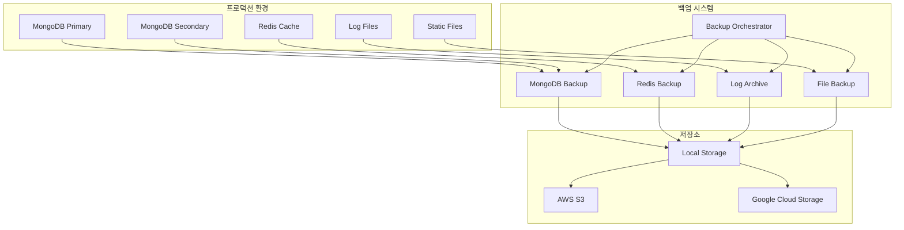

# 백업 및 복구 절차

## 개요

이 문서는 Korea Public Data API 시스템의 데이터 백업, 복구, 재해 복구 절차를 상세히 기술합니다.

## 백업 아키텍처



## 백업 전략

### 1. 백업 정책

#### 데이터 분류별 백업 정책

```yaml
backup_policy:
  critical_data:  # 사용자 데이터, 공고, 사업체 정보
    frequency: 매 4시간
    retention: 3개월
    storage: 3중화 (Local + AWS S3 + GCS)
    
  operational_data:  # 통계, 로그, 캐시
    frequency: 매일
    retention: 1개월
    storage: 2중화 (Local + AWS S3)
    
  configuration:  # 설정 파일, 스키마
    frequency: 매주
    retention: 6개월
    storage: 3중화 (Local + AWS S3 + GCS)
    
  application_code:  # 소스 코드, 도커 이미지
    frequency: 매 배포시
    retention: 1년
    storage: Git + Docker Registry
```

#### RPO/RTO 목표

```yaml
recovery_objectives:
  critical_services:
    RPO: 4시간  # 최대 데이터 손실 허용 시간
    RTO: 30분   # 최대 복구 시간
    
  standard_services:
    RPO: 24시간
    RTO: 2시간
    
  non_critical:
    RPO: 72시간
    RTO: 4시간
```

### 2. MongoDB 백업

#### 백업 스크립트

```bash
#!/bin/bash
# scripts/mongodb_backup.sh

# 환경 변수
MONGODB_URI="mongodb://localhost:27017"
MONGODB_DB="korea_public_data"
BACKUP_DIR="/backup/mongodb"
S3_BUCKET="korea-public-data-backups"
RETENTION_DAYS=90

# 날짜 기반 백업 디렉토리
BACKUP_DATE=$(date +%Y%m%d_%H%M%S)
BACKUP_PATH="${BACKUP_DIR}/${BACKUP_DATE}"

# 로깅 설정
LOG_FILE="/var/log/backup/mongodb_backup.log"
exec 1> >(tee -a ${LOG_FILE})
exec 2>&1

echo "Starting MongoDB backup at $(date)"

# 백업 디렉토리 생성
mkdir -p ${BACKUP_PATH}

# Full Backup (주 1회)
if [[ $(date +%u) -eq 1 ]]; then
    echo "Performing full backup"
    
    mongodump \
        --uri="${MONGODB_URI}" \
        --db="${MONGODB_DB}" \
        --out="${BACKUP_PATH}/full" \
        --gzip \
        --verbose
        
    if [ $? -eq 0 ]; then
        echo "Full backup completed successfully"
        
        # 압축
        tar -czf "${BACKUP_PATH}/full_backup_${BACKUP_DATE}.tar.gz" \
            -C "${BACKUP_PATH}" full/
        
        # S3 업로드
        aws s3 cp "${BACKUP_PATH}/full_backup_${BACKUP_DATE}.tar.gz" \
            "s3://${S3_BUCKET}/mongodb/full/"
            
        # 로컬 압축 해제된 파일 삭제
        rm -rf "${BACKUP_PATH}/full"
        
    else
        echo "Full backup failed" >&2
        exit 1
    fi
    
# Incremental Backup (일일)
else
    echo "Performing incremental backup"
    
    # Oplog 기반 증분 백업
    LAST_BACKUP_TIME=$(cat /tmp/last_backup_time 2>/dev/null || echo "$(date -d '1 day ago' --iso-8601=seconds)")
    
    mongodump \
        --uri="${MONGODB_URI}" \
        --db="${MONGODB_DB}" \
        --out="${BACKUP_PATH}/incremental" \
        --query="{\"_id\": {\"\$gte\": ObjectId(\"$(echo ${LAST_BACKUP_TIME} | date -f - +%s | printf '%08x00000000\n' $(cat))\") }}" \
        --gzip
        
    if [ $? -eq 0 ]; then
        echo "Incremental backup completed successfully"
        
        # 현재 시간 기록
        date --iso-8601=seconds > /tmp/last_backup_time
        
        # 압축 및 업로드
        tar -czf "${BACKUP_PATH}/incremental_backup_${BACKUP_DATE}.tar.gz" \
            -C "${BACKUP_PATH}" incremental/
            
        aws s3 cp "${BACKUP_PATH}/incremental_backup_${BACKUP_DATE}.tar.gz" \
            "s3://${S3_BUCKET}/mongodb/incremental/"
            
        rm -rf "${BACKUP_PATH}/incremental"
        
    else
        echo "Incremental backup failed" >&2
        exit 1
    fi
fi

# 로컬 백업 정리 (보존 기간 초과)
find ${BACKUP_DIR} -type d -mtime +${RETENTION_DAYS} -exec rm -rf {} +

echo "MongoDB backup completed at $(date)"
```

#### Replica Set 백업 스크립트

```bash
#!/bin/bash
# scripts/mongodb_replica_backup.sh

# Replica Set 백업 설정
PRIMARY_URI="mongodb://primary:27017"
SECONDARY_URI="mongodb://secondary:27017"

# Secondary에서 백업 수행 (Primary 성능 영향 최소화)
echo "Starting backup from secondary replica"

mongodump \
    --uri="${SECONDARY_URI}" \
    --readPreference=secondary \
    --db="${MONGODB_DB}" \
    --out="${BACKUP_PATH}/replica" \
    --gzip \
    --verbose

# 백업 무결성 검증
echo "Verifying backup integrity"
mongorestore \
    --uri="mongodb://localhost:27017" \
    --db="backup_verification" \
    --dir="${BACKUP_PATH}/replica/${MONGODB_DB}" \
    --drop \
    --dryRun

if [ $? -eq 0 ]; then
    echo "Backup verification successful"
else
    echo "Backup verification failed" >&2
    exit 1
fi
```

### 3. Redis 백업

#### Redis 백업 스크립트

```bash
#!/bin/bash
# scripts/redis_backup.sh

REDIS_HOST="localhost"
REDIS_PORT="6379"
REDIS_PASSWORD=""
BACKUP_DIR="/backup/redis"
S3_BUCKET="korea-public-data-backups"

BACKUP_DATE=$(date +%Y%m%d_%H%M%S)
BACKUP_PATH="${BACKUP_DIR}/${BACKUP_DATE}"

mkdir -p ${BACKUP_PATH}

echo "Starting Redis backup at $(date)"

# RDB 스냅샷 생성
redis-cli -h ${REDIS_HOST} -p ${REDIS_PORT} -a ${REDIS_PASSWORD} BGSAVE

# 백업 완료 대기
while [ $(redis-cli -h ${REDIS_HOST} -p ${REDIS_PORT} -a ${REDIS_PASSWORD} LASTSAVE) -eq $(redis-cli -h ${REDIS_HOST} -p ${REDIS_PORT} -a ${REDIS_PASSWORD} LASTSAVE) ]; do
    sleep 1
done

# RDB 파일 복사
cp /var/lib/redis/dump.rdb ${BACKUP_PATH}/redis_${BACKUP_DATE}.rdb

# AOF 파일 백업 (활성화된 경우)
if [ -f /var/lib/redis/appendonly.aof ]; then
    cp /var/lib/redis/appendonly.aof ${BACKUP_PATH}/redis_${BACKUP_DATE}.aof
fi

# 압축
tar -czf "${BACKUP_PATH}/redis_backup_${BACKUP_DATE}.tar.gz" \
    -C "${BACKUP_PATH}" *.rdb *.aof

# S3 업로드
aws s3 cp "${BACKUP_PATH}/redis_backup_${BACKUP_DATE}.tar.gz" \
    "s3://${S3_BUCKET}/redis/"

echo "Redis backup completed at $(date)"
```

### 4. 애플리케이션 파일 백업

#### 소스 코드 및 설정 백업

```bash
#!/bin/bash
# scripts/application_backup.sh

APP_DIR="/app"
CONFIG_DIR="/app/config"
LOGS_DIR="/app/logs"
BACKUP_DIR="/backup/application"
S3_BUCKET="korea-public-data-backups"

BACKUP_DATE=$(date +%Y%m%d_%H%M%S)
BACKUP_PATH="${BACKUP_DIR}/${BACKUP_DATE}"

mkdir -p ${BACKUP_PATH}

echo "Starting application backup at $(date)"

# 설정 파일 백업
tar -czf "${BACKUP_PATH}/config_${BACKUP_DATE}.tar.gz" \
    -C "${CONFIG_DIR}" .

# 로그 파일 백업 (최근 30일)
find ${LOGS_DIR} -name "*.log" -mtime -30 | \
    tar -czf "${BACKUP_PATH}/logs_${BACKUP_DATE}.tar.gz" -T -

# 업로드된 파일 백업
if [ -d "/app/uploads" ]; then
    tar -czf "${BACKUP_PATH}/uploads_${BACKUP_DATE}.tar.gz" \
        -C "/app" uploads/
fi

# S3 업로드
aws s3 sync ${BACKUP_PATH} s3://${S3_BUCKET}/application/${BACKUP_DATE}/

echo "Application backup completed at $(date)"
```

### 5. 통합 백업 오케스트레이터

#### 백업 조정 스크립트

```python
#!/usr/bin/env python3
# scripts/backup_orchestrator.py

import asyncio
import subprocess
import logging
import json
import smtplib
from datetime import datetime, timedelta
from email.mime.text import MIMEText
from typing import Dict, List
import aioredis
import motor.motor_asyncio

# 로깅 설정
logging.basicConfig(
    level=logging.INFO,
    format='%(asctime)s - %(levelname)s - %(message)s',
    handlers=[
        logging.FileHandler('/var/log/backup/orchestrator.log'),
        logging.StreamHandler()
    ]
)

class BackupOrchestrator:
    def __init__(self):
        self.backup_jobs = {
            'mongodb': {
                'script': '/scripts/mongodb_backup.sh',
                'priority': 1,
                'timeout': 3600  # 1시간
            },
            'redis': {
                'script': '/scripts/redis_backup.sh',
                'priority': 2,
                'timeout': 300   # 5분
            },
            'application': {
                'script': '/scripts/application_backup.sh',
                'priority': 3,
                'timeout': 1800  # 30분
            }
        }
        self.backup_results = {}
        
    async def run_backup_job(self, job_name: str, job_config: Dict) -> Dict:
        """개별 백업 작업 실행"""
        try:
            logging.info(f"Starting backup job: {job_name}")
            
            start_time = datetime.now()
            
            # 백업 스크립트 실행
            process = await asyncio.create_subprocess_exec(
                job_config['script'],
                stdout=asyncio.subprocess.PIPE,
                stderr=asyncio.subprocess.PIPE
            )
            
            try:
                stdout, stderr = await asyncio.wait_for(
                    process.communicate(),
                    timeout=job_config['timeout']
                )
                
                end_time = datetime.now()
                duration = (end_time - start_time).total_seconds()
                
                if process.returncode == 0:
                    logging.info(f"Backup job {job_name} completed successfully in {duration}s")
                    return {
                        'job': job_name,
                        'status': 'success',
                        'duration': duration,
                        'start_time': start_time.isoformat(),
                        'end_time': end_time.isoformat(),
                        'stdout': stdout.decode() if stdout else '',
                        'stderr': stderr.decode() if stderr else ''
                    }
                else:
                    logging.error(f"Backup job {job_name} failed with return code {process.returncode}")
                    return {
                        'job': job_name,
                        'status': 'failed',
                        'duration': duration,
                        'return_code': process.returncode,
                        'stdout': stdout.decode() if stdout else '',
                        'stderr': stderr.decode() if stderr else ''
                    }
                    
            except asyncio.TimeoutError:
                process.kill()
                logging.error(f"Backup job {job_name} timed out after {job_config['timeout']}s")
                return {
                    'job': job_name,
                    'status': 'timeout',
                    'timeout': job_config['timeout']
                }
                
        except Exception as e:
            logging.error(f"Exception in backup job {job_name}: {str(e)}")
            return {
                'job': job_name,
                'status': 'error',
                'error': str(e)
            }
    
    async def run_all_backups(self):
        """모든 백업 작업 실행"""
        logging.info("Starting backup orchestration")
        
        # 우선순위별로 정렬
        sorted_jobs = sorted(
            self.backup_jobs.items(),
            key=lambda x: x[1]['priority']
        )
        
        # 백업 작업 실행
        for job_name, job_config in sorted_jobs:
            result = await self.run_backup_job(job_name, job_config)
            self.backup_results[job_name] = result
            
            # 중요한 백업이 실패하면 중단
            if job_name == 'mongodb' and result['status'] != 'success':
                logging.error("Critical backup failed, stopping orchestration")
                break
        
        # 결과 요약
        await self.generate_backup_report()
        
        logging.info("Backup orchestration completed")
    
    async def generate_backup_report(self):
        """백업 결과 보고서 생성"""
        report = {
            'timestamp': datetime.now().isoformat(),
            'summary': {
                'total_jobs': len(self.backup_results),
                'successful': len([r for r in self.backup_results.values() if r['status'] == 'success']),
                'failed': len([r for r in self.backup_results.values() if r['status'] != 'success'])
            },
            'details': self.backup_results
        }
        
        # 보고서 저장
        report_file = f"/var/log/backup/report_{datetime.now().strftime('%Y%m%d_%H%M%S')}.json"
        with open(report_file, 'w') as f:
            json.dump(report, f, indent=2)
        
        # 실패한 백업이 있으면 알림 발송
        if report['summary']['failed'] > 0:
            await self.send_failure_notification(report)
        
        logging.info(f"Backup report saved to {report_file}")
    
    async def send_failure_notification(self, report: Dict):
        """백업 실패 알림 발송"""
        try:
            failed_jobs = [
                r for r in report['details'].values() 
                if r['status'] != 'success'
            ]
            
            subject = f"Korea Public Data - 백업 실패 알림 ({len(failed_jobs)}개 작업)"
            
            body = f"""
백업 작업에서 오류가 발생했습니다.

실패한 작업:
{chr(10).join([f"- {job['job']}: {job['status']}" for job in failed_jobs])}

상세 정보는 첨부된 보고서를 확인하십시오.

시간: {report['timestamp']}
"""
            
            # 이메일 발송 (실제 SMTP 설정 필요)
            logging.info(f"Backup failure notification: {subject}")
            
            # Slack 알림 (웹훅 URL 필요)
            # await self.send_slack_notification(subject, body)
            
        except Exception as e:
            logging.error(f"Failed to send notification: {str(e)}")

async def main():
    orchestrator = BackupOrchestrator()
    await orchestrator.run_all_backups()

if __name__ == "__main__":
    asyncio.run(main())
```

## 복구 절차

### 1. MongoDB 복구

#### 전체 복구 스크립트

```bash
#!/bin/bash
# scripts/mongodb_restore.sh

BACKUP_SOURCE=""  # S3 또는 로컬 경로
MONGODB_URI="mongodb://localhost:27017"
MONGODB_DB="korea_public_data"
RESTORE_DATE=""   # YYYYMMDD_HHMMSS 형식

# 매개변수 검증
if [ -z "$BACKUP_SOURCE" ] || [ -z "$RESTORE_DATE" ]; then
    echo "Usage: $0 <backup_source> <restore_date>"
    echo "Example: $0 s3://bucket/mongodb/full/ 20241201_020000"
    exit 1
fi

echo "Starting MongoDB restore from $BACKUP_SOURCE at $(date)"

# 임시 복구 디렉토리
RESTORE_DIR="/tmp/restore_${RESTORE_DATE}"
mkdir -p ${RESTORE_DIR}

# 백업 파일 다운로드
if [[ $BACKUP_SOURCE == s3://* ]]; then
    aws s3 cp "${BACKUP_SOURCE}/full_backup_${RESTORE_DATE}.tar.gz" \
        "${RESTORE_DIR}/"
else
    cp "${BACKUP_SOURCE}/full_backup_${RESTORE_DATE}.tar.gz" \
        "${RESTORE_DIR}/"
fi

# 압축 해제
cd ${RESTORE_DIR}
tar -xzf "full_backup_${RESTORE_DATE}.tar.gz"

# 기존 데이터베이스 백업 (안전장치)
echo "Creating safety backup of current database"
mongodump \
    --uri="${MONGODB_URI}" \
    --db="${MONGODB_DB}" \
    --out="${RESTORE_DIR}/safety_backup" \
    --gzip

# 데이터베이스 복구
echo "Restoring database from backup"
mongorestore \
    --uri="${MONGODB_URI}" \
    --db="${MONGODB_DB}" \
    --dir="${RESTORE_DIR}/full/${MONGODB_DB}" \
    --drop \
    --gzip \
    --verbose

if [ $? -eq 0 ]; then
    echo "MongoDB restore completed successfully"
    
    # 무결성 검사
    echo "Running integrity checks"
    mongo ${MONGODB_URI}/${MONGODB_DB} --eval "
        db.runCommand({validate: 'announcements'});
        db.runCommand({validate: 'businesses'});
        db.runCommand({validate: 'contents'});
        db.runCommand({validate: 'statistics'});
    "
    
else
    echo "MongoDB restore failed, rolling back"
    
    # 롤백
    mongorestore \
        --uri="${MONGODB_URI}" \
        --db="${MONGODB_DB}" \
        --dir="${RESTORE_DIR}/safety_backup/${MONGODB_DB}" \
        --drop \
        --gzip
    
    exit 1
fi

# 정리
rm -rf ${RESTORE_DIR}

echo "MongoDB restore process completed at $(date)"
```

#### 포인트 인 타임 복구

```bash
#!/bin/bash
# scripts/mongodb_point_in_time_restore.sh

TARGET_TIME="$1"  # ISO 8601 형식: 2024-12-01T14:30:00Z
OPLOG_BACKUP_DIR="$2"

if [ -z "$TARGET_TIME" ]; then
    echo "Usage: $0 <target_time> [oplog_backup_dir]"
    exit 1
fi

echo "Starting point-in-time restore to $TARGET_TIME"

# 최신 전체 백업 복구
latest_full_backup=$(ls -t /backup/mongodb/full/ | head -n 1)
bash mongodb_restore.sh "/backup/mongodb/full" "${latest_full_backup%.*}"

# Oplog 재생을 통한 포인트 인 타임 복구
mongorestore \
    --uri="${MONGODB_URI}" \
    --oplogReplay \
    --oplogLimit="${TARGET_TIME}" \
    --dir="${OPLOG_BACKUP_DIR}" \
    --verbose

echo "Point-in-time restore completed"
```

### 2. Redis 복구

#### Redis 복구 스크립트

```bash
#!/bin/bash
# scripts/redis_restore.sh

BACKUP_FILE="$1"
REDIS_HOST="localhost"
REDIS_PORT="6379"
REDIS_DATA_DIR="/var/lib/redis"

if [ -z "$BACKUP_FILE" ]; then
    echo "Usage: $0 <backup_file>"
    exit 1
fi

echo "Starting Redis restore from $BACKUP_FILE"

# Redis 서비스 중지
systemctl stop redis

# 기존 데이터 백업
cp ${REDIS_DATA_DIR}/dump.rdb ${REDIS_DATA_DIR}/dump.rdb.backup.$(date +%s)

# 백업 파일 압축 해제 및 복사
if [[ $BACKUP_FILE == *.tar.gz ]]; then
    tar -xzf "$BACKUP_FILE" -C /tmp/
    cp /tmp/redis_*.rdb ${REDIS_DATA_DIR}/dump.rdb
    
    if [ -f /tmp/redis_*.aof ]; then
        cp /tmp/redis_*.aof ${REDIS_DATA_DIR}/appendonly.aof
    fi
else
    cp "$BACKUP_FILE" ${REDIS_DATA_DIR}/dump.rdb
fi

# 권한 설정
chown redis:redis ${REDIS_DATA_DIR}/dump.rdb
chmod 660 ${REDIS_DATA_DIR}/dump.rdb

# Redis 서비스 시작
systemctl start redis

# 복구 확인
if redis-cli -h ${REDIS_HOST} -p ${REDIS_PORT} ping | grep -q PONG; then
    echo "Redis restore completed successfully"
else
    echo "Redis restore failed"
    exit 1
fi
```

### 3. 재해 복구 계획

#### 재해 복구 시나리오

```yaml
disaster_recovery_scenarios:
  scenario_1:
    name: "데이터베이스 서버 장애"
    rpo: 4시간
    rto: 30분
    steps:
      - 백업 인프라에서 최신 MongoDB 백업 확인
      - 새 서버에 MongoDB 설치 및 설정
      - 백업에서 데이터 복구
      - 애플리케이션 연결 설정 변경
      - 서비스 재시작 및 검증
      
  scenario_2:
    name: "전체 인프라 장애"
    rpo: 24시간
    rto: 4시간
    steps:
      - 클라우드 인스턴스 생성
      - Docker 환경 구성
      - 백업에서 전체 시스템 복구
      - DNS 설정 변경
      - 서비스 정상성 검증
      
  scenario_3:
    name: "데이터 손상"
    rpo: 1시간
    rto: 2시간
    steps:
      - 손상 범위 분석
      - 포인트 인 타임 복구 수행
      - 데이터 무결성 검증
      - 애플리케이션 재시작
```

#### 재해 복구 자동화 스크립트

```python
#!/usr/bin/env python3
# scripts/disaster_recovery.py

import asyncio
import logging
import subprocess
import yaml
import json
from datetime import datetime
from typing import Dict, List

class DisasterRecovery:
    def __init__(self, config_file: str):
        with open(config_file, 'r') as f:
            self.config = yaml.safe_load(f)
        
        self.scenario = None
        self.steps_completed = []
        
    async def detect_scenario(self) -> str:
        """장애 시나리오 자동 탐지"""
        
        # MongoDB 연결 테스트
        mongo_status = await self.test_mongodb_connection()
        
        # Redis 연결 테스트
        redis_status = await self.test_redis_connection()
        
        # 애플리케이션 서버 테스트
        app_status = await self.test_application_status()
        
        if not mongo_status and not redis_status and not app_status:
            return "scenario_2"  # 전체 인프라 장애
        elif not mongo_status:
            return "scenario_1"  # 데이터베이스 서버 장애
        elif mongo_status and redis_status and app_status:
            return "scenario_3"  # 데이터 손상 (수동 확인 필요)
        
        return "unknown"
    
    async def execute_recovery_plan(self, scenario: str):
        """복구 계획 실행"""
        if scenario not in self.config['disaster_recovery_scenarios']:
            raise ValueError(f"Unknown scenario: {scenario}")
        
        self.scenario = scenario
        plan = self.config['disaster_recovery_scenarios'][scenario]
        
        logging.info(f"Executing recovery plan for {plan['name']}")
        logging.info(f"RPO: {plan['rpo']}, RTO: {plan['rto']}")
        
        for i, step in enumerate(plan['steps'], 1):
            try:
                logging.info(f"Step {i}: {step}")
                
                # 단계별 실행 (실제 구현 필요)
                success = await self.execute_recovery_step(step)
                
                if success:
                    self.steps_completed.append(step)
                    logging.info(f"Step {i} completed successfully")
                else:
                    logging.error(f"Step {i} failed")
                    break
                    
            except Exception as e:
                logging.error(f"Error in step {i}: {str(e)}")
                break
        
        logging.info("Recovery plan execution completed")
    
    async def execute_recovery_step(self, step: str) -> bool:
        """개별 복구 단계 실행"""
        
        if "MongoDB" in step and "백업" in step:
            return await self.restore_mongodb()
        elif "Docker" in step:
            return await self.setup_docker_environment()
        elif "DNS" in step:
            return await self.update_dns_settings()
        
        # 기본적으로 성공으로 처리 (실제로는 각 단계별 구현 필요)
        await asyncio.sleep(1)
        return True
    
    async def test_mongodb_connection(self) -> bool:
        """MongoDB 연결 테스트"""
        try:
            process = await asyncio.create_subprocess_exec(
                'mongosh', '--eval', 'db.adminCommand("ping")',
                stdout=asyncio.subprocess.PIPE,
                stderr=asyncio.subprocess.PIPE
            )
            
            stdout, stderr = await process.communicate()
            return process.returncode == 0
            
        except Exception:
            return False
    
    async def restore_mongodb(self) -> bool:
        """MongoDB 복구 실행"""
        try:
            # 최신 백업 파일 찾기
            latest_backup = await self.find_latest_backup('mongodb')
            
            if not latest_backup:
                logging.error("No MongoDB backup found")
                return False
            
            # 복구 스크립트 실행
            process = await asyncio.create_subprocess_exec(
                '/scripts/mongodb_restore.sh',
                latest_backup['source'],
                latest_backup['date'],
                stdout=asyncio.subprocess.PIPE,
                stderr=asyncio.subprocess.PIPE
            )
            
            stdout, stderr = await process.communicate()
            return process.returncode == 0
            
        except Exception as e:
            logging.error(f"MongoDB restore failed: {str(e)}")
            return False

async def main():
    # 설정 파일 로드
    dr = DisasterRecovery('/config/disaster_recovery.yml')
    
    # 시나리오 탐지
    scenario = await dr.detect_scenario()
    
    if scenario == "unknown":
        logging.warning("Could not detect disaster scenario")
        return
    
    # 복구 계획 실행
    await dr.execute_recovery_plan(scenario)

if __name__ == "__main__":
    logging.basicConfig(level=logging.INFO)
    asyncio.run(main())
```

## 백업 모니터링

### 1. 백업 상태 모니터링

```python
# scripts/backup_monitor.py

import asyncio
import json
import logging
from datetime import datetime, timedelta
from pathlib import Path
import boto3
import psutil

class BackupMonitor:
    def __init__(self):
        self.s3_client = boto3.client('s3')
        self.backup_bucket = 'korea-public-data-backups'
        
    async def check_backup_health(self) -> Dict:
        """백업 시스템 건강성 검사"""
        
        health_status = {
            'timestamp': datetime.now().isoformat(),
            'overall_status': 'healthy',
            'checks': {}
        }
        
        # 최근 백업 존재 확인
        recent_backups = await self.check_recent_backups()
        health_status['checks']['recent_backups'] = recent_backups
        
        # 저장소 용량 확인
        storage_status = await self.check_storage_capacity()
        health_status['checks']['storage'] = storage_status
        
        # 백업 스크립트 상태 확인
        script_status = await self.check_backup_scripts()
        health_status['checks']['scripts'] = script_status
        
        # 전체 상태 계산
        if any(check['status'] == 'critical' for check in health_status['checks'].values()):
            health_status['overall_status'] = 'critical'
        elif any(check['status'] == 'warning' for check in health_status['checks'].values()):
            health_status['overall_status'] = 'warning'
        
        return health_status
    
    async def check_recent_backups(self) -> Dict:
        """최근 백업 존재 확인"""
        try:
            now = datetime.now()
            yesterday = now - timedelta(days=1)
            
            # S3에서 최근 백업 확인
            response = self.s3_client.list_objects_v2(
                Bucket=self.backup_bucket,
                Prefix='mongodb/',
                StartAfter=f"mongodb/full_backup_{yesterday.strftime('%Y%m%d')}"
            )
            
            recent_backups = response.get('Contents', [])
            
            if len(recent_backups) > 0:
                return {
                    'status': 'healthy',
                    'message': f'{len(recent_backups)} recent backups found',
                    'last_backup': recent_backups[-1]['LastModified'].isoformat()
                }
            else:
                return {
                    'status': 'critical',
                    'message': 'No recent backups found',
                    'last_backup': None
                }
                
        except Exception as e:
            return {
                'status': 'critical',
                'message': f'Backup check failed: {str(e)}'
            }
    
    async def generate_backup_report(self):
        """일일 백업 보고서 생성"""
        health_status = await self.check_backup_health()
        
        # 보고서 저장
        report_path = f"/var/log/backup/daily_report_{datetime.now().strftime('%Y%m%d')}.json"
        with open(report_path, 'w') as f:
            json.dump(health_status, f, indent=2)
        
        # 알림 발송 (상태에 따라)
        if health_status['overall_status'] != 'healthy':
            await self.send_health_alert(health_status)
```

### 2. 백업 스케줄링

#### Crontab 설정

```bash
# /etc/crontab

# MongoDB 백업 (매 4시간)
0 */4 * * * root /scripts/mongodb_backup.sh

# Redis 백업 (매일 새벽 2시)
0 2 * * * root /scripts/redis_backup.sh

# 애플리케이션 백업 (매일 새벽 3시)
0 3 * * * root /scripts/application_backup.sh

# 백업 오케스트레이터 (매일 새벽 1시)
0 1 * * * root /usr/bin/python3 /scripts/backup_orchestrator.py

# 백업 모니터링 (매 시간)
0 * * * * root /usr/bin/python3 /scripts/backup_monitor.py

# 로그 로테이션 (매일)
0 0 * * * root /usr/sbin/logrotate /etc/logrotate.d/backup
```

## 테스트 및 검증

### 1. 백업 복구 테스트

```bash
#!/bin/bash
# scripts/backup_recovery_test.sh

TEST_ENV_DIR="/tmp/backup_test_$(date +%s)"
MONGODB_TEST_PORT="27018"
REDIS_TEST_PORT="6380"

echo "Starting backup recovery test"

# 테스트 환경 설정
mkdir -p ${TEST_ENV_DIR}

# MongoDB 테스트 인스턴스 시작
mongod \
    --port ${MONGODB_TEST_PORT} \
    --dbpath ${TEST_ENV_DIR}/mongodb \
    --logpath ${TEST_ENV_DIR}/mongodb.log \
    --fork

# Redis 테스트 인스턴스 시작
redis-server \
    --port ${REDIS_TEST_PORT} \
    --dir ${TEST_ENV_DIR} \
    --daemonize yes

# 최신 백업으로 복구 테스트
latest_backup=$(ls -t /backup/mongodb/full/ | head -n 1)
backup_date=${latest_backup%.*}

# MongoDB 복구 테스트
mongorestore \
    --port ${MONGODB_TEST_PORT} \
    --dir "/backup/mongodb/full/${latest_backup%.*}/korea_public_data" \
    --drop

# 데이터 무결성 검사
mongo localhost:${MONGODB_TEST_PORT}/korea_public_data --eval "
    print('Collections:');
    db.getCollectionNames().forEach(function(name) {
        var count = db[name].count();
        print(name + ': ' + count + ' documents');
    });
    
    print('Sample announcement:');
    printjson(db.announcements.findOne());
"

# 정리
mongod --port ${MONGODB_TEST_PORT} --shutdown
redis-cli -p ${REDIS_TEST_PORT} shutdown
rm -rf ${TEST_ENV_DIR}

echo "Backup recovery test completed"
```

### 2. 성능 테스트

```python
# scripts/backup_performance_test.py

import time
import asyncio
import logging
from pathlib import Path

async def measure_backup_performance():
    """백업 성능 측정"""
    
    tests = [
        {
            'name': 'MongoDB Full Backup',
            'script': '/scripts/mongodb_backup.sh',
            'expected_duration': 1800  # 30분
        },
        {
            'name': 'Redis Backup',
            'script': '/scripts/redis_backup.sh',
            'expected_duration': 300   # 5분
        }
    ]
    
    results = []
    
    for test in tests:
        logging.info(f"Running {test['name']}")
        
        start_time = time.time()
        
        process = await asyncio.create_subprocess_exec(
            test['script'],
            stdout=asyncio.subprocess.PIPE,
            stderr=asyncio.subprocess.PIPE
        )
        
        stdout, stderr = await process.communicate()
        
        duration = time.time() - start_time
        
        result = {
            'test': test['name'],
            'duration': duration,
            'expected': test['expected_duration'],
            'status': 'pass' if duration <= test['expected_duration'] else 'fail',
            'performance_ratio': duration / test['expected_duration']
        }
        
        results.append(result)
        logging.info(f"{test['name']}: {duration:.2f}s ({'PASS' if result['status'] == 'pass' else 'FAIL'})")
    
    return results

if __name__ == "__main__":
    logging.basicConfig(level=logging.INFO)
    asyncio.run(measure_backup_performance())
```

이 백업 및 복구 절차를 통해 Korea Public Data API 시스템의 데이터 안전성과 재해 복구 능력을 보장할 수 있습니다.