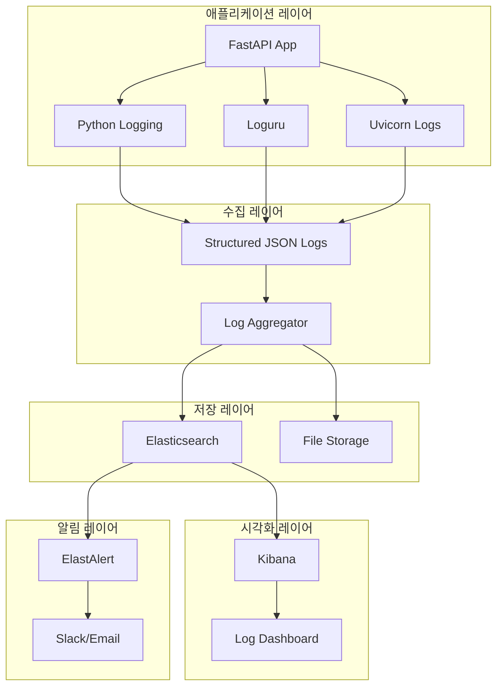

# 로깅 시스템 설정

## 개요

이 문서는 Korea Public Data API 백엔드의 통합 로깅 시스템 설정과 운영 방안을 제공합니다.

## 아키텍처



## 로깅 구성 요소

### 1. 로깅 설정

#### 로깅 설정 파일 (`logging_config.py`)

```python
# be/app/core/logging_config.py
import json
import sys
from datetime import datetime
from typing import Dict, Any
from loguru import logger
import structlog

# Loguru 설정
def setup_loguru():
    logger.remove()  # 기본 핸들러 제거
    
    # 파일 로테이션 설정
    logger.add(
        "logs/app_{time:YYYY-MM-DD}.log",
        rotation="1 day",
        retention="30 days",
        compression="gz",
        format="{time:YYYY-MM-DD HH:mm:ss} | {level} | {name}:{function}:{line} | {message}",
        serialize=True,  # JSON 직렬화
        level="INFO"
    )
    
    # 에러 로그 별도 파일
    logger.add(
        "logs/error_{time:YYYY-MM-DD}.log",
        rotation="1 day",
        retention="90 days",
        compression="gz",
        level="ERROR",
        serialize=True
    )
    
    # 콘솔 출력 (개발 환경)
    if sys.stdout.isatty():  # TTY 환경에서만
        logger.add(
            sys.stdout,
            format="<green>{time:HH:mm:ss}</green> | <level>{level}</level> | <cyan>{name}</cyan>:<cyan>{function}</cyan>:<cyan>{line}</cyan> | {message}",
            level="DEBUG"
        )

# Structlog 설정
def setup_structlog():
    structlog.configure(
        processors=[
            structlog.stdlib.filter_by_level,
            structlog.stdlib.add_logger_name,
            structlog.stdlib.add_log_level,
            structlog.stdlib.PositionalArgumentsFormatter(),
            structlog.processors.TimeStamper(fmt="iso"),
            structlog.processors.StackInfoRenderer(),
            structlog.processors.format_exc_info,
            structlog.processors.UnicodeDecoder(),
            structlog.processors.JSONRenderer()
        ],
        context_class=dict,
        logger_factory=structlog.stdlib.LoggerFactory(),
        cache_logger_on_first_use=True,
    )

# 통합 로깅 초기화
def init_logging():
    setup_loguru()
    setup_structlog()
    logger.info("Logging system initialized")
```

#### 미들웨어 설정 (`logging_middleware.py`)

```python
# be/app/middleware/logging_middleware.py
import time
import uuid
from typing import Callable
from fastapi import Request, Response
from fastapi.responses import JSONResponse
from loguru import logger
import structlog

# 컨텍스트 로거
context_logger = structlog.get_logger()

class LoggingMiddleware:
    def __init__(self, app):
        self.app = app

    async def __call__(self, scope, receive, send):
        if scope["type"] != "http":
            await self.app(scope, receive, send)
            return

        request = Request(scope, receive)
        
        # 요청 ID 생성
        request_id = str(uuid.uuid4())
        
        # 요청 시작 시간
        start_time = time.time()
        
        # 컨텍스트 설정
        structlog.contextvars.clear_contextvars()
        structlog.contextvars.bind_contextvars(
            request_id=request_id,
            method=request.method,
            path=request.url.path,
            query_params=str(request.query_params),
            client_ip=request.client.host,
            user_agent=request.headers.get("user-agent", "")
        )
        
        # 요청 로깅
        context_logger.info(
            "Request started",
            request_method=request.method,
            request_path=request.url.path,
            request_id=request_id
        )
        
        response = None
        status_code = 500
        
        try:
            # 실제 요청 처리
            response = await self.app(scope, receive, send)
            status_code = getattr(response, 'status_code', 200)
            
        except Exception as e:
            # 예외 로깅
            context_logger.error(
                "Request failed",
                error=str(e),
                error_type=type(e).__name__,
                request_id=request_id,
                exc_info=True
            )
            
            # 에러 응답 생성
            status_code = 500
            response = JSONResponse(
                status_code=500,
                content={"detail": "Internal server error", "request_id": request_id}
            )
            
        finally:
            # 응답 시간 계산
            process_time = time.time() - start_time
            
            # 응답 로깅
            context_logger.info(
                "Request completed",
                status_code=status_code,
                process_time=round(process_time * 1000, 2),  # milliseconds
                request_id=request_id
            )
```

### 2. 도메인별 로깅

#### API 엔드포인트 로깅

```python
# be/app/api/v1/announcements.py
from loguru import logger
import structlog

router = APIRouter()
domain_logger = structlog.get_logger("announcements")

@router.get("/", response_model=List[AnnouncementResponse])
async def get_announcements(
    skip: int = 0,
    limit: int = 20,
    db: AsyncSession = Depends(get_db)
):
    try:
        domain_logger.info(
            "Fetching announcements",
            skip=skip,
            limit=limit,
            operation="list_announcements"
        )
        
        announcements = await announcement_service.get_announcements(
            db, skip=skip, limit=limit
        )
        
        domain_logger.info(
            "Announcements fetched successfully",
            count=len(announcements),
            operation="list_announcements"
        )
        
        return announcements
        
    except Exception as e:
        domain_logger.error(
            "Failed to fetch announcements",
            error=str(e),
            operation="list_announcements",
            exc_info=True
        )
        raise HTTPException(status_code=500, detail="Failed to fetch announcements")
```

#### 서비스 레이어 로깅

```python
# be/app/services/business_service.py
import structlog
from typing import List, Optional

service_logger = structlog.get_logger("business_service")

class BusinessService:
    async def create_business(self, db: AsyncSession, business_data: BusinessCreate) -> Business:
        try:
            service_logger.info(
                "Creating business",
                business_name=business_data.name,
                operation="create_business"
            )
            
            # 비즈니스 생성 로직
            business = Business(**business_data.dict())
            db.add(business)
            await db.commit()
            await db.refresh(business)
            
            service_logger.info(
                "Business created successfully",
                business_id=business.id,
                business_name=business.name,
                operation="create_business"
            )
            
            return business
            
        except Exception as e:
            service_logger.error(
                "Failed to create business",
                business_name=business_data.name,
                error=str(e),
                operation="create_business",
                exc_info=True
            )
            await db.rollback()
            raise
```

### 3. 보안 및 감사 로깅

#### 인증/인가 로깅

```python
# be/app/core/security.py
import structlog
from datetime import datetime

security_logger = structlog.get_logger("security")

async def authenticate_user(token: str, db: AsyncSession) -> Optional[User]:
    try:
        security_logger.info(
            "Authentication attempt",
            token_prefix=token[:10] + "..." if len(token) > 10 else token,
            operation="authenticate"
        )
        
        # 토큰 검증 로직
        payload = jwt.decode(token, SECRET_KEY, algorithms=[ALGORITHM])
        user_id = payload.get("sub")
        
        if user_id is None:
            security_logger.warning(
                "Invalid token: missing user ID",
                operation="authenticate"
            )
            return None
            
        user = await get_user(db, user_id)
        if user is None:
            security_logger.warning(
                "Authentication failed: user not found",
                user_id=user_id,
                operation="authenticate"
            )
            return None
            
        security_logger.info(
            "Authentication successful",
            user_id=user.id,
            username=user.username,
            operation="authenticate"
        )
        
        return user
        
    except JWTError as e:
        security_logger.error(
            "JWT validation failed",
            error=str(e),
            operation="authenticate"
        )
        return None
    except Exception as e:
        security_logger.error(
            "Authentication error",
            error=str(e),
            operation="authenticate",
            exc_info=True
        )
        return None
```

### 4. 성능 로깅

#### 데이터베이스 쿼리 로깅

```python
# be/app/core/database.py
import structlog
from sqlalchemy.engine import Engine
from sqlalchemy import event
import time

db_logger = structlog.get_logger("database")

@event.listens_for(Engine, "before_cursor_execute")
def receive_before_cursor_execute(conn, cursor, statement, parameters, context, executemany):
    context._query_start_time = time.time()

@event.listens_for(Engine, "after_cursor_execute")
def receive_after_cursor_execute(conn, cursor, statement, parameters, context, executemany):
    total = time.time() - context._query_start_time
    
    # 느린 쿼리 로깅 (100ms 이상)
    if total > 0.1:
        db_logger.warning(
            "Slow query detected",
            query_time=round(total * 1000, 2),
            statement=statement[:200] + "..." if len(statement) > 200 else statement,
            operation="slow_query"
        )
    
    # 모든 쿼리 로깅 (DEBUG 레벨)
    db_logger.debug(
        "Database query executed",
        query_time=round(total * 1000, 2),
        statement=statement[:100] + "..." if len(statement) > 100 else statement,
        operation="db_query"
    )
```

### 5. AI/ML 모델 로깅

```python
# be/app/services/ai_service.py
import structlog
from typing import Dict, Any

ai_logger = structlog.get_logger("ai_service")

class AIService:
    async def classify_content(self, content: str) -> Dict[str, Any]:
        try:
            ai_logger.info(
                "Content classification started",
                content_length=len(content),
                operation="classify_content"
            )
            
            start_time = time.time()
            
            # AI 모델 추론
            result = self.bert_model.predict(content)
            
            inference_time = time.time() - start_time
            
            ai_logger.info(
                "Content classification completed",
                inference_time=round(inference_time * 1000, 2),
                confidence=result.get('confidence', 0),
                predicted_category=result.get('category'),
                operation="classify_content"
            )
            
            return result
            
        except Exception as e:
            ai_logger.error(
                "Content classification failed",
                content_length=len(content),
                error=str(e),
                operation="classify_content",
                exc_info=True
            )
            raise
```

## 로그 집계 및 저장

### 1. ELK Stack 설정

#### Docker Compose 설정

```yaml
# docker-compose.logging.yml
version: '3.8'

services:
  elasticsearch:
    image: docker.elastic.co/elasticsearch/elasticsearch:8.11.0
    container_name: elasticsearch
    environment:
      - discovery.type=single-node
      - xpack.security.enabled=false
      - "ES_JAVA_OPTS=-Xms1g -Xmx1g"
    ports:
      - "9200:9200"
    volumes:
      - elasticsearch_data:/usr/share/elasticsearch/data
    networks:
      - logging

  logstash:
    image: docker.elastic.co/logstash/logstash:8.11.0
    container_name: logstash
    volumes:
      - ./logstash/config:/usr/share/logstash/pipeline
      - ./logs:/usr/share/logstash/logs
    ports:
      - "5044:5044"
    environment:
      - "LS_JAVA_OPTS=-Xmx256m -Xms256m"
    networks:
      - logging
    depends_on:
      - elasticsearch

  kibana:
    image: docker.elastic.co/kibana/kibana:8.11.0
    container_name: kibana
    ports:
      - "5601:5601"
    environment:
      - ELASTICSEARCH_HOSTS=http://elasticsearch:9200
    networks:
      - logging
    depends_on:
      - elasticsearch

  filebeat:
    image: docker.elastic.co/beats/filebeat:8.11.0
    container_name: filebeat
    user: root
    volumes:
      - ./filebeat/filebeat.yml:/usr/share/filebeat/filebeat.yml:ro
      - ./logs:/var/log/app
      - /var/lib/docker/containers:/var/lib/docker/containers:ro
      - /var/run/docker.sock:/var/run/docker.sock:ro
    networks:
      - logging
    depends_on:
      - elasticsearch

networks:
  logging:
    driver: bridge

volumes:
  elasticsearch_data:
```

#### Logstash 설정

```ruby
# logstash/config/logstash.conf
input {
  beats {
    port => 5044
  }
  
  file {
    path => "/usr/share/logstash/logs/*.log"
    start_position => "beginning"
    codec => "json"
  }
}

filter {
  if [fields][log_type] == "app" {
    json {
      source => "message"
    }
    
    date {
      match => [ "timestamp", "ISO8601" ]
    }
    
    # 성능 메트릭 파싱
    if [operation] == "api_request" {
      mutate {
        convert => { "process_time" => "float" }
        convert => { "status_code" => "integer" }
      }
    }
    
    # 에러 로그 분류
    if [level] == "ERROR" {
      mutate {
        add_tag => [ "error" ]
      }
    }
    
    # 보안 이벤트 분류
    if [logger_name] == "security" {
      mutate {
        add_tag => [ "security" ]
      }
    }
  }
}

output {
  elasticsearch {
    hosts => ["elasticsearch:9200"]
    index => "korea-public-data-%{+YYYY.MM.dd}"
  }
  
  # 에러 로그 별도 인덱스
  if "error" in [tags] {
    elasticsearch {
      hosts => ["elasticsearch:9200"]
      index => "korea-public-data-errors-%{+YYYY.MM.dd}"
    }
  }
  
  # 보안 이벤트 별도 인덱스
  if "security" in [tags] {
    elasticsearch {
      hosts => ["elasticsearch:9200"]
      index => "korea-public-data-security-%{+YYYY.MM.dd}"
    }
  }
}
```

#### Filebeat 설정

```yaml
# filebeat/filebeat.yml
filebeat.inputs:
- type: log
  enabled: true
  paths:
    - /var/log/app/*.log
  fields:
    log_type: app
  fields_under_root: true
  json.keys_under_root: true
  json.add_error_key: true

- type: docker
  containers.ids:
    - "*"
  containers.path: "/var/lib/docker/containers"
  containers.stream: "stdout"
  fields:
    log_type: docker
  fields_under_root: true

output.logstash:
  hosts: ["logstash:5044"]

logging.level: info
logging.to_files: true
logging.files:
  path: /var/log/filebeat
  name: filebeat
  keepfiles: 7
  permissions: 0644
```

### 2. 로그 알림 설정

#### ElastAlert 설정

```yaml
# elastalert/config.yaml
rules_folder: rules
run_every:
  minutes: 1

buffer_time:
  minutes: 15

es_host: elasticsearch
es_port: 9200

writeback_index: elastalert_status
writeback_alias: elastalert_alerts

alert_time_limit:
  days: 2
```

#### 에러 알림 규칙

```yaml
# elastalert/rules/error_alerts.yaml
name: High Error Rate Alert
type: frequency
index: korea-public-data-errors-*
num_events: 10
timeframe:
  minutes: 5

filter:
- term:
    level: "ERROR"

alert:
- "email"
- "slack"

email:
- "admin@korea-public-data.com"

slack:
webhook_url: "https://hooks.slack.com/services/YOUR/SLACK/WEBHOOK"
slack_channel_override: "#alerts"
slack_username_override: "ElastAlert"

alert_text: |
  High error rate detected in Korea Public Data API
  
  Error count: {0}
  Time range: {1}
  
  Recent errors:
  {2}

alert_text_args:
  - num_matches
  - timeframe
  - top_count_keys

include:
  - timestamp
  - level
  - message
  - logger_name
  - request_id
```

#### 성능 알림 규칙

```yaml
# elastalert/rules/performance_alerts.yaml
name: Slow API Response Alert
type: frequency
index: korea-public-data-*
num_events: 5
timeframe:
  minutes: 5

filter:
- range:
    process_time:
      gt: 1000  # 1초 이상

alert:
- "slack"

slack:
webhook_url: "https://hooks.slack.com/services/YOUR/SLACK/WEBHOOK"
slack_channel_override: "#performance"

alert_text: |
  Slow API responses detected
  
  Slow request count: {0}
  Average response time: {1}ms
  
  Details in Kibana dashboard
```

## 로그 분석 및 대시보드

### 1. Kibana 대시보드

#### API 성능 대시보드

```json
{
  "version": "8.11.0",
  "objects": [
    {
      "id": "api-performance-dashboard",
      "type": "dashboard",
      "attributes": {
        "title": "API Performance Dashboard",
        "panelsJSON": "[{\"version\":\"8.11.0\",\"gridData\":{\"x\":0,\"y\":0,\"w\":24,\"h\":15,\"i\":\"1\"},\"panelIndex\":\"1\",\"embeddableConfig\":{},\"panelRefName\":\"panel_1\"}]",
        "timeRestore": false,
        "kibanaSavedObjectMeta": {
          "searchSourceJSON": "{\"query\":{\"match_all\":{}},\"filter\":[]}"
        }
      }
    }
  ]
}
```

#### 에러 분석 대시보드

- 에러 발생 빈도 차트
- 에러 유형별 분류
- 요청 ID별 에러 추적
- 사용자별 에러 패턴

### 2. 로그 검색 쿼리

#### 성능 분석 쿼리

```json
{
  "query": {
    "bool": {
      "must": [
        {"term": {"operation": "api_request"}},
        {"range": {"process_time": {"gte": 500}}}
      ]
    }
  },
  "aggs": {
    "avg_response_time": {
      "avg": {"field": "process_time"}
    },
    "endpoints": {
      "terms": {"field": "request_path.keyword"}
    }
  }
}
```

#### 보안 이벤트 쿼리

```json
{
  "query": {
    "bool": {
      "must": [
        {"term": {"logger_name": "security"}},
        {"range": {"@timestamp": {"gte": "now-1h"}}}
      ]
    }
  },
  "sort": [
    {"@timestamp": {"order": "desc"}}
  ]
}
```

## 로그 보관 및 아카이브

### 1. 로그 보관 정책

```yaml
# 로그 보관 정책
retention_policy:
  application_logs:
    hot: 7일     # 빠른 검색
    warm: 30일   # 중간 속도 검색
    cold: 90일   # 느린 검색
    delete: 1년  # 완전 삭제
    
  error_logs:
    hot: 30일
    warm: 90일
    cold: 1년
    delete: 3년
    
  security_logs:
    hot: 30일
    warm: 6개월
    cold: 2년
    delete: 5년
    
  audit_logs:
    hot: 30일
    warm: 1년
    cold: 3년
    delete: 7년
```

### 2. 아카이브 스크립트

```bash
#!/bin/bash
# scripts/archive_logs.sh

ELASTICSEARCH_HOST="localhost:9200"
DATE_30_DAYS_AGO=$(date -d "30 days ago" +%Y.%m.%d)
DATE_90_DAYS_AGO=$(date -d "90 days ago" +%Y.%m.%d)

# Hot to Warm 이동 (30일 이전)
curl -X PUT "${ELASTICSEARCH_HOST}/korea-public-data-${DATE_30_DAYS_AGO}/_settings" \
  -H 'Content-Type: application/json' \
  -d '{
    "index.routing.allocation.require.data": "warm"
  }'

# Warm to Cold 이동 (90일 이전)
curl -X PUT "${ELASTICSEARCH_HOST}/korea-public-data-${DATE_90_DAYS_AGO}/_settings" \
  -H 'Content-Type: application/json' \
  -d '{
    "index.routing.allocation.require.data": "cold"
  }'

echo "Log archiving completed for $(date)"
```

## 운영 가이드

### 1. 일일 운영 체크리스트

- [ ] Elasticsearch 클러스터 상태 확인
- [ ] 로그 인덱싱 속도 모니터링
- [ ] 디스크 사용량 확인
- [ ] 에러 로그 리뷰
- [ ] 성능 이상 징후 확인

### 2. 장애 대응

#### Elasticsearch 장애
```bash
# 클러스터 상태 확인
curl -X GET "localhost:9200/_cluster/health?pretty"

# 인덱스 상태 확인
curl -X GET "localhost:9200/_cat/indices?v"

# 노드 상태 확인
curl -X GET "localhost:9200/_cat/nodes?v"
```

#### 로그 누락 대응
```bash
# Filebeat 상태 확인
docker logs filebeat

# Logstash 파이프라인 확인
curl -X GET "localhost:9600/_node/stats/pipelines?pretty"

# 로그 파일 권한 확인
ls -la logs/
```

### 3. 성능 최적화

#### 인덱스 최적화
```json
{
  "settings": {
    "number_of_shards": 1,
    "number_of_replicas": 0,
    "refresh_interval": "30s",
    "index.mapping.total_fields.limit": 2000
  },
  "mappings": {
    "properties": {
      "timestamp": {"type": "date"},
      "level": {"type": "keyword"},
      "message": {"type": "text"},
      "process_time": {"type": "float"},
      "request_id": {"type": "keyword"}
    }
  }
}
```

#### JVM 힙 크기 조정
```bash
# Elasticsearch
export ES_JAVA_OPTS="-Xms2g -Xmx2g"

# Logstash
export LS_JAVA_OPTS="-Xms1g -Xmx1g"
```

### 4. 보안 설정

#### Elasticsearch 보안
```yaml
# elasticsearch.yml
xpack.security.enabled: true
xpack.security.transport.ssl.enabled: true
xpack.security.http.ssl.enabled: true
```

#### 로그 민감정보 마스킹
```python
# 민감정보 마스킹 함수
def mask_sensitive_data(log_data: dict) -> dict:
    sensitive_fields = ['password', 'token', 'api_key', 'ssn']
    
    for field in sensitive_fields:
        if field in log_data:
            log_data[field] = "***MASKED***"
    
    return log_data
```

이 로깅 시스템 설정을 통해 Korea Public Data API의 모든 활동을 체계적으로 기록하고 모니터링할 수 있습니다.