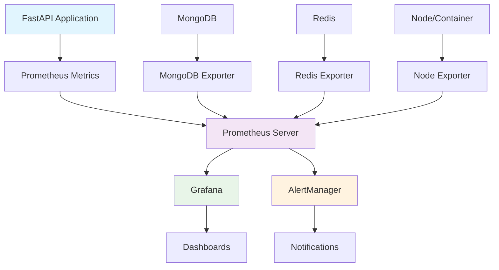

# 📊 Prometheus/Grafana 모니터링 설정

> Korea Public Data Backend의 종합적인 모니터링 시스템 구축 가이드

## 📋 목차
- [모니터링 개요](#모니터링-개요)
- [Prometheus 설정](#prometheus-설정)
- [Grafana 설정](#grafana-설정)
- [메트릭 정의](#메트릭-정의)
- [대시보드 구성](#대시보드-구성)
- [알림 설정](#알림-설정)
- [성능 최적화](#성능-최적화)
- [문제 해결](#문제-해결)

## 🎯 모니터링 개요

### 모니터링 목표
1. **시스템 가용성**: 서비스 상태 실시간 모니터링
2. **성능 추적**: API 응답 시간, 처리량, 리소스 사용률
3. **비즈니스 메트릭**: 사용자 활동, 콘텐츠 성과, 비즈니스 KPI
4. **오류 탐지**: 예외, 장애, 성능 저하 조기 감지
5. **용량 계획**: 리소스 사용 패턴 분석 및 확장 계획

### 아키텍처 구조


### 구성 요소
- **Prometheus**: 메트릭 수집 및 저장
- **Grafana**: 시각화 및 대시보드
- **AlertManager**: 알림 관리
- **Exporters**: 외부 시스템 메트릭 수집
- **Application Metrics**: 애플리케이션 레벨 메트릭

## 🔧 Prometheus 설정

### Docker Compose 설정
```yaml
# docker-compose.monitoring.yml
version: '3.8'

services:
  prometheus:
    image: prom/prometheus:v2.45.0
    container_name: prometheus
    ports:
      - "9090:9090"
    volumes:
      - ./monitoring/prometheus:/etc/prometheus
      - prometheus_data:/prometheus
    command:
      - '--config.file=/etc/prometheus/prometheus.yml'
      - '--storage.tsdb.path=/prometheus'
      - '--storage.tsdb.retention.time=30d'
      - '--storage.tsdb.retention.size=10GB'
      - '--web.console.libraries=/etc/prometheus/console_libraries'
      - '--web.console.templates=/etc/prometheus/consoles'
      - '--web.enable-lifecycle'
      - '--web.enable-admin-api'
    restart: unless-stopped
    networks:
      - monitoring

  grafana:
    image: grafana/grafana:10.0.0
    container_name: grafana
    ports:
      - "3000:3000"
    volumes:
      - grafana_data:/var/lib/grafana
      - ./monitoring/grafana/provisioning:/etc/grafana/provisioning
      - ./monitoring/grafana/dashboards:/var/lib/grafana/dashboards
    environment:
      - GF_SECURITY_ADMIN_PASSWORD=admin123!
      - GF_USERS_ALLOW_SIGN_UP=false
      - GF_INSTALL_PLUGINS=grafana-clock-panel,grafana-simple-json-datasource
    restart: unless-stopped
    networks:
      - monitoring
    depends_on:
      - prometheus

  alertmanager:
    image: prom/alertmanager:v0.25.0
    container_name: alertmanager
    ports:
      - "9093:9093"
    volumes:
      - ./monitoring/alertmanager:/etc/alertmanager
      - alertmanager_data:/alertmanager
    command:
      - '--config.file=/etc/alertmanager/alertmanager.yml'
      - '--storage.path=/alertmanager'
      - '--web.external-url=http://localhost:9093'
    restart: unless-stopped
    networks:
      - monitoring

  # 외부 시스템 Exporters
  mongodb_exporter:
    image: percona/mongodb_exporter:0.39
    container_name: mongodb_exporter
    ports:
      - "9216:9216"
    environment:
      - MONGODB_URI=mongodb://localhost:27017
    command:
      - '--mongodb.uri=mongodb://mongodb:27017'
      - '--collect-all'
    restart: unless-stopped
    networks:
      - monitoring
      - korea_network
    depends_on:
      - mongodb

  redis_exporter:
    image: oliver006/redis_exporter:v1.52.0
    container_name: redis_exporter
    ports:
      - "9121:9121"
    environment:
      - REDIS_ADDR=redis://redis:6379
    restart: unless-stopped
    networks:
      - monitoring
      - korea_network
    depends_on:
      - redis

  node_exporter:
    image: prom/node-exporter:v1.6.0
    container_name: node_exporter
    ports:
      - "9100:9100"
    volumes:
      - /proc:/host/proc:ro
      - /sys:/host/sys:ro
      - /:/rootfs:ro
    command:
      - '--path.procfs=/host/proc'
      - '--path.rootfs=/rootfs'
      - '--path.sysfs=/host/sys'
      - '--collector.filesystem.mount-points-exclude=^/(sys|proc|dev|host|etc)($$|/)'
    restart: unless-stopped
    networks:
      - monitoring

volumes:
  prometheus_data:
  grafana_data:
  alertmanager_data:

networks:
  monitoring:
    driver: bridge
  korea_network:
    external: true
```

### Prometheus 설정 파일
```yaml
# monitoring/prometheus/prometheus.yml
global:
  scrape_interval: 15s
  evaluation_interval: 15s
  external_labels:
    cluster: 'korea-public-data'
    environment: 'production'

rule_files:
  - "alert_rules.yml"
  - "recording_rules.yml"

alerting:
  alertmanagers:
    - static_configs:
        - targets:
          - alertmanager:9093

scrape_configs:
  # FastAPI 애플리케이션
  - job_name: 'fastapi-app'
    static_configs:
      - targets: ['korea-backend:8000']
    metrics_path: '/metrics'
    scrape_interval: 10s
    scrape_timeout: 5s

  # MongoDB
  - job_name: 'mongodb'
    static_configs:
      - targets: ['mongodb_exporter:9216']
    scrape_interval: 30s

  # Redis
  - job_name: 'redis'
    static_configs:
      - targets: ['redis_exporter:9121']
    scrape_interval: 30s

  # 시스템 메트릭
  - job_name: 'node'
    static_configs:
      - targets: ['node_exporter:9100']
    scrape_interval: 30s

  # Prometheus 자체 모니터링
  - job_name: 'prometheus'
    static_configs:
      - targets: ['localhost:9090']

  # Grafana
  - job_name: 'grafana'
    static_configs:
      - targets: ['grafana:3000']
    metrics_path: '/metrics'

  # 추가 서비스 (필요시 활성화)
  # - job_name: 'elasticsearch'
  #   static_configs:
  #     - targets: ['elasticsearch:9200']
```

### 알림 규칙 설정
```yaml
# monitoring/prometheus/alert_rules.yml
groups:
  - name: korea_public_data_alerts
    rules:
      # 인스턴스 다운
      - alert: InstanceDown
        expr: up == 0
        for: 1m
        labels:
          severity: critical
        annotations:
          summary: "Instance {{ $labels.instance }} is down"
          description: "{{ $labels.instance }} of job {{ $labels.job }} has been down for more than 1 minute."

      # 높은 메모리 사용률
      - alert: HighMemoryUsage
        expr: (1 - (node_memory_MemAvailable_bytes / node_memory_MemTotal_bytes)) * 100 > 85
        for: 5m
        labels:
          severity: warning
        annotations:
          summary: "High memory usage on {{ $labels.instance }}"
          description: "Memory usage is above 85% for more than 5 minutes. Current value: {{ $value }}%"

      # 높은 CPU 사용률
      - alert: HighCPUUsage
        expr: 100 - (avg by(instance) (rate(node_cpu_seconds_total{mode="idle"}[5m])) * 100) > 80
        for: 5m
        labels:
          severity: warning
        annotations:
          summary: "High CPU usage on {{ $labels.instance }}"
          description: "CPU usage is above 80% for more than 5 minutes. Current value: {{ $value }}%"

      # 디스크 사용률 높음
      - alert: HighDiskUsage
        expr: (1 - node_filesystem_avail_bytes{fstype!="tmpfs"} / node_filesystem_size_bytes{fstype!="tmpfs"}) * 100 > 85
        for: 5m
        labels:
          severity: warning
        annotations:
          summary: "High disk usage on {{ $labels.instance }}"
          description: "Disk usage on {{ $labels.mountpoint }} is above 85%. Current value: {{ $value }}%"

      # API 응답 시간 높음
      - alert: HighAPIResponseTime
        expr: histogram_quantile(0.95, rate(http_request_duration_seconds_bucket[5m])) > 1
        for: 3m
        labels:
          severity: warning
        annotations:
          summary: "High API response time"
          description: "95th percentile response time is above 1 second for more than 3 minutes. Current value: {{ $value }}s"

      # API 에러율 높음
      - alert: HighAPIErrorRate
        expr: rate(http_requests_total{status=~"5.."}[5m]) / rate(http_requests_total[5m]) > 0.05
        for: 3m
        labels:
          severity: critical
        annotations:
          summary: "High API error rate"
          description: "API error rate is above 5% for more than 3 minutes. Current value: {{ $value }}%"

      # MongoDB 연결 실패
      - alert: MongoDBDown
        expr: mongodb_up == 0
        for: 1m
        labels:
          severity: critical
        annotations:
          summary: "MongoDB is down"
          description: "MongoDB instance is not responding for more than 1 minute."

      # Redis 연결 실패
      - alert: RedisDown
        expr: redis_up == 0
        for: 1m
        labels:
          severity: critical
        annotations:
          summary: "Redis is down"
          description: "Redis instance is not responding for more than 1 minute."

      # 사용자 활동 급감
      - alert: UserActivityDrop
        expr: (
          rate(user_activity_total[10m]) < 
          rate(user_activity_total[1h] offset 24h) * 0.5
        )
        for: 15m
        labels:
          severity: warning
        annotations:
          summary: "Significant drop in user activity"
          description: "User activity has dropped by more than 50% compared to the same time yesterday."

      # 비정상적으로 높은 요청량
      - alert: UnusuallyHighRequestVolume
        expr: rate(http_requests_total[5m]) > rate(http_requests_total[1h] offset 24h) * 3
        for: 10m
        labels:
          severity: warning
        annotations:
          summary: "Unusually high request volume"
          description: "Request volume is more than 3x higher than the same time yesterday."
```

### 레코딩 규칙 설정
```yaml
# monitoring/prometheus/recording_rules.yml
groups:
  - name: korea_public_data_recording_rules
    interval: 30s
    rules:
      # API 메트릭 집계
      - record: api:request_rate:5m
        expr: rate(http_requests_total[5m])

      - record: api:request_rate:1h
        expr: rate(http_requests_total[1h])

      - record: api:error_rate:5m
        expr: rate(http_requests_total{status=~"5.."}[5m]) / rate(http_requests_total[5m])

      - record: api:response_time:p95:5m
        expr: histogram_quantile(0.95, rate(http_request_duration_seconds_bucket[5m]))

      - record: api:response_time:p99:5m
        expr: histogram_quantile(0.99, rate(http_request_duration_seconds_bucket[5m]))

      # 시스템 리소스 집계
      - record: system:cpu_usage:5m
        expr: 100 - (avg by(instance) (rate(node_cpu_seconds_total{mode="idle"}[5m])) * 100)

      - record: system:memory_usage:current
        expr: (1 - (node_memory_MemAvailable_bytes / node_memory_MemTotal_bytes)) * 100

      - record: system:disk_usage:current
        expr: (1 - node_filesystem_avail_bytes{fstype!="tmpfs"} / node_filesystem_size_bytes{fstype!="tmpfs"}) * 100

      # 애플리케이션 메트릭
      - record: app:active_users:5m
        expr: increase(active_users_total[5m])

      - record: app:content_views:1h
        expr: increase(content_views_total[1h])

      - record: app:api_calls_by_endpoint:5m
        expr: sum by(endpoint) (rate(http_requests_total[5m]))
```

## 📊 Grafana 설정

### 데이터소스 설정
```yaml
# monitoring/grafana/provisioning/datasources/prometheus.yml
apiVersion: 1

datasources:
  - name: Prometheus
    type: prometheus
    access: proxy
    url: http://prometheus:9090
    isDefault: true
    editable: true
    jsonData:
      httpMethod: POST
      exemplarTraceIdDestinations:
        - name: traceID
          datasourceUid: jaeger
          url: http://jaeger:16686/trace/${__value.raw}

  - name: AlertManager
    type: alertmanager
    access: proxy
    url: http://alertmanager:9093
    editable: true
```

### 대시보드 프로비저닝
```yaml
# monitoring/grafana/provisioning/dashboards/default.yml
apiVersion: 1

providers:
  - name: 'default'
    orgId: 1
    folder: ''
    type: file
    disableDeletion: false
    updateIntervalSeconds: 10
    allowUiUpdates: true
    options:
      path: /var/lib/grafana/dashboards
```

### 시스템 개요 대시보드
```json
{
  "dashboard": {
    "id": null,
    "title": "Korea Public Data - System Overview",
    "tags": ["korea", "system", "overview"],
    "timezone": "Asia/Seoul",
    "panels": [
      {
        "id": 1,
        "title": "System Health Status",
        "type": "stat",
        "targets": [
          {
            "expr": "up",
            "legendFormat": "{{instance}}"
          }
        ],
        "fieldConfig": {
          "defaults": {
            "color": {
              "mode": "thresholds"
            },
            "thresholds": {
              "steps": [
                {"color": "red", "value": 0},
                {"color": "green", "value": 1}
              ]
            },
            "mappings": [
              {"options": {"0": {"text": "DOWN"}}, "type": "value"},
              {"options": {"1": {"text": "UP"}}, "type": "value"}
            ]
          }
        },
        "gridPos": {"h": 4, "w": 6, "x": 0, "y": 0}
      },
      {
        "id": 2,
        "title": "API Request Rate",
        "type": "graph",
        "targets": [
          {
            "expr": "sum(rate(http_requests_total[5m]))",
            "legendFormat": "Total Requests/sec"
          },
          {
            "expr": "sum(rate(http_requests_total{status=~\"5..\"}[5m]))",
            "legendFormat": "Error Requests/sec"
          }
        ],
        "yAxes": [
          {
            "label": "Requests/sec",
            "min": 0
          }
        ],
        "gridPos": {"h": 8, "w": 12, "x": 6, "y": 0}
      },
      {
        "id": 3,
        "title": "Response Time (95th percentile)",
        "type": "graph",
        "targets": [
          {
            "expr": "histogram_quantile(0.95, rate(http_request_duration_seconds_bucket[5m]))",
            "legendFormat": "95th percentile"
          }
        ],
        "yAxes": [
          {
            "label": "Seconds",
            "min": 0
          }
        ],
        "gridPos": {"h": 8, "w": 6, "x": 18, "y": 0}
      },
      {
        "id": 4,
        "title": "CPU Usage",
        "type": "graph",
        "targets": [
          {
            "expr": "100 - (avg by(instance) (rate(node_cpu_seconds_total{mode=\"idle\"}[5m])) * 100)",
            "legendFormat": "{{instance}}"
          }
        ],
        "yAxes": [
          {
            "label": "Percent",
            "min": 0,
            "max": 100
          }
        ],
        "gridPos": {"h": 8, "w": 8, "x": 0, "y": 8}
      },
      {
        "id": 5,
        "title": "Memory Usage",
        "type": "graph",
        "targets": [
          {
            "expr": "(1 - (node_memory_MemAvailable_bytes / node_memory_MemTotal_bytes)) * 100",
            "legendFormat": "{{instance}}"
          }
        ],
        "yAxes": [
          {
            "label": "Percent",
            "min": 0,
            "max": 100
          }
        ],
        "gridPos": {"h": 8, "w": 8, "x": 8, "y": 8}
      },
      {
        "id": 6,
        "title": "Disk Usage",
        "type": "graph",
        "targets": [
          {
            "expr": "(1 - node_filesystem_avail_bytes{fstype!=\"tmpfs\"} / node_filesystem_size_bytes{fstype!=\"tmpfs\"}) * 100",
            "legendFormat": "{{instance}}:{{mountpoint}}"
          }
        ],
        "yAxes": [
          {
            "label": "Percent",
            "min": 0,
            "max": 100
          }
        ],
        "gridPos": {"h": 8, "w": 8, "x": 16, "y": 8}
      }
    ],
    "time": {
      "from": "now-1h",
      "to": "now"
    },
    "refresh": "30s"
  }
}
```

### API 성능 대시보드
```json
{
  "dashboard": {
    "id": null,
    "title": "Korea Public Data - API Performance",
    "tags": ["korea", "api", "performance"],
    "panels": [
      {
        "id": 1,
        "title": "Requests by Endpoint",
        "type": "graph",
        "targets": [
          {
            "expr": "sum by(endpoint) (rate(http_requests_total[5m]))",
            "legendFormat": "{{endpoint}}"
          }
        ],
        "gridPos": {"h": 8, "w": 12, "x": 0, "y": 0}
      },
      {
        "id": 2,
        "title": "Response Time by Endpoint",
        "type": "graph",
        "targets": [
          {
            "expr": "histogram_quantile(0.95, sum by(endpoint, le) (rate(http_request_duration_seconds_bucket[5m])))",
            "legendFormat": "{{endpoint}} (95th)"
          },
          {
            "expr": "histogram_quantile(0.50, sum by(endpoint, le) (rate(http_request_duration_seconds_bucket[5m])))",
            "legendFormat": "{{endpoint}} (50th)"
          }
        ],
        "gridPos": {"h": 8, "w": 12, "x": 12, "y": 0}
      },
      {
        "id": 3,
        "title": "Error Rate by Endpoint",
        "type": "graph",
        "targets": [
          {
            "expr": "sum by(endpoint) (rate(http_requests_total{status=~\"5..\"}[5m])) / sum by(endpoint) (rate(http_requests_total[5m])) * 100",
            "legendFormat": "{{endpoint}}"
          }
        ],
        "yAxes": [
          {
            "label": "Error Rate (%)",
            "min": 0
          }
        ],
        "gridPos": {"h": 8, "w": 24, "x": 0, "y": 8}
      },
      {
        "id": 4,
        "title": "Top Slowest Endpoints",
        "type": "table",
        "targets": [
          {
            "expr": "topk(10, histogram_quantile(0.95, sum by(endpoint, le) (rate(http_request_duration_seconds_bucket[5m]))))",
            "format": "table",
            "instant": true
          }
        ],
        "gridPos": {"h": 8, "w": 12, "x": 0, "y": 16}
      },
      {
        "id": 5,
        "title": "Request Volume Trend",
        "type": "graph",
        "targets": [
          {
            "expr": "sum(increase(http_requests_total[1h]))",
            "legendFormat": "Requests per hour"
          }
        ],
        "gridPos": {"h": 8, "w": 12, "x": 12, "y": 16}
      }
    ],
    "time": {
      "from": "now-6h",
      "to": "now"
    },
    "refresh": "1m"
  }
}
```

### 비즈니스 메트릭 대시보드
```json
{
  "dashboard": {
    "id": null,
    "title": "Korea Public Data - Business Metrics",
    "tags": ["korea", "business", "kpi"],
    "panels": [
      {
        "id": 1,
        "title": "Active Users",
        "type": "stat",
        "targets": [
          {
            "expr": "sum(increase(active_users_total[5m]))",
            "legendFormat": "5분간 활성 사용자"
          }
        ],
        "fieldConfig": {
          "defaults": {
            "color": {
              "mode": "palette-classic"
            },
            "unit": "short"
          }
        },
        "gridPos": {"h": 4, "w": 6, "x": 0, "y": 0}
      },
      {
        "id": 2,
        "title": "Content Views",
        "type": "stat",
        "targets": [
          {
            "expr": "sum(increase(content_views_total[1h]))",
            "legendFormat": "1시간 콘텐츠 조회"
          }
        ],
        "gridPos": {"h": 4, "w": 6, "x": 6, "y": 0}
      },
      {
        "id": 3,
        "title": "API Calls Distribution",
        "type": "piechart",
        "targets": [
          {
            "expr": "sum by(endpoint) (increase(http_requests_total[1h]))",
            "legendFormat": "{{endpoint}}"
          }
        ],
        "gridPos": {"h": 8, "w": 12, "x": 12, "y": 0}
      },
      {
        "id": 4,
        "title": "User Activity Over Time",
        "type": "graph",
        "targets": [
          {
            "expr": "sum(rate(user_actions_total[5m])) by (action_type)",
            "legendFormat": "{{action_type}}"
          }
        ],
        "gridPos": {"h": 8, "w": 12, "x": 0, "y": 4}
      },
      {
        "id": 5,
        "title": "Popular Content Categories",
        "type": "bargauge",
        "targets": [
          {
            "expr": "topk(10, sum by(category) (increase(content_views_total[24h])))",
            "legendFormat": "{{category}}"
          }
        ],
        "gridPos": {"h": 8, "w": 12, "x": 0, "y": 12}
      },
      {
        "id": 6,
        "title": "Search Queries Trend",
        "type": "graph",
        "targets": [
          {
            "expr": "sum(increase(search_queries_total[1h]))",
            "legendFormat": "Search Queries/hour"
          }
        ],
        "gridPos": {"h": 8, "w": 12, "x": 12, "y": 12}
      }
    ],
    "time": {
      "from": "now-24h",
      "to": "now"
    },
    "refresh": "5m"
  }
}
```

## 📢 AlertManager 설정

### AlertManager 설정 파일
```yaml
# monitoring/alertmanager/alertmanager.yml
global:
  smtp_smarthost: 'localhost:587'
  smtp_from: 'alerts@korea-public-data.com'
  smtp_auth_username: 'alerts@korea-public-data.com'
  smtp_auth_password: 'your-smtp-password'

route:
  group_by: ['alertname', 'severity']
  group_wait: 10s
  group_interval: 10s
  repeat_interval: 1h
  receiver: 'web.hook'
  routes:
    - match:
        severity: critical
      receiver: 'critical-alerts'
      repeat_interval: 30m
    
    - match:
        severity: warning
      receiver: 'warning-alerts'
      repeat_interval: 2h

receivers:
  - name: 'web.hook'
    webhook_configs:
      - url: 'http://alertmanager-webhook:5000/webhook'
        send_resolved: true

  - name: 'critical-alerts'
    email_configs:
      - to: 'dev-team@korea-public-data.com'
        subject: '[CRITICAL] Korea Public Data Alert'
        body: |
          {{ range .Alerts }}
          Alert: {{ .Annotations.summary }}
          Description: {{ .Annotations.description }}
          Severity: {{ .Labels.severity }}
          {{ end }}
    
    slack_configs:
      - api_url: 'https://hooks.slack.com/services/YOUR/SLACK/WEBHOOK'
        channel: '#critical-alerts'
        title: 'Critical Alert - Korea Public Data'
        text: |
          {{ range .Alerts }}
          *Alert:* {{ .Annotations.summary }}
          *Description:* {{ .Annotations.description }}
          *Severity:* {{ .Labels.severity }}
          {{ end }}

  - name: 'warning-alerts'
    email_configs:
      - to: 'monitoring@korea-public-data.com'
        subject: '[WARNING] Korea Public Data Alert'
        body: |
          {{ range .Alerts }}
          Alert: {{ .Annotations.summary }}
          Description: {{ .Annotations.description }}
          {{ end }}

inhibit_rules:
  - source_match:
      severity: 'critical'
    target_match:
      severity: 'warning'
    equal: ['alertname', 'instance']
```

## 📊 메트릭 정의

### 애플리케이션 메트릭
```python
# app/monitoring/metrics.py

from prometheus_client import Counter, Histogram, Gauge, Info, Enum
from prometheus_client import start_http_server, CONTENT_TYPE_LATEST, REGISTRY
from prometheus_client.openmetrics.exposition import CONTENT_TYPE_LATEST as OPENMETRICS_CONTENT_TYPE
import time
from functools import wraps

# HTTP 요청 메트릭
http_requests_total = Counter(
    'http_requests_total',
    'Total HTTP requests',
    ['method', 'endpoint', 'status']
)

http_request_duration_seconds = Histogram(
    'http_request_duration_seconds',
    'HTTP request duration in seconds',
    ['method', 'endpoint'],
    buckets=[0.01, 0.05, 0.1, 0.25, 0.5, 1.0, 2.5, 5.0, 10.0]
)

# 비즈니스 메트릭
active_users_total = Counter(
    'active_users_total',
    'Total active users',
    ['time_window']
)

content_views_total = Counter(
    'content_views_total',
    'Total content views',
    ['content_type', 'category']
)

search_queries_total = Counter(
    'search_queries_total',
    'Total search queries',
    ['search_type', 'result_count_range']
)

user_actions_total = Counter(
    'user_actions_total',
    'Total user actions',
    ['action_type', 'target_type']
)

# 시스템 메트릭
database_connections = Gauge(
    'database_connections_active',
    'Active database connections',
    ['database_type']
)

cache_hit_rate = Gauge(
    'cache_hit_rate',
    'Cache hit rate',
    ['cache_type']
)

queue_size = Gauge(
    'queue_size',
    'Queue size',
    ['queue_name']
)

# 애플리케이션 정보
app_info = Info(
    'app_info',
    'Application information'
)

# 서비스 상태
service_status = Enum(
    'service_status',
    'Service status',
    ['service_name'],
    states=['healthy', 'degraded', 'unhealthy']
)

def monitor_endpoint(endpoint_name: str):
    """엔드포인트 모니터링 데코레이터"""
    def decorator(func):
        @wraps(func)
        async def wrapper(request, *args, **kwargs):
            method = request.method
            start_time = time.time()
            status = "200"
            
            try:
                response = await func(request, *args, **kwargs)
                if hasattr(response, 'status_code'):
                    status = str(response.status_code)
                return response
            except Exception as e:
                status = "500"
                raise
            finally:
                duration = time.time() - start_time
                
                http_requests_total.labels(
                    method=method,
                    endpoint=endpoint_name,
                    status=status
                ).inc()
                
                http_request_duration_seconds.labels(
                    method=method,
                    endpoint=endpoint_name
                ).observe(duration)
        
        return wrapper
    return decorator

class MetricsCollector:
    """메트릭 수집기"""
    
    def __init__(self):
        self.start_time = time.time()
        
        # 애플리케이션 정보 설정
        app_info.info({
            'version': '1.0.0',
            'build_date': '2025-08-14',
            'environment': 'production'
        })
    
    def record_user_action(self, action_type: str, target_type: str):
        """사용자 액션 기록"""
        user_actions_total.labels(
            action_type=action_type,
            target_type=target_type
        ).inc()
    
    def record_content_view(self, content_type: str, category: str):
        """콘텐츠 조회 기록"""
        content_views_total.labels(
            content_type=content_type,
            category=category
        ).inc()
    
    def record_search_query(self, search_type: str, result_count: int):
        """검색 쿼리 기록"""
        # 결과 수를 범위로 분류
        if result_count == 0:
            result_range = "0"
        elif result_count <= 10:
            result_range = "1-10"
        elif result_count <= 50:
            result_range = "11-50"
        elif result_count <= 100:
            result_range = "51-100"
        else:
            result_range = "100+"
        
        search_queries_total.labels(
            search_type=search_type,
            result_count_range=result_range
        ).inc()
    
    def update_database_connections(self, database_type: str, count: int):
        """데이터베이스 연결 수 업데이트"""
        database_connections.labels(database_type=database_type).set(count)
    
    def update_cache_hit_rate(self, cache_type: str, hit_rate: float):
        """캐시 히트율 업데이트"""
        cache_hit_rate.labels(cache_type=cache_type).set(hit_rate)
    
    def update_queue_size(self, queue_name: str, size: int):
        """큐 크기 업데이트"""
        queue_size.labels(queue_name=queue_name).set(size)
    
    def update_service_status(self, service_name: str, status: str):
        """서비스 상태 업데이트"""
        service_status.labels(service_name=service_name).state(status)

# 전역 메트릭 수집기 인스턴스
metrics_collector = MetricsCollector()
```

### 미들웨어 통합
```python
# app/middleware/metrics_middleware.py

import time
from fastapi import Request, Response
from starlette.middleware.base import BaseHTTPMiddleware
from ..monitoring.metrics import http_requests_total, http_request_duration_seconds

class MetricsMiddleware(BaseHTTPMiddleware):
    """메트릭 수집 미들웨어"""
    
    async def dispatch(self, request: Request, call_next):
        start_time = time.time()
        
        # 요청 정보 추출
        method = request.method
        path = request.url.path
        
        # 경로 정규화 (매개변수 제거)
        normalized_path = self.normalize_path(path)
        
        response = await call_next(request)
        
        # 처리 시간 계산
        duration = time.time() - start_time
        
        # 메트릭 기록
        http_requests_total.labels(
            method=method,
            endpoint=normalized_path,
            status=str(response.status_code)
        ).inc()
        
        http_request_duration_seconds.labels(
            method=method,
            endpoint=normalized_path
        ).observe(duration)
        
        return response
    
    def normalize_path(self, path: str) -> str:
        """경로 정규화 (ID 등 동적 부분 제거)"""
        # API 경로에서 동적 부분을 일반화
        import re
        
        # UUID 패턴 제거
        path = re.sub(r'/[0-9a-f]{8}-[0-9a-f]{4}-[0-9a-f]{4}-[0-9a-f]{4}-[0-9a-f]{12}', '/{id}', path)
        
        # 숫자 ID 패턴 제거
        path = re.sub(r'/\d+', '/{id}', path)
        
        # ObjectId 패턴 제거
        path = re.sub(r'/[0-9a-f]{24}', '/{id}', path)
        
        return path
```

## 🚀 성능 최적화

### Prometheus 최적화
```yaml
# monitoring/prometheus/prometheus.yml (최적화 설정)
global:
  scrape_interval: 15s
  evaluation_interval: 15s
  
  # 외부 레이블로 클러스터 식별
  external_labels:
    cluster: 'korea-public-data'
    replica: '1'

# 스토리지 최적화
storage:
  tsdb:
    retention.time: 30d
    retention.size: 10GB
    wal-compression: true
    
# 쿼리 최적화
query:
  max-concurrency: 20
  timeout: 2m
  max-samples: 50000000

# 메트릭 수집 최적화
scrape_configs:
  - job_name: 'fastapi-app'
    scrape_interval: 10s
    scrape_timeout: 5s
    metrics_path: '/metrics'
    honor_labels: true
    static_configs:
      - targets: ['korea-backend:8000']
    
    # 메트릭 필터링
    metric_relabel_configs:
      # 불필요한 메트릭 제거
      - source_labels: [__name__]
        regex: 'go_.*'
        action: drop
      
      # 높은 카디널리티 메트릭 샘플링
      - source_labels: [__name__]
        regex: 'http_requests_total'
        target_label: __tmp_sample
        replacement: '1'
      
      # 레이블 정규화
      - source_labels: [endpoint]
        regex: '/api/v1/.*'
        target_label: api_version
        replacement: 'v1'

# 원격 저장소 설정 (선택사항)
remote_write:
  - url: "https://prometheus-remote-write-endpoint.com/api/v1/write"
    queue_config:
      capacity: 10000
      max_shards: 1000
      min_shards: 1
      max_samples_per_send: 2000
      batch_send_deadline: 5s
```

### Grafana 최적화
```yaml
# monitoring/grafana/grafana.ini
[server]
protocol = http
http_port = 3000
enable_gzip = true

[database]
type = postgres
host = postgres:5432
name = grafana
user = grafana
password = grafana_password

[session]
provider = postgres
provider_config = user=grafana password=grafana_password host=postgres port=5432 dbname=grafana sslmode=disable

[analytics]
reporting_enabled = false
check_for_updates = false

[security]
admin_user = admin
admin_password = secure_admin_password
secret_key = your_secret_key

[users]
allow_sign_up = false
auto_assign_org = true
auto_assign_org_role = Viewer

[auth.anonymous]
enabled = false

[log]
mode = console file
level = warn

[metrics]
enabled = true
interval_seconds = 10

[alerting]
enabled = true
execute_alerts = true

[unified_alerting]
enabled = true
```

## 🔧 배포 및 운영

### 배포 스크립트
```bash
#!/bin/bash
# scripts/deploy_monitoring.sh

set -e

echo "🚀 Deploying monitoring stack..."

# 디렉토리 생성
mkdir -p monitoring/{prometheus,grafana,alertmanager}
mkdir -p monitoring/grafana/{provisioning/{datasources,dashboards},dashboards}

# 설정 파일 권한 설정
chmod 644 monitoring/prometheus/*.yml
chmod 644 monitoring/grafana/provisioning/**/*.yml
chmod 644 monitoring/alertmanager/*.yml

# Docker 네트워크 생성 (존재하지 않는 경우)
docker network create monitoring 2>/dev/null || true

# 모니터링 스택 시작
echo "📊 Starting Prometheus..."
docker-compose -f docker-compose.monitoring.yml up -d prometheus

# Prometheus 시작 대기
echo "⏳ Waiting for Prometheus to start..."
sleep 10

# AlertManager 시작
echo "🔔 Starting AlertManager..."
docker-compose -f docker-compose.monitoring.yml up -d alertmanager

# Grafana 시작
echo "📈 Starting Grafana..."
docker-compose -f docker-compose.monitoring.yml up -d grafana

# Exporters 시작
echo "📡 Starting exporters..."
docker-compose -f docker-compose.monitoring.yml up -d mongodb_exporter redis_exporter node_exporter

# 서비스 상태 확인
echo "🔍 Checking service status..."
sleep 20

# 서비스 URL 출력
echo "✅ Monitoring stack deployed successfully!"
echo ""
echo "📊 Service URLs:"
echo "  Prometheus: http://localhost:9090"
echo "  Grafana: http://localhost:3000 (admin/admin123!)"
echo "  AlertManager: http://localhost:9093"
echo ""
echo "📈 Default Dashboards:"
echo "  System Overview: http://localhost:3000/d/system-overview"
echo "  API Performance: http://localhost:3000/d/api-performance"
echo "  Business Metrics: http://localhost:3000/d/business-metrics"
```

### 헬스체크 스크립트
```bash
#!/bin/bash
# scripts/check_monitoring_health.sh

echo "🔍 Checking monitoring stack health..."

# Prometheus 헬스체크
echo "📊 Checking Prometheus..."
if curl -s http://localhost:9090/-/healthy > /dev/null; then
    echo "  ✅ Prometheus is healthy"
else
    echo "  ❌ Prometheus is not responding"
fi

# Grafana 헬스체크
echo "📈 Checking Grafana..."
if curl -s http://localhost:3000/api/health | grep -q "ok"; then
    echo "  ✅ Grafana is healthy"
else
    echo "  ❌ Grafana is not responding"
fi

# AlertManager 헬스체크
echo "🔔 Checking AlertManager..."
if curl -s http://localhost:9093/-/healthy > /dev/null; then
    echo "  ✅ AlertManager is healthy"
else
    echo "  ❌ AlertManager is not responding"
fi

# 메트릭 수집 상태 확인
echo "📡 Checking metric collection..."
METRICS_COUNT=$(curl -s http://localhost:9090/api/v1/label/__name__/values | jq '.data | length')
if [ "$METRICS_COUNT" -gt 10 ]; then
    echo "  ✅ Collecting $METRICS_COUNT metrics"
else
    echo "  ⚠️  Only collecting $METRICS_COUNT metrics (expected > 10)"
fi

# 활성 알림 확인
echo "🚨 Checking active alerts..."
ALERTS_COUNT=$(curl -s http://localhost:9093/api/v1/alerts | jq '.data | length')
if [ "$ALERTS_COUNT" -eq 0 ]; then
    echo "  ✅ No active alerts"
else
    echo "  ⚠️  $ALERTS_COUNT active alerts"
fi

echo ""
echo "🎯 Monitoring health check completed!"
```

## 🐛 문제 해결

### 일반적인 문제들

#### 1. Prometheus가 메트릭을 수집하지 못하는 경우
```bash
# 타겟 상태 확인
curl http://localhost:9090/api/v1/targets

# 애플리케이션 메트릭 엔드포인트 직접 확인
curl http://korea-backend:8000/metrics

# 네트워크 연결 확인
docker exec prometheus ping korea-backend
```

#### 2. Grafana 대시보드가 데이터를 표시하지 않는 경우
```bash
# 데이터소스 연결 확인
curl -u admin:admin123! http://localhost:3000/api/datasources

# Prometheus 쿼리 테스트
curl 'http://localhost:9090/api/v1/query?query=up'

# Grafana 로그 확인
docker logs grafana
```

#### 3. 메모리 사용량이 높은 경우
```yaml
# prometheus.yml에서 retention 조정
storage:
  tsdb:
    retention.time: 15d  # 30d에서 15d로 감소
    retention.size: 5GB  # 10GB에서 5GB로 감소
```

#### 4. 높은 카디널리티 메트릭 처리
```yaml
# 메트릭 필터링 설정
metric_relabel_configs:
  - source_labels: [__name__]
    regex: 'high_cardinality_metric_.*'
    action: drop
  
  - source_labels: [user_id]
    regex: '.*'
    action: drop  # user_id 레이블 제거
```

### 로그 및 디버깅
```bash
# 모든 서비스 로그 확인
docker-compose -f docker-compose.monitoring.yml logs -f

# 특정 서비스 로그
docker logs prometheus -f
docker logs grafana -f
docker logs alertmanager -f

# 메트릭 확인
curl http://localhost:9090/metrics | grep prometheus_

# 설정 다시 로드
curl -X POST http://localhost:9090/-/reload
```

### 백업 및 복원
```bash
#!/bin/bash
# scripts/backup_monitoring.sh

BACKUP_DIR="/backup/monitoring"
DATE=$(date +%Y%m%d_%H%M%S)

# Prometheus 데이터 백업
docker run --rm -v prometheus_data:/data -v $BACKUP_DIR:/backup \
  alpine tar czf /backup/prometheus_$DATE.tar.gz -C /data .

# Grafana 데이터 백업
docker run --rm -v grafana_data:/data -v $BACKUP_DIR:/backup \
  alpine tar czf /backup/grafana_$DATE.tar.gz -C /data .

echo "✅ Backup completed: $BACKUP_DIR"
```

## 📊 모니터링 체크리스트

### 배포 전 체크리스트
- [ ] 모든 설정 파일이 올바른 위치에 있는가?
- [ ] 네트워크 설정이 올바른가?
- [ ] 볼륨 마운트가 올바른가?
- [ ] 환경 변수가 올바르게 설정되었는가?
- [ ] 보안 설정 (패스워드, 토큰)이 적절한가?

### 운영 중 체크리스트
- [ ] 모든 서비스가 정상 동작하는가?
- [ ] 메트릭이 올바르게 수집되고 있는가?
- [ ] 대시보드가 데이터를 표시하는가?
- [ ] 알림이 올바르게 작동하는가?
- [ ] 디스크 사용량이 임계치 이하인가?

### 정기 점검 사항
- [ ] 메트릭 보존 정책 검토
- [ ] 알림 규칙 효과성 검토
- [ ] 대시보드 사용 패턴 분석
- [ ] 성능 최적화 기회 식별
- [ ] 보안 업데이트 적용

## 🔄 업데이트 이력

| 버전 | 날짜 | 변경사항 | 작성자 |
|------|------|----------|--------|
| 1.0.0 | 2025-08-14 | 초기 Prometheus/Grafana 모니터링 설정 문서 작성 | DevOps Team |

---

*이 모니터링 시스템은 Korea Public Data 프로젝트의 안정적인 운영과 지속적인 개선을 위한 핵심 인프라입니다. 정기적인 점검과 업데이트를 통해 최적의 모니터링 환경을 유지하겠습니다.*